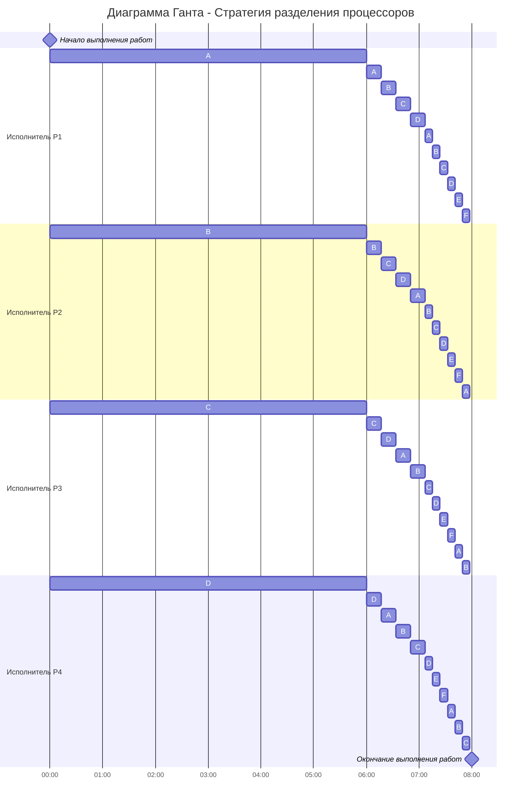

# Вариант задачи:
Имеется 6 независимых задач и 4 исполнителя с производительностями 5, 4, 3 и 2. Длительность заданий составляет 36, 30, 24, 18, 2, 2.    

# Решение:
Для решения задачи был выбрана стратегия разделения исполнителя для построения оптимального расписания. В задаче требуется определить оптимальное расписание для нескольких независимых заданий, выполняемых 4 исполнителями, причем прерывания разрешены, поэтому для ее решения будем использовать стратегию разделения процессов.

__Введем обозначения:__

| Задания      |  A  |  B  |  C  |  D  |  E  |  F  |
|:------------:|:---:|:---:|:---:|:---:|:---:|:---:|
| Длительность | 36  |  30 |  24 |  18 |  2  |   2 |

| Исполнители        |  P1  |  P2  |  P3  |  P4  |
|:------------------:|:----:|:----:|:----:|:----:|
| Производительность |   5  |   4  |   3  |   2  |

Длительность оптимального расписания для $k$ исполнителей и $n$ заданий рассчитаем по формуле:

$$  
T_{min} = \frac {V_1 + V_2 + ... + V_n}{p_1 + p_2 + ... + p_k}  
$$  

где $V_i$ - объем i-го задания, а $p_j$ - производительность j-го исполнителя. Минимальное время расписания предполагает, что в течении всего времени $T_{min}$ все исполнители будут работать непрерывно (без простоев).

Для нашего случая (k = 4, n = 6) получим:

$$
    T_{min} = \frac{36+30+24+18+2+2}{5+4+3+2} = \frac{112}{14} = 8
$$

Так как время оптимального расписания рассчитано, необходимо определить над какой задачей и в какое время каждый работник будет работать.

Для описания алгоритма построения оптимального расписания введем понятие **приоритета задания** в определенный момент времени - объем оставшейся части задания, которая в данный момент еще не выполнена. В начальный момент времени приоритет задания соответствует его объему.

__Основная идея алгоритма__: задания с высоким приоритетом выполняет работник с высокой производительностью.

Шаги алгоритма:
1. Назначим на задание с самым высоким приоритетом более производительного работника, на следующее по приоритетности - менее производительного работника:

| Приоритеты     |  1  |  2  |  3  |  4  |  5  |  5  |
|:--------------:|:---:|:---:|:---:|:---:|:---:|:---:|
| Задания        |  A  |  B  |  C  |  D  |  E  |  F  |
| Длительность   | __36__  |  __30__ |  __24__ |  __18__ |  2 |  2 |
| Назначенный исполнитель | Р1  |  Р2 |  P3 |  P4 |     |     |

2. Работники выполняют задания до тех пор, пока не сравняются приоритеты у заданий (или пока какое-то из заданий не будет выполнено).

*Решим уравнения:*

1) A = B  
36 - 5t = 30 - 4t  
<strong>t = 6</strong>

2) B = C  
        30 - 4t = 24-3t  
        <strong>t = 6</strong>

3) C = D  
        24 - 3t = 18-2t  
        <strong>t = 6</strong>

4) D = E = F  
        18 - 2t = 2  
        t = 8

За 6 минут сравняютса приоритеты заданий *A, B, C и D*. У задач изменятся приоритеты, поэтому необходимо провести перераспределение работников. Проделаем этапы заново:

| Приоритеты     |  1  |  1  |  1  |  1  |  2  |  2  |
|:--------------:|:---:|:---:|:---:|:---:|:---:|:---:|
| Задания        |  A  |  B  |  C  |  D  |  E  |  F  |
| Длительность   | __6__  |  __6__ |  __6__ |  __6__ |  2 |  2 |
| Назначенный исполнитель | Р1+P2+P3+P4  |  Р1+P2+P3+P4 |  Р1+P2+P3+P4 |  Р1+P2+P3+P4 |     |     |

Так как задачи A, В, C и D имеют одинаковый приоритет, все исполнители будут выполнять их поочередно (так как по условию задачи разрешены прерывания работ).

*Решим уравнение:*

<table>
  <tr>
    <td>
      ABCD = EF  
      6 - 14t/4 = 2 
      <strong>t = 8/7</strong>  
    </td>
  </tr>
</table>

За <strong>8/7</strong> минуты сравняются приоритеты *всех заданий*:

| Приоритеты     |  1  |  1  |  1  |  1  |  1  |  1  |
|:--------------:|:---:|:---:|:---:|:---:|:---:|:---:|
| Задания        |  A  |  B  |  C  |  D  |  E  |  F  |
| Длительность   | __2__  |  __2__ |  __2__ |  __2__ |  __2__ |  __2__ |

Так как длительность всех задач сравнялась, будем поочередно назначать исполнителей на все задачи (подробнее решение отображено в диаграмме Ганта).

Таким образом работы будут выполнены за:

$$
    T_{min} = \frac{2+2+2+2+2+2}{5+4+3+2} = \frac{12}{14} = 6/7
$$

# Ответ

Оптимальная длительность расписания равна __8 минут__.

*Построим диаграмму Ганта:*

