# Вариант 2

### Постановка задачи:
1. количество заданий произвольно;
2. все задания имеют одинаковую длительность;
3. задания зависимы, причём **граф зависимостей не должен содержать транзитивных ребер**;
4. запрещены прерывания при выполнении заданий;
5. количество **работников строго 2**;
6. работники универсальны;
7. производительность работников, размеры оплаты из труда и т.д. не учитываются;

*Требуется построить расписание выполнения всех заданий для заданного 
количества исполнителей в кратчайшие сроки.*

#### Таблица зависимостей:

| Предшествующее задание | A | A | A | A | B | B | C | D | D | E | F | F | G | H | I | J | K | L | M | M |
|------------------------|---|---|---|---|---|---|---|---|---|---|---|---|---|---|---|---|---|---|---|---|
| Последующее задание    | D | E | I | B | C | E | F | G | H | I | I | J | K | L | M | N | O | O | O | N |

## Нарисуем исходный граф зависимостей

### Шаг №1 Удалим транзитивные ребра

Мы удалили ребра **AI** и ребра **AE** т.к. в эти ребра существует путь через узел B, значит они избыточны. Также нужно удалить ребро **MO** т.к. задача M всегда будет иметь приоритет выше чем О или N, ведь у нее останется потомок N. 

### Шаг №2 Расставим приоритеты выполнения заданий
Приоритеты в первую очередь выставляются истокам графа (узлам у которых нет потомков) - это узлы N и O, соответственно назначим им приоритет 1 и 2.
Для заданий, все прямые потомки которых уже имеют приоритеты, составляется строка из приоритетов прямых потомков, записанных в убывающем порядке. Приоритет (t + 1) назначается заданию, у которого строка из приоритетов является лексикографически наименьшей.
Далее продемонстрирую распределение приоритетов продемонстрирую на графике.

### Шаг №3 Составим диаграмму Ганта
Когда приоритеты для всех заданий определены, они будут размещены в расписании согласно их важности. В каждый момент времени выбираются только те задания, которые могут быть выполнены (то есть, все их предшествующие задачи уже завершены). Из доступных заданий будет выбрано то, которое имеет наибольший приоритет, и оно будет включено передано исполнителю. После этого можно построить диаграмму Ганта для визуализации процесса выполнения задач.

```mermaid
gantt
    title Диаграмма Ганта
    dateFormat HH:mm    
    axisFormat %H:%M
    Начало выполнения работ : milestone, m1, 00:00, 0h
    section Исполнитель 1
    A         :c, 00:00, 1h
    B         :i, after c, 1h    
    C         :e, after i, 1h    
    G         :h, after e, 1h
    F         :a, after h, 1h
    K         :b, after a, 1h
    J         :k, after b, 1h
    O         :m, after k, 1h
    section Исполнитель 2
    D         :d, 01:00, 1h
    E         :f, after d, 1h
    H         :l, after f, 1h
    I         :g, after l, 1h
    L         :j, after g, 1h
    M         :x, after j, 1h
    N         :y, after x, 1h
    Окончание выполнения работ : milestone, m2, 08:00, 0h
```

