# Задание №7
## Оптимальное расписание. Лексикографическая стратегия.

## Лексикографическая стратегия
### Постановка задачи:
1. количество заданий произвольно;
2. все задания имеют одинаковую длительность;
3. задания зависимы, причём **граф зависимостей не должен содержать транзитивных ребер**;
4. запрещены прерывания при выполнении заданий;
5. количество **работников строго 2**;
6. работники универсальны;
7. производительность работников, размеры оплаты из труда и т.д. не учитываются;

*Требуется построить расписание выполнения всех заданий для заданного 
количества исполнителей в кратчайшие сроки.*
### Алгоритм решения задачи
Перед выполнением алгоритма необходимо удалить из графа зависимостей транзитивные ребра.

Для построения расписания необходимо назначить приоритет для каждой задачи. В первую очередь приоритеты 1, 2, 3, ... назначаются стокам графа (вершины, из которых нет исходящих ребер). 

Для заданий, все прямые потомки которых уже имеют приоритеты, составляется строка из приоритетов прямых потомков, записанных в убывающем порядке. Приоритет (t + 1) назначается заданию, у которого строка из приоритетов является лексикографически наименьшей.

После того как приоритеты для всех задач назначены, задачи добавляются в расписание в соответствии с их приоритетом. В каждый момент времени выбираются задачи готовые к выполнению (для которых все предшествующие задачи выполнены к началу момента времени) из них для добавления в расписание выбирается задача с наибольшим приоритетом.

## Вариант 4
### Таблица зависимостей

| Предшествующее задание | M | M | C | C | C | I | I | D | D | E | F | L | L | H | H | Q | P | A | A | G | G |
|------------------------|---|---|---|---|---|---|---|---|---|---|---|---|---|---|---|---|---|---|---|---|---|
| Последующее задание    | C | I | D | E | F | F | L | E | H | H | H | Q | P | A | G | A | G | B | J | J | K |

### Граф зависимостей

Построим изначальный граф по заданной таблице

Перед выполнением алгоритма, следует удалить транзитивные рёбра
Транзитивное ребро - ребро, при удалении которого, всё ещё будет существовать ориентированный путь между вершинами, прежде соединёнными этим ребром.

По построенному графу можно заметить транзитивные рёбра: CE, DH
При удалении ребра CE можно выделить ориентированный путь: CDE
При удалении ребра DH можно выделить ориентированный путь: DEH

Поэтому удаляем ребра CE, DH

После удаления транзитивных рёбер граф выглядит следущим образом

### Определения приоритетов задач
Найдём вершины, у которых нет потомков - вершины B, J, K

Присвоим им приоритеты с 1:
- B: приоритет 1
- J: приоритет 2
- K: приоритет 3 

Найдём вершины без присвоенного приоритета, у которых все потомки имеют приоритеты - вершины A, G

Составим строку приоритетов прямых потомков:
- A <2,1>
- G <3,2>

Сравним строки лексикографически

| № символа | Строка A | Знак | Строка G | Промежуточный результат |
|-----------|----------|------|----------|-------------------------|
| 1         | 2        | <    | 3        | A < D                   |
| 2         | 1        | <    | 2        | A < D                   |

Результат: A < G

Присвоим вершинам приоритеты, начиная с наименьшей строки:
- A: приоритет 4
- G: приоритет 5

Найдём вершины без присвоенного приоритета, у которых все потомки имеют приоритеты - вершины H, Q, P

Составим строку приоритетов прямых потомков:
- H <5,4>
- Q <4>
- P <5>

Сравним строки лексикографически

| № символа | Строка H | Знак | Строка Q | Знак | Строка P | Промежуточный результат |
|-----------|----------|------|----------|------|----------|-------------------------|
| 1         | 5        | >    | 4        | <    | 5        | Q < H = P               |
| 2         | 4        | >    | -        | =    | -        | Q < P < H               |

Результат: Q < P < H

Присвоим вершинам приоритеты, начиная с наименьшей строки:
- Q: приоритет 6
- P: приоритет 7
- H: приоритет 8

Найдём вершины без присвоенного приоритета, у которых все потомки имеют приоритеты - вершины L, F, E

Составим строку приоритетов прямых потомков:
- L <7, 6>
- F <8>
- E <8>

Сравним строки лексикографически

| № символа | Строка L | Знак | Строка F | Знак | Строка E | Промежуточный результат |
|-----------|----------|------|----------|------|----------|-------------------------|
| 1         | 7        | <    | 8        | =    | 8        | L < F = E               |
| 2         | 6        | >    | -        | =    | -        | L < F = E               |

Результат: L < F = E

Присвоим вершинам приоритеты, начиная с наименьшей строки:
- L: приоритет 9
- F: приоритет 10
- E: приоритет 11

Найдём вершины без присвоенного приоритета, у которых все потомки имеют приоритеты - вершины C, D, I

Составим строку приоритетов прямых потомков:
- C <11, 10>
- D <10>
- I <11, 9>

Сравним строки лексикографически

| № символа | Строка C | Знак | Строка D | Знак | Строка I | Промежуточный результат |
|-----------|----------|------|----------|------|----------|-------------------------|
| 1         | 11       | >    | 10       | <    | 11       | C < D = I               |
| 2         | 10       | >    | -        | <    | 9        | D < I < C               |

Результат: D < I < C

Присвоим вершинам приоритеты, начиная с наименьшей строки:
- D: приоритет 12
- I: приоритет 13
- C: приоритет 14

Единстенная оставшаяся без приоритета вершина: M
Её приоритет: 15

### Граф зависимостей с приоритетами
Отобразим расставленные приоритеты в графе

Приоритет - #
Строка приоритетов прямых потомков - <>

### Диаграмма Ганта

```mermaid
gantt
    title Диаграмма Ганта
    dateFormat HH:mm    
    axisFormat %H:%M
    Начало выполнения работ : milestone, m1, 00:00, 0h
    section Исполнитель 1
    M         :m, 00:00, 1h
    C         :c, after m, 1h    
    D         :d, after c, 1h    
    E         :e, after d, 1h
    H         :h, after e, 1h
    Q         :q, after h, 1h
    A         :a, after q, 1h
    J         :j, after a, 1h
    section Исполнитель 2
    I         :i, after m, 1h
    F         :f, after i, 1h
    L         :l, after f, 1h
    P         :p, after l, 1h
    G         :g, after p, 1h
    K         :k, after g, 1h
    B         :b, after k, 1h
    Окончание выполнения работ : milestone, m2, 08:00, 0h
```

