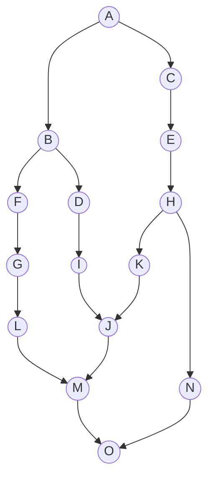
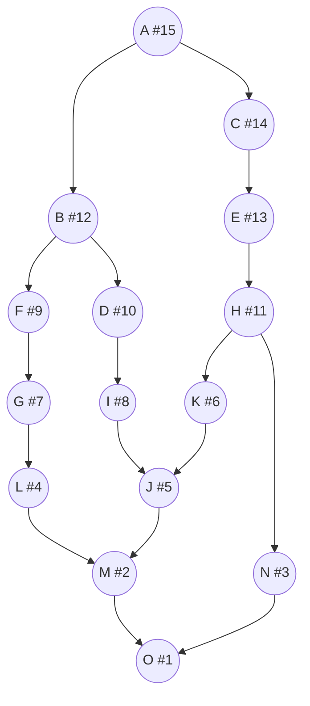

## Вариант №7

### Постановка задачи
1. Количество заданий – 15 (обозначим их латинскими буквами: A, B, C, D, E, F, G, H, I, J, K, L, M, N, O).  
2. Все задания имеют единичную длительность.  
3. Задания зависимы, при этом в исходном графе зависимостей **присутствуют транзитивные рёбра**, которые необходимо удалить.  
4. Запрещены прерывания при выполнении заданий.  
5. Количество исполнителей строго 2.  
6. Работники (исполнители) универсальны, производительность и прочие экономические параметры не учитываются.  
7. Требуется составить расписание выполнения всех заданий в кратчайшие сроки, используя **лексикографическую стратегию**.  
8. В конце полученного расписания должен быть период простоя одного из исполнителей.

---

### Таблица зависимостей (исходные прямые рёбра, включая транзитивные)

| **Предшествующее** | **Последующее** |
|--------------------|-----------------|
| A                  | B               |
| B                  | D               |
| A                  | D  *(транзитивное)* |
| B                  | I  *(транзитивное)* |
| D                  | I               |
| A                  | C               |
| C                  | E               |
| E                  | H               |
| H                  | K               |
| B                  | F               |
| F                  | G               |
| G                  | L               |
| I                  | J               |
| K                  | J               |
| L                  | M               |
| J                  | M               |
| H                  | N               |
| M                  | O               |
| N                  | O               |

- Рёбра **A → D** и **B → I** являются транзитивными (например, A → B и B → D порождают A → D; B → D и D → I порождают B → I).

---

### Шаг №1: Удаление транзитивных рёбер

Из графа убираем только явные транзитивные дуги:

- **A → D** (возникает транзитивно через A → B → D)  
- **B → I** (возникает транзитивно через B → D → I)

После удаления этих рёбер получаем следующий **окончательный граф зависимостей**:

---

### Шаг №2: Определение приоритетов (лексикографическая стратегия)

1. **Присваиваем приоритеты стокам графа**.  
   Единственный сток (вершина без потомков) – это **O**, следовательно:
**P(O) = 1**

2. **Находим задачи, все прямые потомки которых уже имеют приоритеты**, и записываем их приоритеты в порядке убывания.  
   - Прямые предшественники **O** – это **M** и **N**. У обоих строка потомков 1При лексикографическом сравнении строки одинаковы, поэтому назначаем приоритеты в условном порядке:
     **P(M) = 2, P(N) = 3**
   
3. Аналогично определяем приоритеты вверх по цепочкам:
   - **L** и **J** → потомок M(2). У обоих строка потомков 2. Назначим:
     **P(L) = 4,P(J) = 5**
   - **K** → потомок J(5). Строка потомков 5, значит:
     **P(K) = 6**
   - **G** → потомок L(4). Строка потомков 4, значит:
     **P(G) = 7**
  - **I** → потомок J(5). Строка потомков 5, значит:
    **P(I) = 8**
  - **F** → потомок G(7). Строка потомков 7, значит:
    **P(F) = 9**
  - **D** → потомок I(8). Строка потомков 8, значит:
    **P(D) = 10**
  - **H** → потомки K(6) и N(3). Строка потомков 6,3, значит (когда придёт её очередь – см. лексикографический порядок):
    **P(H) = 11**
  - **B** → потомки D(10) и F(9). Строка потомков 10,9, значит: **
    P(B) = 12**
  - **E** → потомок H(11). Строка потомков 11, значит:
    **P(E) = 13**
  - **C** → потомок E(13). Строка потомков 13, значит:
    **P(C) = 14**
  - **A** → потомки B(12) и C(14). Строка потомков 14,12, значит:
    **P(A) = 15**

Итоговое назначение приоритетов:

| Задание | Приоритет |
|---------|----------|
| O       | 1        |
| M       | 2        |
| N       | 3        |
| L       | 4        |
| J       | 5        |
| K       | 6        |
| G       | 7        |
| I       | 8        |
| F       | 9        |
| D       | 10       |
| H       | 11       |
| B       | 12       |
| E       | 13       |
| C       | 14       |
| A       | 15       |

---

### Граф зависимостей с приоритетами

---

### Шаг №3: Построение расписания (диаграммы Ганта)

### Диаграмма Ганта

```mermaid
gantt
    title Расписание (Вариант №7)
    dateFormat  HH:mm
    axisFormat  %H:%M
    
    section Исполнитель 1
    A :a, 00:00, 1h
    C :c, after a, 1h
    E :e, after c, 1h
    F :f, after e, 1h
    H :h, after f, 1h
    K :k, after h, 1h
    J :j, after k, 1h
    M :m, after j, 1h
    O :o, after m, 1h
    
    section Исполнитель 2
    %% пустой период 00:00-01:00
    B :b, 01:00, 1h
    D :d, after b, 1h
    I :i, after d, 1h
    G :g, after i, 1h
    L :l, after g, 1h
    N :n, after l, 1h
    %% простаивает c 07:00 до 09:00
```

- Промежуток с 00:00 до 01:00 у **Исполнителя 2** и время с 07:00 до 09:00 у **Исполнителя 2** – это периоды простоя, когда данный исполнитель не загружен работой.

---

## Итоги
Все 15 заданий (A, B, C, D, E, F, G, H, I, J, K, L, M, N, O) выполнены за 9 часов.