## Вариант №6
### Шаг 1:Таблица зависимостей
#### Построение графа зависимостей
Для начала, необходимо составить граф зависимостей на основе предоставленной таблицы.

|Предшествующее задание	    |M|	M|	B|	K|	K|	E|	E|	F|	I|	I|	H|	H|	L|	A|	A|	G|	G|	H|
|---------------------------|-|--|---|---|---|---|---|---|---|---|---|---|---|---|---|---|---|---|
|Последующее задание	    |B|	K|	E|	E|	F|	A|	H|	H|	H|	L|	A|	G|	G|	D|	J|	J|	C|	J|
#### Граф зависимостей

### Шаг 2: Удаление транзитивных ребер
Транзитивные ребра – это такие, которые возникают в результате других зависимостей. Например, если из задачи M → B и из B → E, то мы можем сделать вывод, что M → E и удалить прямое ребро между M и E.

#### Измененный граф зависимостей после удаления транзитивных ребер:

### Шаг 3: Назначение приоритетов задачам

Теперь мы присваиваем приоритеты каждому заданию. Задания без исходящих ребер получают наименьший приоритет.

Задания без исходящих ребер: B, J, C, D.
Для остальных заданий приоритеты вычисляются на основе строк приоритетов их потомков.
|Задание|Приоритет|	Строка приоритетов потомков|
|-------|---------|----------------------------|
|M	    |   1     |	<2, 3>                     |
|K	    |	2     |	<5, 4>                     |
|B	    |	3     |	<>                         |
|E	    |	4     |	<3, 6>                     |
|F	    |	5     |	<6>                        |
|I	    |	6     |	<7, 8>                     |
|A	    |	7     |	<4, 9>                     |
|H	    |	8     |	<7, 10>                    |
|G	    |	9     |	<8, 11>                    |
|D	    |	10    |	<>                         |
|J	    |	11    |	<>                         |
|L	    |	12    |	<9>                        |
|C	    |	13    |	<>                         |

#### Результирующий граф с приоритетами:
Приоритет - #
Строка приоритетов прямых потомков - <>

### Шаг 4: Составление расписания (Диаграмма Ганта)
Теперь, когда приоритеты назначены, мы можем формировать расписание. Начнем с того, что на каждом шаге выбираем задания с наибольшим приоритетом, которые готовы к выполнению (не имеют зависимостей).

```mermaid
gantt
    title Диаграмма Ганта
    dateFormat HH:mm    
    axisFormat %H:%M
    Начало выполнения работ : milestone, m1, 00:00, 0h
    section Исполнитель 1
    M         :m, 00:00, 1h
    B         :b, after m, 1h    
    E         :e, after b, 1h    
    A         :a, after e, 1h
    J         :j, after a, 1h
    C         :c, after j, 1h
    section Исполнитель 2
    K         :k, 00:00, 1h
    F         :f, after k, 1h
    L         :l, after f, 1h
    G         :g, after l, 1h
    H         :h, after g, 1h
    D         :d, after h, 1h
    Окончание выполнения работ : milestone, m2, 06:00, 0h
```

### Ответ

#### Длительность полученного расписания — 6 часов.