## Вариант №6
### Шаг 1:Таблица зависимостей
#### Построение графа зависимостей
Для начала, необходимо составить граф зависимостей на основе предоставленной таблицы.

|Предшествующее задание	    |M|	M|	B|	K|	K|	E|	E|	F|	I|	I|	H|	H|	L|	A|	A|	G|	G|	H|
|---------------------------|-|--|---|---|---|---|---|---|---|---|---|---|---|---|---|---|---|---|
|Последующее задание	    |B|	K|	E|	E|	F|	A|	H|	H|	H|	L|	A|	G|	G|	D|	J|	J|	C|	J|
#### Граф зависимостей

### Шаг 2: Удаление транзитивных ребер
Транзитивные ребра – это такие, которые возникают в результате других зависимостей. Например, если из задачи M → B и из B → E, то мы можем сделать вывод, что M → E и удалить прямое ребро между M и E.

#### Измененный граф зависимостей после удаления транзитивных ребер:

### Шаг 3: Назначение приоритетов задачам

Теперь мы присваиваем приоритеты каждому заданию. Задания без исходящих ребер получают наименьший приоритет.

|Задание	|Приоритет	|Список приоритетов прямых потомков (по убыв.)|
|-----------|-----------|---------------------------------------------|
| D	        |    1	    |    <>
| J	        |    1	    |    <>
| C	        |    1	    |    <>
| L	        |    1	    |    <>
| A	        |    2	    |    <1, 1>
| G	        |    2	    |    <1, 1>
| H	        |    3	    |    <2, 2>
| E	        |    4	    |    <3>
| F	        |    4	    |    <3>
| I	        |    4	    |    <3, 1>
| B	        |    5	    |    <4>
| K	        |    5	    |    <4, 4>
| M	        |    6      |    <5, 5>
#### Результирующий граф с приоритетами:
Приоритет - #
Строка приоритетов прямых потомков - <>

### Шаг 4: Составление расписания (Диаграмма Ганта)
Теперь, когда приоритеты назначены, мы можем формировать расписание. Начнем с того, что на каждом шаге выбираем задания с наибольшим приоритетом, которые готовы к выполнению (не имеют зависимостей).

```mermaid
gantt
    title Диаграмма Ганта (2 исполнителя)
    dateFormat  HH:mm
    axisFormat  %H:%M

    section Исполнитель 1
    M :m, 00:00, 1h
    B :b, after m, 1h
    E :e, after b, 1h
    H :h, after e, 1h
    A :a, after h, 1h
    D :d, after a, 1h
    C :c, after d, 1h

    section Исполнитель 2
    I :i, 00:00, 1h
    K :k, after i, 1h
    F :f, after k, 1h
    L :l, after f, 1h
    G :g, after l, 1h
    J :j, after g, 1h

```

### Ответ

#### Длительность полученного расписания — 7 часов.