# Задание №7. Вариант 3

#### Таблица зависимостей:

| Предшествующее задание | A | B | B | C | D | D | D | E | F | G | G | H | I | J | K | K | L | L | I |
|------------------------|---|---|---|---|---|---|---|---|---|---|---|---|---|---|---|---|---|---|---|
| Последующее задание    | F | F | G | G | H | I | L | I | J | J | K | L | L | K | M | N | N | K | O |

#### Граф зависимостей

### Шаг №1. Удаление транзитивных ребер

Перед выполнением алгоритма необходимо удалить из графа зависимостей транзитивные ребра. В нашем случае таковыми ребрами являются D-L (так как есть путь D-I-L), G-K (так как есть путь G-J-K), L-N (так как есть путь L-K-N). Граф зависимостей после удаления транзитивных ребер выглядит следующим образом:

### Шаг №2. Расставление приоритетов

Для построения расписания необходимо назначить приоритет для каждой задачи. В первую очередь приоритеты 1, 2, 3, ... назначаются стокам графа (вершинам, из которых нет исходящих ребер).
Для заданий, все прямые потомки которых уже имеют приоритеты, составляется строка из приоритетов прямых потомков, записанных в убывающем порядке. Приоритет (t + 1) назначается заданию, у которого строка из приоритетов является лексикографически наименьшей.

В нашем случае расставляем приоритеты следующим образом:
1. Стоки графа: M - 1 приоритет, N - 2, O - 3.
2. K - 4 приоритет (<2,1> - строка из приоритетов).
3. J<3>, L<3>. Строки из приоритетов одинаковые, порядок назначения приоритетов не имеет значения. J - 5 приоритет, L - 6.
4. F<5>, G<5>, H<6>, I<6,3>. Наименьшие строки у заданий F, G, при этом порядок назначения приоритетов для них не имеет значения, так как строки из приоритетов одинаковые. F - 7 приоритет, G - 8. Между заданиями H, I наименьшая строка у задания H. H - 9 приоритет, I - 10.
5. A<7>, B<8,7>, C<8>, D<10,9>, E<10>. Наименьшая строка у задания A - 11 приоритет. Следующее задание C - 12 приоритет. Далее аналогично B - 13 приоритет, E - 14, D - 15. 

Тогда граф зависимостей с приоритетами будет выглядеть следующим образом:
*Прим. Приоритет - #. Строка приоритетов прямых потомков - <>*

### Шаг №3. Составление диаграммы Ганта

После того как приоритеты для всех задач назначены, задачи добавляются в расписание в соответствии с их приоритетом. В каждый момент времени выбираются задачи готовые к выполнению (для которых все предшествующие задачи выполнены к началу момента времени) из них для добавления в расписание выбирается задача с наибольшим приоритетом.

В нашем случае диаграмма Ганта будет выглядеть следующим образом:

```mermaid
gantt
    title Расписание задач (диаграмма Ганта)
    dateFormat HH:mm    
    axisFormat %H:%M
    Начало выполнения заданий : milestone, m1, 00:00, 0h
    section Исполнитель 1
    D         :d, 00:00, 1h
    B         :b, after d, 1h    
    A         :a, after b, 1h    
    H         :h, after a, 1h
    F         :f, after h, 1h
    J         :j, after f, 1h
    K         :k, after j, 1h
    N         :n, after k, 1h
    section Исполнитель 2
    E         :e, 00:00, 1h
    C         :c, after e, 1h
    I         :i, after c, 1h
    G         :g, after i, 1h
    L         :l, after g, 1h
    O         :o, after l, 1h
    M         :m, after k, 1h
    Окончание выполнения заданий : milestone, m2, 08:00, 0h
```

**Ответ:** длительность полученного расписания - **8 часов**.