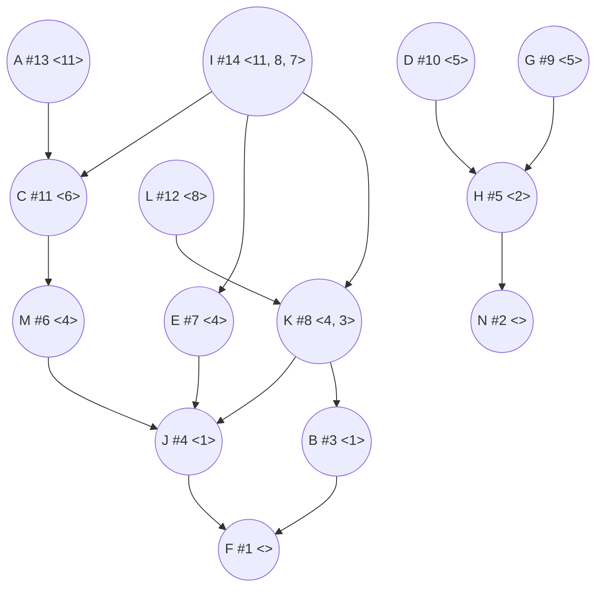

## Вариант №5

### Постановка задачи:
1. количество заданий произвольно;
2. все задания имеют одинаковую длительность;
3. задания зависимы, причём **граф зависимостей не должен содержать транзитивных рёбер**;
4. запрещены прерывания при выполнении заданий;
5. количество **работников строго 2**;
6. работники универсальны;
7. производительность работников, размеры оплаты из труда и т.д. не учитываются;

*Требуется построить расписание выполнения всех заданий для заданного
количества исполнителей в кратчайшие сроки.*

### Таблица зависимостей

| Предшествующее задание | A | I | I | I | L | D | G | C | E | K | K | H | G | M | J | B |
|------------------------|---|---|---|---|---|---|---|---|---|---|---|---|---|---|---|---|
| Последующее задание    | C | C | E | K | K | H | H | M | J | J | B | N | N | J | F | F |

### Исходный граф зависимостей

### Алгоритм решения задачи
__Шаг №1:__ перед выполнением алгоритма необходимо удалить из графа зависимостей транзитивные рёбра.

Для нашей задачи такими одно рёбро являются __G → N__. После удаления получим следующий граф:

__Шаг №2:__ для построения расписания необходимо назначить приоритет для каждой задачи. В первую очередь приоритеты 1, 2, 3, ... назначаются стокам графа (вершины, из которых нет исходящих рёбер).

В нашем случае стоками являются вершины __F и N__. Присвоим им соответственно приоритеты __1 и 2__.

Для заданий, все прямые потомки которых уже имеют приоритеты, составляется строка из приоритетов прямых потомков, записанных в убывающем порядке. Приоритет (t + 1) назначается заданию, у которого строка из приоритетов является лексикографически наименьшей.

Для вершины J прямым потомком является вершина F с приоритетом #1. Следовательно, для неё строка из приоритетов прямых потомков имеет вид: {1}.

Для вершины H прямым потомком является вершина N с приоритетом #2. Следовательно, для неё строка из приоритетов прямых потомков имеет вид: {2}.

Для вершины B прямым потомком является вершина F с приоритетом #1. Следовательно, для неё строка из приоритетов прямых потомков имеет вид: {1}.

Так как вершины J и B имеют одинаковые строки приоритетов потомков, лексикографически меньшие чем у H, выставляем их приоритеты в произвольном порядке: J - #4, B - #3. Для H приоритетом будет #5.

Аналогично поступим с остальными вершинами:

M {4} < K {4, 3} => вершина M будет иметь приоритет #6, а вершина K - #8.

C {6} < E {4} < L {10} => вершина E будет иметь приоритет #7, вершина C - #11, вершина L - #12.

I {11, 10, 7} => вершина I будет иметь приоритет #14.

A {11} => вершина A будет иметь приоритет #13.

### Граф зависимостей с приоритетами
Приоритет - # Строка приоритетов прямых потомков - <>

После того как приоритеты для всех задач назначены, задачи добавляются в расписание в соответствии с их приоритетом. В каждый момент времени выбираются задачи готовые к выполнению (для которых все предшествующие задачи выполнены к началу момента времени) из них для добавления в расписание выбирается задача с наибольшим приоритетом. Построим диаграмму Ганта для нашей задачи:

```mermaid
gantt
    title Диаграмма Ганта
    dateFormat HH:mm
    axisFormat %H:%M
    section Исполнитель 1
    I :a1, 00:00, 1h
    L :a2, after a1, 1h
    D :a3, after a2, 1h
    E :a4, after a3, 1h
    H :a5, after a4, 1h
    N :a6, after a5, 1h
    section Исполнитель 2
    A :b1, 00:00, 1h
    C :b2, after b1, 1h
    G :b3, after b2, 1h
    K :b4, after b3, 1h
    M :b5, after b4, 1h
    J :b6, after b5, 1h
    B :b7, after b6, 1h
    F :b8, after b7, 1h
```

