## Вариант №1
### Постановка задачи:
1. количество заданий произвольно;
2. все задания имеют одинаковую длительность;
3. задания зависимы, причём **граф зависимостей не должен содержать транзитивных ребер**;
4. запрещены прерывания при выполнении заданий;
5. количество **работников строго 2**;
6. работники универсальны;
7. производительность работников, размеры оплаты из труда и т.д. не учитываются;

*Требуется построить расписание выполнения всех заданий для заданного 
количества исполнителей в кратчайшие сроки.*

### Таблица зависимостей

| Предшествующее задание | A | A | A | A | B | C | C | D | E | E | E | F | F | G | H | I | J | J | K | N |
|------------------------|---|---|---|---|---|---|---|---|---|---|---|---|---|---|---|---|---|---|---|---|
| Последующее задание    | C | B | D | E | E | F | G | F | H | F | I | I | J | K | L | L | M | N | N | O | 

### Исходный граф зависимостей

### Алгоритм решения задачи
__Шаг №1:__ перед выполнением алгоритма необходимо удалить из графа зависимостей транзитивные ребра. 

Для нашей задачи такими ребрами являются __AE__ и __EI__. После удаления получим следующий граф:

__Шаг №2:__ для построения расписания необходимо назначить приоритет для каждой задачи. В первую очередь приоритеты 1, 2, 3, ... назначаются стокам графа (вершины, из которых нет исходящих ребер). 

В нашем случае стоками являются вершины __L, M и O__. Присвоим им соответственно приоритеты __1, 2, 3__.

Для заданий, все прямые потомки которых уже имеют приоритеты, составляется строка из приоритетов прямых потомков, записанных в убывающем порядке. Приоритет (t + 1) назначается заданию, у которого строка из приоритетов является лексикографически наименьшей.

Для вершины H приямым потомком является вершина L с приоритетом #1. Следовательно, для нее строка из приоритетов прямых потомков имеет вид: {1}. 

Для вершины I приямым потомком является вершина L с приоритетом #1. Следовательно, для нее строка из приоритетов прямых потомков имеет вид: {1}. 

Для вершины N приямым потомком является вершина O с приоритетом #3. Следовательно, для нее строка из приоритетов прямых потомков имеет вид: {3}. 

Так как вершины H и I имеют одинаковые строки приоритетов потомков, лексикографически меньшие чем у N, выставляем их приоритеты в произвольном порядке: H - #4, L - #5. Для N приоритетом будет #6.

Аналогично поступим с остальными вершинами:

K {6} < J {6, 2} => вершина K будет иметь приоритет #7, а вершина J - #8.

G {7} < F {8, 5} => вершина G будет иметь приоритет #9, а вершина J - #10.

D {10} < E {10, 4} < C {10, 9} => вершина D будет иметь приоритет #11, вершина E - #12, 
вершина C - #13.

Вершина B {12} будет иметь приоритет #14.

Вершина A {14, 13, 11} будет иметь приоритет #15.

### Граф зависимостей с приоритетами
Приоритет - #
Строка приоритетов прямых потомков - <>

После того как приоритеты для всех задач назначены, задачи добавляются в расписание в соответствии с их приоритетом. В каждый момент времени выбираются задачи готовые к выполнению (для которых все предшествующие задачи выполнены к началу момента времени) из них для добавления в расписание выбирается задача с наибольшим приоритетом. Построим диаграмму Ганта для нашей задачи:

```mermaid
gantt
    title Диаграмма Ганта
    dateFormat HH:mm    
    axisFormat %H:%M
    Начало выполнения работ : milestone, m1, 00:00, 0h
    section Исполнитель 1
    A         :c, 00:00, 1h
    C         :i, after c, 1h    
    D         :e, after i, 1h    
    F         :h, after e, 1h
    J         :a, after h, 1h
    N         :b, after a, 1h
    O         :k, after b, 1h
    L         :m, after k, 1h
    section Исполнитель 2
    B         :d, 01:00, 1h
    E         :f, after d, 1h
    G         :l, after f, 1h
    K         :g, after l, 1h
    I         :j, after g, 1h
    H         :x, after j, 1h
    M         :y, after x, 1h
    Окончание выполнения работ : milestone, m2, 07:00, 0h
```

