# Задание №8
## Вариант 9
Дана матрица затрат для задач A, B, C, D, E и исполнителей 1, 2, 3, 4, 5:
|       | **1** | **2** | **3** | **4** | **5** |
|-------|:-----:|:-----:|:-----:|:-----:|:-----:|
| **A** |  14   |   15   |   10  |   9   |  14   |
| **B** |   7   |    7   |   11  |  12   |   8   |
| **C** |  15   |   14   |  10   |   7   |  15   |
| **D** |  15   |   12   |   8   |   7   |  13   |
| **E** |   7   |   14   |   5   |  15   |   6   |

1. Редукция матрицы затрат по строке. Вычесть из каждой строки минимальное значение, представленное в этой строке.

|       | **1** | **2** | **3** | **4** | **5** | **min**|
|-------|:-----:|:-----:|:-----:|:-----:|:-----:|:------:|
| **A** |  14   |   15   |   10  |   9   |  14   |  -9   |
| **B** |   7   |    7   |   11  |  12   |   8   |  -7   |
| **C** |  15   |   14   |  10   |   7   |  15   |  -7   | 
| **D** |  15   |   12   |   8   |   7   |  13   |  -7   |
| **E** |   7   |   14   |   5   |  15   |   6   |  -5   |

Результат редукции по строке:

|       | **1** | **2** | **3** | **4** | **5** |
|-------|:-----:|:-----:|:-----:|:-----:|:-----:|
| **A** |  5    |   6    |   1   |   0   |   5   |
| **B** |   0   |    0   |   4   |  5    |   1   |
| **C** |   8   |   7    |   3   |   0   |   8   |
| **D** |   8   |   5    |   1   |   0   |   6   |
| **E** |   2   |    9   |   0   |  10   |   1   |

Далее необходимо выполнить редуцкию по столбцам.
Результат редукции по столбцам:

|       | **1** | **2** | **3** | **4** | **5** |
|-------|:-----:|:-----:|:-----:|:-----:|:-----:|
| **A** |  5    |   6    |   1   |   0   |   4   |
| **B** |   0   |    0   |   4   |  5    |   0   |
| **C** |   8   |   7    |   3   |   0   |   7   |
| **D** |   8   |   5    |   1   |   0   |   5   |
| **E** |   2   |    9   |   0   |  10   |   0   |

Была получена редуцированная матрица, где нули обозначают наименее затратные варианты назначений.

2. Построить двудольный граф, где вершины с одной стороны - задачи, другой - исполнители, вынесем рёбра, для которых в редуцированной матрице указаны нули.

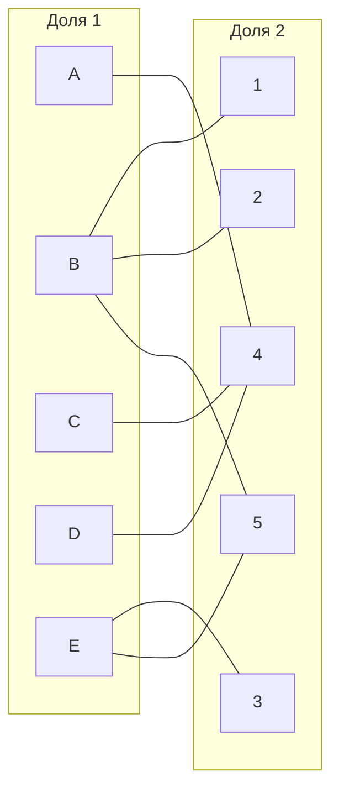

Выбрано произвольное паросочетание A --- 4, B --- 1, E --- 3, соответствующие рёбра закрашены. Необходимо выяснить получится ли построить совершенное паросочетание. Сделать это можно при помощи чередующихся деревьев.

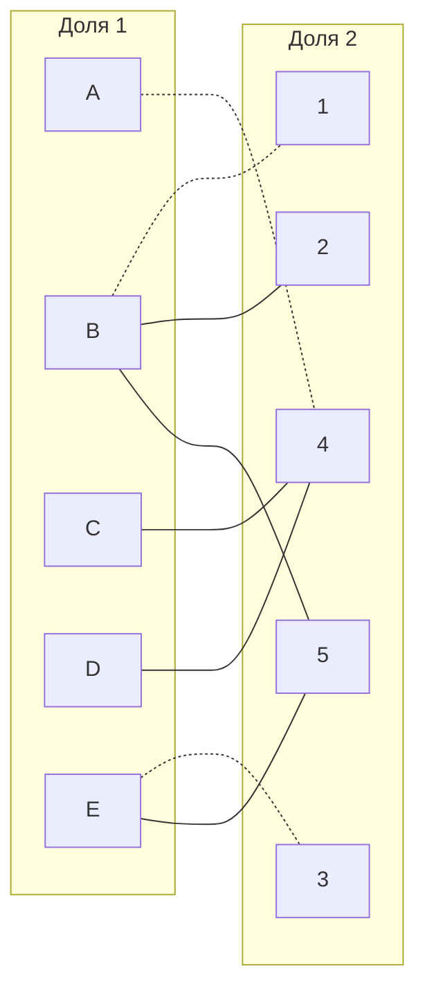

Непокрытыми осталались вершины C и D.

Вершина D

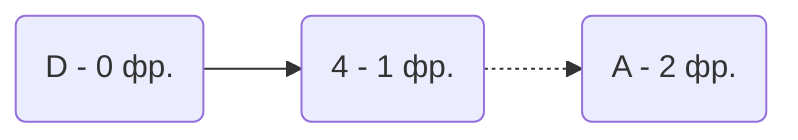
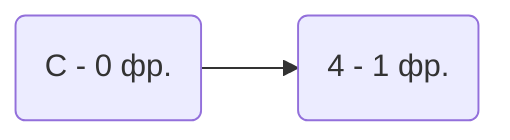

Из A, D и C рёбра ведут в вершины, которые уже рассматривались => совершенное парасочетание найдено не было

3. Повторная редукция матрицы затрат (по диагонали).

Множество X - все **покрытые построенным деревом** вершины первой доли графа
Множество Y - все **покрытые построенным деревом** вершины из второй доли графа
Множество не Y - все **непокрытые построенным деревом** вершины из второй доли графа

$$
X = \{A, D, C\}
$$

$$
Y = \{ 4\}
$$

$$
\overline{Y} = \{1, 2,3, 5\}
$$
Необходимо найти минимальный элемент из строк, включенных во множество X и столбцов, не включенных во множество Y.

В нашем случае минимальным элементом оказался 1 ==> производим редукцию
|       | **1** | **2** | **3** | **4** | **5**  | **min** |
|-------|:-----:|:-----:|:-----:|:-----:|:-----: | :------:|
| **A** |   5   |   6    |   1   |   0   |   4   |  -1     |
| **B** |   0   |    0   |   4   |  5    |   0   |
| **C** |   7   |   6    |   2   |   0   |   6   | -1
| **D** |   8   |   5    |   1   |   0   |   5   | -1
| **E** |   2   |    9   |   0   |  10   |   0   |
|**min**|       |        |       |   +1  |       |

Результат редукции

|       | **1** | **2** | **3** | **4** | **5** |
|-------|:-----:|:-----:|:-----:|:-----:|:-----:|
| **A** |   4   |   5    |   0   |   0   |   3   |
| **B** |   0   |    0   |   4   |  6    |   0   |
| **C** |   8   |   7    |   3   |   0   |   7   |
| **D** |   7   |   4    |   0   |   0   |   4   |
| **E** |   2   |    9   |   0   |  11   |   0   |

В ячейке A3 и ячейке D3 появились новые нулевые значения. Соответствующие ребра добавлены в двудольный граф.

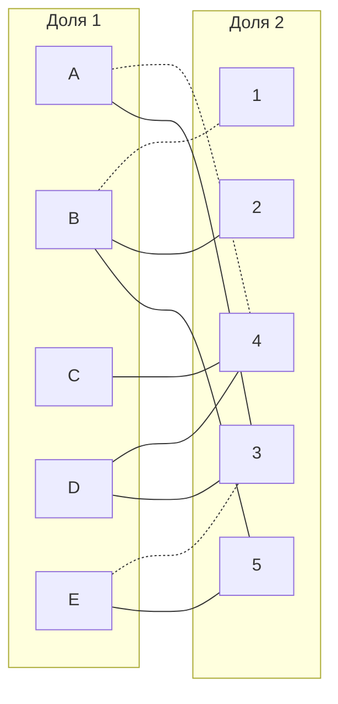
4. Попытка снова найти совершенное парасочетание при помощи чередующихся деревьев

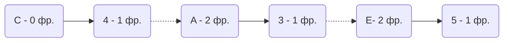
Построенное дерево содержит чередующуюся, относительно текущего паросочетания, цепь C4 - A3 - E5, цепь начинается и заканчивается в непокрытых вершинах, все ребра в цепи чередуются по вхождению в текущее паросочетание. Найденная цепь перекрашена.

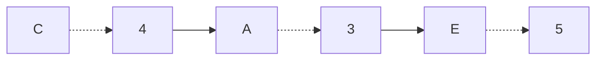
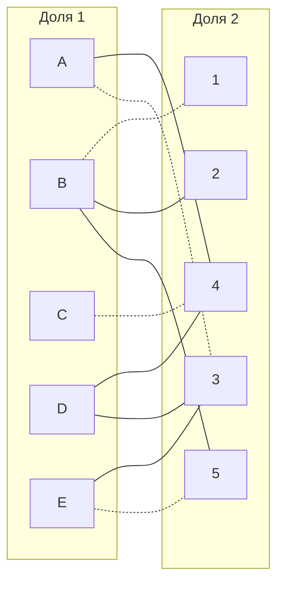
Есть непокрытая вершина D пробуем построить дерево.

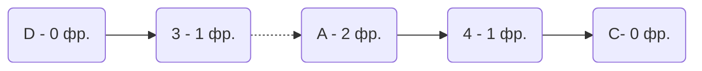

$$
X = \{A, D, C\}
$$

$$
Y = \{ 4,3\}
$$

$$
\overline{Y} = \{1, 2, 5\}
$$
Необходимо найти минимальный элемент из строк, включенных во множество X и столбцов, не включенных во множество Y.

|       | **1** | **2** | **3** | **4** | **5** |**min**|
|-------|:-----:|:-----:|:-----:|:-----:|:-----:|:-----:|
| **A** |   4   |   5    |   0   |   0   |   3   |   -3 | 
| **B** |   0   |   0    |   4   |   6   |   0   |      |
| **C** |   8   |   7    |   3   |   0   |   7   |   -3 |
| **D** |   7   |   4    |   0   |   0   |   4   |   -3 |
| **E** |   2   |   9    |   0   |  11   |   0   |      |
| **min**|      |        |   +3  |  +3   |       |      |

Результат редукции

|       | **1** | **2** | **3** | **4** | **5** |
|-------|:-----:|:-----:|:-----:|:-----:|:-----:|
| **A** |   1   |   2    |   0   |   0   |   0   |
| **B** |   0   |    0   |   7   |   9   |   0   |
| **C** |   5   |   4    |   3   |   0   |   4   |
| **D** |   4   |   1    |   0   |   0   |   1   |
| **E** |   2   |    9   |   3   |  14   |   0   |

Добавился 0 A5 убрался 0 E3

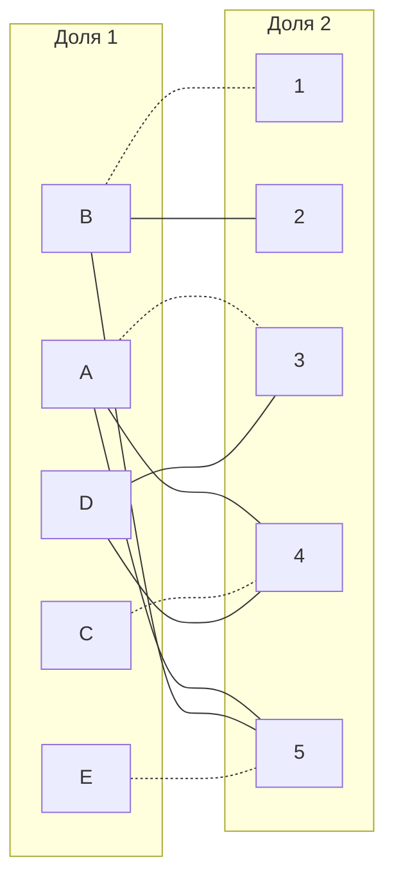

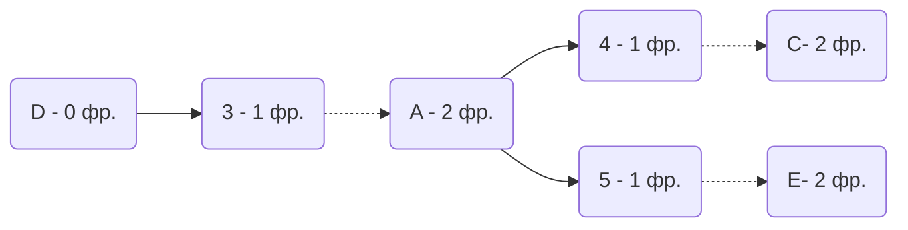
$$
X = \{A, D, C, E\}
$$

$$
Y = \{4,3,5\}
$$

$$
\overline{Y} = \{1, 2\}
$$
|       | **1** | **2** | **3** | **4** | **5**  | **min** |
|-------|:-----:|:-----:|:-----:|:-----:|:-----: |:-------:|
| **A** |   1   |   2    |   0   |   0   |   0   |   -1    |
| **B** |   0   |    0   |   7   |   9   |   0   |         |
| **C** |   5   |   4    |   3   |   0   |   4   |   -1    |
| **D** |   4   |   1    |   0   |   0   |   1   |   -1    |
| **E** |   2   |    9   |   3   |  14   |   0   |   -1    |
|**min**|       |        |  +1   |   +1  |   +1  |         |    

результат

|       | **1** | **2** | **3** | **4** | **5** |
|-------|:-----:|:-----:|:-----:|:-----:|:-----:|
| **A** |   0   |   1    |   0   |   0   |   0   |
| **B** |   0   |    0   |   8   |   10   |  1   |
| **C** |   4   |   3    |   3   |   0   |   4   |
| **D** |   3   |   0    |   0   |   0   |   1   |
| **E** |   1   |    8   |   3   |  14   |   0   |

Новый A1 0, D2 0   Убрался В5

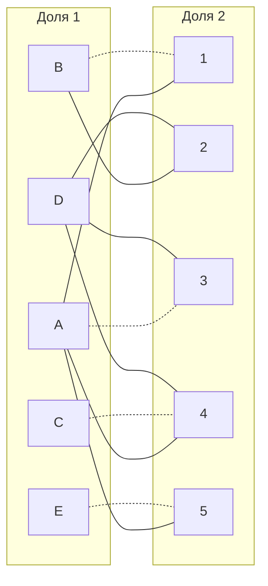

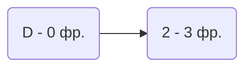
Данное дерево содержит цепь, которая начинается и заканчивается в непокрытой вершине, внутри него ребра чередются. Цепь D-1-B-2

"Перекрасим" найденную цепь.
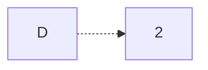

Полученное парасочетание является совершенным. Выпишем полученные назначения и их стоимости из исходной матрицы:
- A3 - 10
- B1 - 7
- C4 - 12
- D2 - 6
- E5 - 6

Общая стоимость затрат = 42.

## Ответ
Минимальная стоимость затрат 42, при следующих назначениях:
- задача D, исполнитель 2,
- задача C, исполнитель 4,
- задача B, исполнитель 1,
- задача A, исполнитель 3,
- задача E, исполнитель 5.