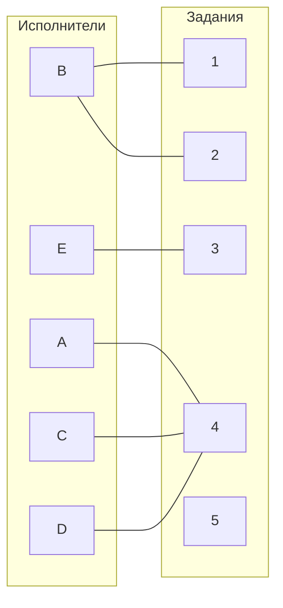
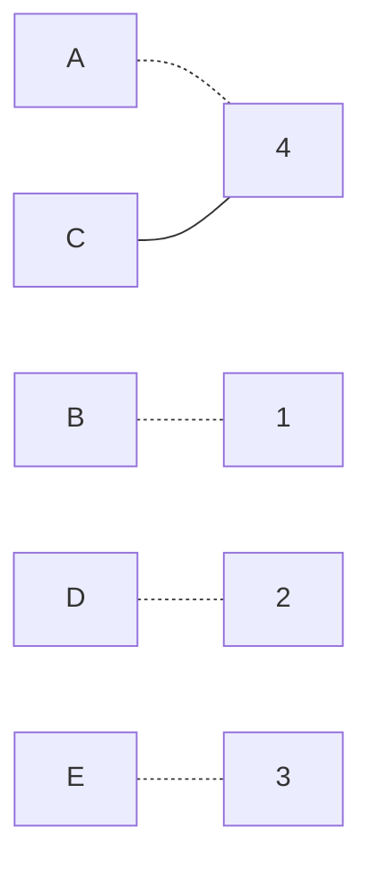
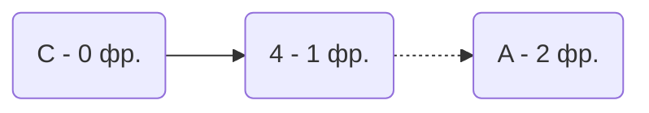

# Задача о назначениях. Венгерский алгоритм  
**Вариант 9**

---

## Постановка задачи

Имеется 5 заданий \(A, B, C, D, E\) и 5 исполнителей \(1, 2, 3, 4, 5\).  
Стоимость выполнения задания \(i\) исполнителем \(j\) задана матрицей затрат, приведённой ниже.  
Необходимо найти назначение исполнителей на задания, при котором суммарная стоимость затрат **минимальна**.

### Исходная матрица затрат

|       | **1** | **2** | **3** | **4** | **5** |
|-------|:-----:|:-----:|:-----:|:-----:|:-----:|
| **A** |  14   |  15   |  10   |   9   |  14   | 
| **B** |   7   |   7   |  11   |  12   |   8   |
| **C** |  15   |  14   |  10   |   7   |  15   |
| **D** |  15   |  12   |   8   |   7   |  13   |
| **E** |   7   |  14   |   5   |  15   |   6   |

## 1 шаг: Редукция матрицы по строкам

|       | **1** | **2** | **3** | **4** | **5** | **min**  |
|-------|:-----:|:-----:|:-----:|:-----:|:-----:|:--------:|
| **A** |  14   |  15   |  10   |   9   |  14   |   -9    |
| **B** |   7   |   7   |  11   |  12   |   8   |   -7    |
| **C** |  15   |  14   |  10   |   7   |  15   |   -7    |
| **D** |  15   |  12   |   8   |   7   |  13   |   -7    |
| **E** |   7   |  14   |   5   |  15   |   6   |   -5    |

Редуцированная матрица:

|       | **1** | **2** | **3** | **4** | **5** |
|-------|:-----:|:-----:|:-----:|:-----:|:-----:|
| **A** |   5   |   6   |   1   |   0   |   5   | 
| **B** |   0   |   0   |   4   |   5   |   1   |
| **C** |   8   |   7   |   3   |   0   |   8   |
| **D** |   8   |   5   |   1   |   0   |   6   |
| **E** |   2   |   9   |   0   |  10   |   1   |

## 2 шаг: Построение двудольного графа

## 3 шаг: Выбор паросочетания и поиск чередующейся цепи

Начальное паросочетание:
- [A ; 4]
- [B ; 1]
- [D ; 2]
- [E ; 3]

Построение чередующегося дерева:

Перекрашивание цепи приводит к совершенному паросочетанию:
- [A ; 4]
- [B ; 1]
- [C ; 5]
- [D ; 2]
- [E ; 3]

## Итоговые назначения и стоимость:

| Работник | Задание | Затраты |
|----------|--------|---------|
| A        | 4      |   9     |
| B        | 1      |   7     |
| C        | 5      |   15    |
| D        | 2      |   12    |
| E        | 3      |   5     |

**Минимальная сумма затрат: 42**

## Ответ:
Минимальная стоимость затрат **42**, при следующих назначениях:
- A выполняет задание 4
- B выполняет задание 1
- C выполняет задание 5
- D выполняет задание 2
- E выполняет задание 3
