# Задание №8. Вариант 6

## Дана матрица затрат:

|       | **1** | **2** | **3** | **4** | **5** |
|-------|:-----:|:-----:|:-----:|:-----:|:-----:|
| **A** |  12   |  13   |   9   |  11   |  11   |
| **B** |   5   |  11   |  13   |  12   |  11   |
| **C** |   6   |  14   |  13   |  13   |  12   |
| **D** |  11   |   7   |  11   |  15   |   9   |
| **E** |   8   |  11   |  10   |  15   |  13   |

# Решение
## Шаг 1:

Необходимо сделать редукцию матрицы. Для этого вычтем из каждой строки минимальное значение.

|       | **1** | **2** | **3** | **4** | **5** | **Min** |
|-------|:-----:|:-----:|:-----:|:-----:|:-----:|:-----:|
| **A** |  12   |  13   |   9   |  11   |  11   |  -9   |
| **B** |   5   |  11   |  13   |  12   |  11   |  -5   |
| **C** |   6   |  14   |  13   |  13   |  12   |  -6   |
| **D** |  11   |   7   |  11   |  15   |   9   |  -7   |
| **E** |   8   |  11   |  10   |  15   |  13   |  -8   |

Мы получили

|       | **1** | **2** | **3** | **4** | **5** |
|-------|:-----:|:-----:|:-----:|:-----:|:-----:|
| **A** |  3   |  4   |   0   |  2   |  2   |
| **B** |   0   |  6   |  8   |  7   |  6   |
| **C** |   0   |  8   |  7   |  7   |  6   |
| **D** |  4   |   0   |  4   |  8   |   2   |
| **E** |   0   |  3   |  2   |  7   |  5   |

Теперь из получившейся матрицы, мы должны вычесть минимальное значение из столбцов.

|       | **1** | **2** | **3** | **4** | **5** |
|-------|:-----:|:-----:|:-----:|:-----:|:-----:|
| **A** |  3   |  4   |   0   |  2   |  2   |
| **B** |   0   |  6   |  8   |  7   |  6   |
| **C** |   0   |  8   |  7   |  7   |  6   |
| **D** |  4   |   0   |  4   |  8   |   2   |
| **E** |   0   |  3   |  2   |  7   |  5   |
| **Min** | 0 | 0 | 0 | -2 | -2 |

Мы получили отредуцированную, где нули обозначают наименее затратные варианты назначений.

|       | **1** | **2** | **3** | **4** | **5** |
|-------|:-----:|:-----:|:-----:|:-----:|:-----:|
| **A** |  3   |  4   |   **0**   |  **0**  |  **0**  |
| **B** |   **0**  |  6   |  8   |  5   |  4   |
| **C** |  **0**   |  8   |  7   |  5   |  4   |
| **D** |  4   |   **0**   |  4   | 6   |   **0**  |
| **E** |   **0**  |  3   |  2   |  5   |  3   |

## Шаг 2:
Теперь построим двудольный граф, ребра в котором - нули в редуцированной матрице.

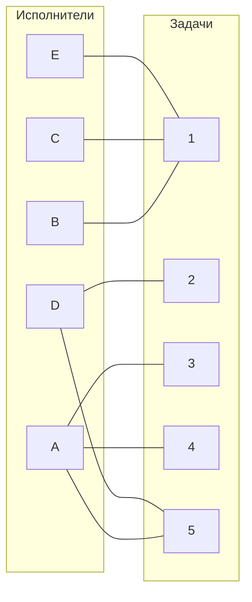

Рассмотрим произвольное паросочетание, включающее рёбра: A -> 3, B -> 1, D -> 2. Попробуем построить совершенное паросочетание, используя построение чередующегося дерева.

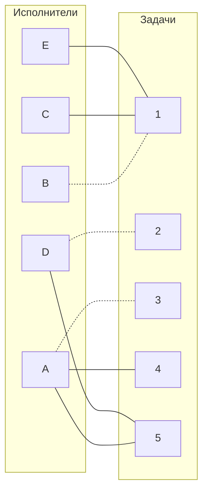

Теперь нужно попытаться построить дерево из оставшихся непокрытых вершин C и E.

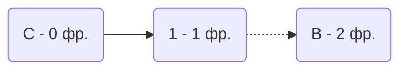
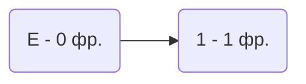
Мы пошли из C в 1, затем в B - ветка закончилась в покрытой вершине.
Мы пошли из E в 1, а в B мы не можем пойти т.к. мы уже ходили по ней, когда шли из C.

В этом графе нет совершенного паросочетания.

## Шаг 3:
Проведем повторную редукцию матрицы затрат. Выпишем несколько множеств.

Множество $X$ - представляет собой **покрытые построенным деревом** вершины первой доли графа.

Множество $Y$ - представляет собой **покрытые построенным деревом** вершины из второй доли графа.

Множество  $\overline{Y}$ - представляет собой **непокрытые построенным деревом** вершины из второй доли графа

$$X = \{ C, B, E\}$$
$$Y = \{1\}$$
$$\overline{Y} = \{2, 3, 4, 5\}$$

Необходимо найти минимальный элемент из строк, включенных во множество $X$ и столбцов, включенных во множество $\overline{Y}$. В нашем случае это будут строки C, B, E и столбцы 2, 3, 4, 5. Минимальный элемент - 2, который находится в E3

Вычтем найденное значение из строк множества $X$ и прибавим к столбцам множества $Y$:

Было:

|       | **1** | **2** | **3** | **4** | **5** | **Min**|
|-------|:-----:|:-----:|:-----:|:-----:|:-----:|:-------:|
| **A** |  3    |  4    | **0** | **0** | **0** |  |
| **B** |  **0** |  6   |  8   |  5   |  4   | -2 |
| **C** |  **0**   |  8   |  7   |  5   | 4   | -2 |
| **D** |  4   |   **0**   |  4   | 6   |   **0**  |  |
| **E** |   **0**  |  3   |  2   |  5   |  3   | -2 |
| **Min** | +2 | 0 | 0 | 0 | 0 |

Стало:

|       | **1** | **2** | **3** | **4** | **5** |
|-------|:-----:|:-----:|:-----:|:-----:|:-----:|
| **A** |  5    |  4    | **0** | **0** | **0** |
| **B** |  **0** |  4   |  6   |  3   |  2   | 
| **C** |  **0**   |  6   |  5   |  3   |  2   |
| **D** |  6   |   **0**   |  4   | 6   |   **0**  |
| **E** |   2  |  1   |  **0**   |  3   |  1   |

Теперь в ячейке Е3 стоит 0, значит мы можем добавить ребро в двудольный граф. 

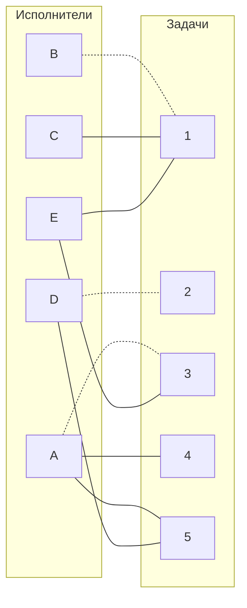

Теперь ещё раз попытаемся построить совершенное паросочетание.

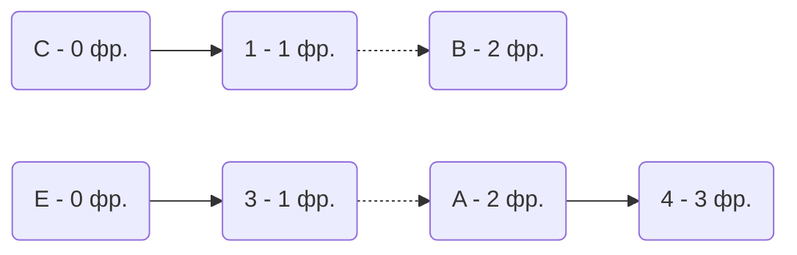

Данное дерево содержит цепь, которая начинается и заканчивается в непокрытой вершине, внутри него ребра чередются. Цепь - E -> 3 -> A -> 4.

"Перекрасим" найденную цепь.

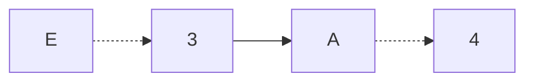

Но, к сожалению, С -> 1 -> B - не образуют цепь т.к. заканчивается в покрытой вершине.

Необходимо вновь провести редукцию матрицы. Составим множества.

$$X = \{С, B\}$$
$$Y = \{1\}$$
$$\overline{Y} = \{2, 3, 4, 5\}$$

Необходимо найти минимальный элемент из строк, включенных во множество $X$ и столбцов, включенных во множество $\overline{Y}$. В нашем случае это будут строки C, B и столбцы 2, 3, 4, 5. Минимальный элемент - 2, который находится в B5 и С5

Вычтем найденное значение из строк множества $X$ и прибавим к столбцам множества $Y$:

Было:

|       | **1** | **2** | **3** | **4** | **5** |**Min** |
|-------|:-----:|:-----:|:-----:|:-----:|:-----:|:-----:|
| **A** |  5    |  4    | **0** | **0** | **0** |     |
| **B** |  **0** |  4   |  6   |  3   |  2   |   -2  |
| **C** |  **0**   |  6   |  5   |  3   |  2   |  -2  |
| **D** |  6   |   **0**   |  4   | 6   |   **0**  |     |
| **E** |   2  |  1   |  **0**   |  3   |  1   |    -2 |
| **Min** | +2 |  |  |  | |

Стало:

|       | **1** | **2** | **3** | **4** | **5** |
|-------|:-----:|:-----:|:-----:|:-----:|:-----:|
| **A** | 7 | 4 | **0** |   **0**   |  **0**   |   
| **B** | **0** |   2   |  4   | 1   |  **0**   |  
| **C** | 2 |  4   |  3   |  1   | **0** | 
| **D** | 8 |  **0**   |  4   |  6   |  **0**  | 
| **E** |   2  |  1   |  **0**   |  3   | 1 |

В ячейке В5 и С5 появилось новое нулевое значение, добавим соответствующее ребро в двудольный граф. 

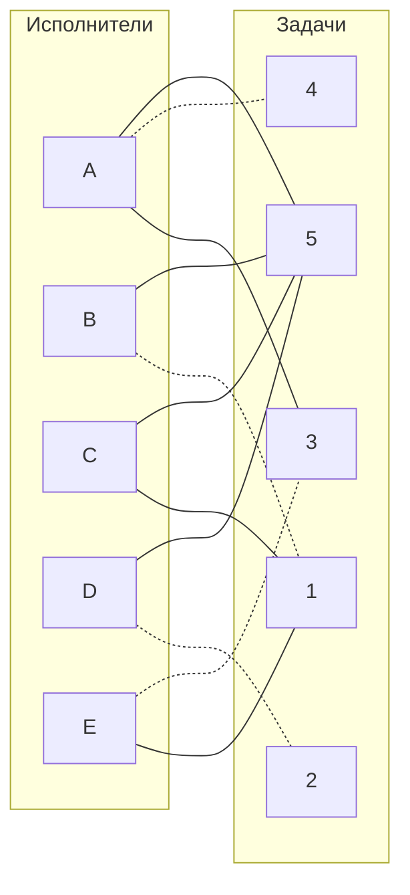

Вновь попытаемся построить совершенное паросочетание.

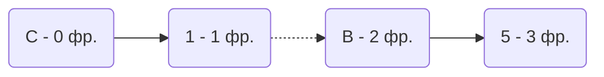

Данное дерево содержит цепь, которая начинается и заканчивается в непокрытой вершине, внутри него ребра чередются. Цепь - C -> 1 -> B -> 5.

"Перекрасим" найденную цепь.

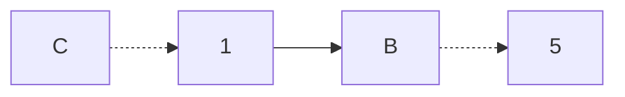

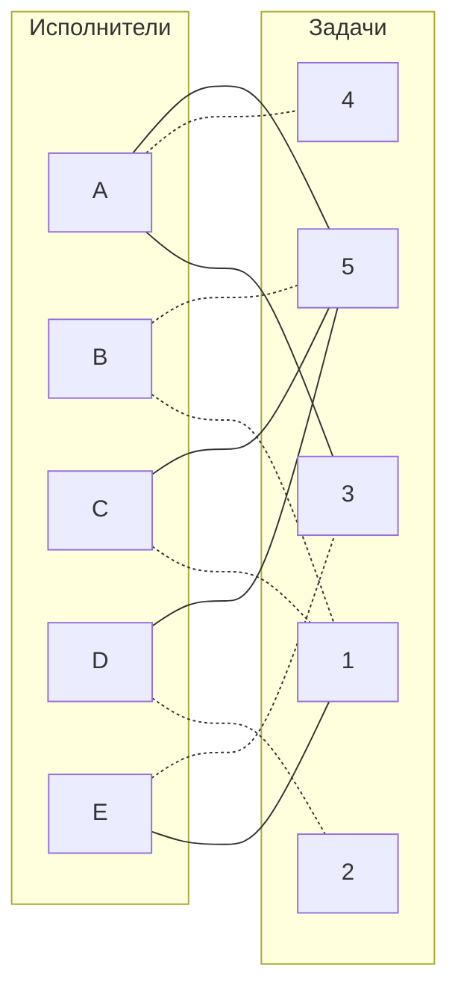

Полученное расписание является совершенным. Выпишем полученные назначения и их стоимости из исходной матрицы:
- C1 - 6
- D2 - 7
- E3 - 10
- A4 - 11
- B5 - 11

Общая стоимость затрат = 6 + 7 + 10 + 11 + 11 = 45.

## Ответ
Минимальная стоимость затрат 45, при следующих назначениях:
- задача A, исполнитель 4,
- задача B, исполнитель 5,
- задача C, исполнитель 1,
- задача D, исполнитель 2,
- задача E, исполнитель 3.
