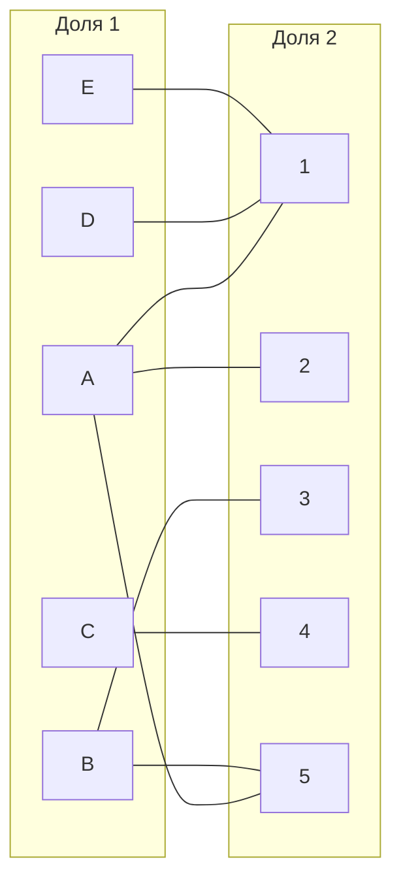
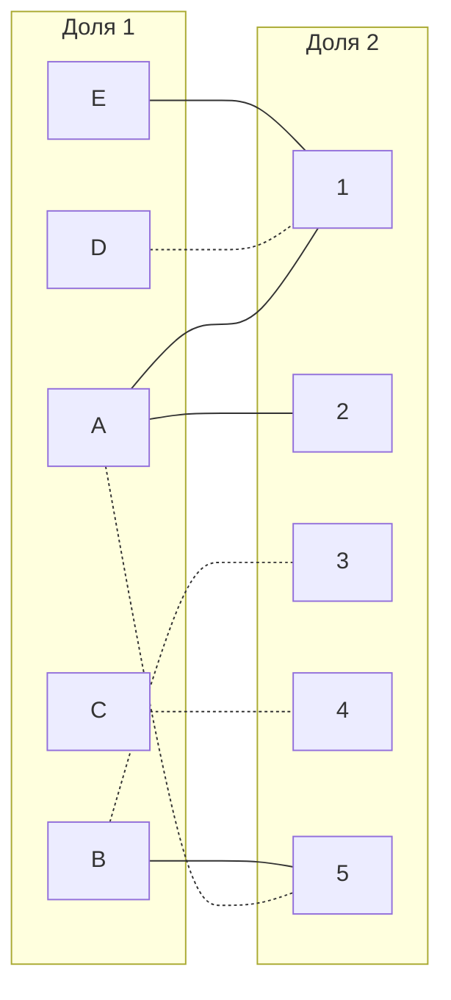
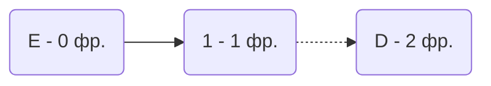
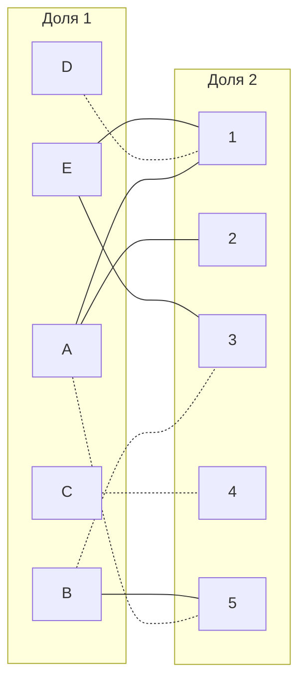
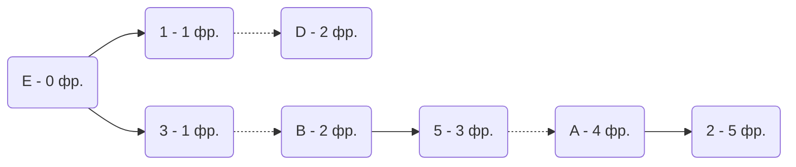
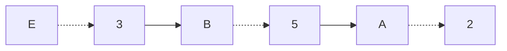
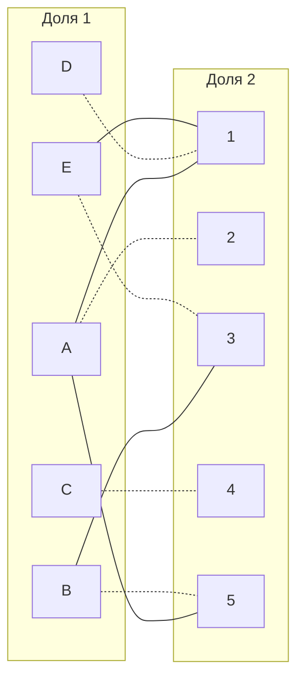

# Задание №8
# Задача о назначениях. Венгерский алгоритм.

## Задание
В каждом варианте представлены условия задачи о назначении, в соответствии с которыми необходимо: 
1. Решить задачу с использованием Венгерского алгоритма.
2. Оформить решение задачи по шагам с подробными комментариями, таблицами и диаграммами.
3. В ответе указать минимальную сумму затрат на выполнение всех заданий.
4. В ответе вывести найденные назначения

## Постановка задачи
1. Дан полный двудольный граф, в котором каждое ребро имеет определенную стоимость. Вершины первой доли представляют задачи, вершины второй доли исполнителей. Стоимость ребра определяет затраты при выполнении соответствующей задачи соответствующим исполнителем. 
2. Затраты неотрицательны и представлены в виде матрицы затрат, в которой на пересечении i-й строки и j-го столбца указаны затраты j-го исполнителя на выполнение i-го задания.
3. Необходимо назначить исполнителей на задачи таким образом, чтобы общая стоимость затрат была минимальной.
4. Задача сводится к нахождению совершенного паросочетания с минимальной суммарной стоимостью в двудольном графе.

## Решение 
### Вариант 1

Дана матрица затрат для задач A, B, C, D, E и исполнителей 1, 2, 3, 4, 5:

|       | **1** | **2** | **3** | **4** | **5** |
|-------|:-----:|:-----:|:-----:|:-----:|:-----:|
| **A** |   6   |   7   |   8   |   14  |   7   |
| **B** |   8   |   14  |   6   |   9   |   7   |
| **C** |   14  |   14  |   13  |   9   |   11  |
| **D** |   5   |   12  |   10  |   9   |   14  |
| **E** |   6   |   10  |   8   |   10  |   15  |

### Проведем редукцию матрицы затрат. 

Вычтем из каждой строки минимальное значение, представленное в этой строке.

|       | **1** | **2** | **3** | **4** | **5** | **Min** |
|-------|:-----:|:-----:|:-----:|:-----:|:-----:|:-------:|
| **A** |   0   |   1   |   2   |   8   |   1   |   -6    |
| **B** |   2   |   8   |   0   |   3   |   1   |   -6    |
| **C** |   5   |   5   |   4   |   0   |   2   |   -9    |
| **D** |   0   |   7   |   5   |   4   |   9   |   -5    |
| **E** |   0   |   4   |   2   |   4   |   9   |   -6    |

После чего вычтем из каждого столбца минимальное значение, представленное в этом столбце.

|         | **1** | **2** | **3** | **4** | **5** | **Min** |
|---------|:-----:|:-----:|:-----:|:-----:|:-----:|:-------:|
| **A**   |   0   |   0   |   2   |   8   |   0   |    6    |
| **B**   |   2   |   7   |   0   |   3   |   0   |    6    |
| **C**   |   5   |   4   |   4   |   0   |   1   |    9    |
| **D**   |   0   |   6   |   5   |   4   |   8   |    5    |
| **E**   |   0   |   3   |   2   |   4   |   8   |    6    |
| **Min** |   0   |   1   |   0   |   0   |   1   |         |

Получим редуцированную матрицу, где нули обозначают наименее затратные варианты назначений.

|         | **1** | **2** | **3** | **4** | **5** |
|---------|:-----:|:-----:|:-----:|:-----:|:-----:|
| **A**   |   0   |   0   |   2   |   8   |   0   |
| **B**   |   2   |   7   |   0   |   3   |   0   |
| **C**   |   5   |   4   |   4   |   0   |   1   |
| **D**   |   0   |   6   |   5   |   4   |   8   |
| **E**   |   0   |   3   |   2   |   4   |   8   |

### Построим двудольный граф.

Вынесем на него те ребра, для которых в редуцированной матрице указаны нули.

Выберем произвольное паросочетание:
- A --- 5
- B --- 3 
- C --- 4
- D --- 1 

Следом попытаемся построить совершенное паросочетание с помощью чередующихся деревьев.

Теперь попытаемся построить дерево из оставшейся непокрытой вершины E.

В построенном дереве нет цепей, чередующихся относительно текущего паросочетания. Выбранное парасочетание максимально, но не совершенно, ведь не покрыты вершины E и 2. А значит, в текущей конфигурации графа задачу не решить. Следовательно, добавим рёбра в граф, проведя повторную редукцию матрицы.

### Проведем повторную редукцию матрицы затрат.

Во множество X выпишем все покрытые построенным деревом вершины первой доли графа, во множество Y все покрытые построенным деревом вершины из второй доли графа.

$$
X = \{E, D \}
$$
$$
Y = \{1 \}
$$

Необходимо найти минимальный элемент из строк, включенных во множество X и столбцов, не включенных во множество Y. 

Во множество Y не включены: 2, 3, 4, 5.

Поэтому в нашем случае это будут строки D, E и столбцы 2, 3, 4, 5.

Минимальный элемент 2, расположен в строке E и столбце 3. 

Вычтем найденное значение из строк множества X и прибавим к столбцам множества Y, компенсировав значение:

|         | **1** | **2** | **3** | **4** | **5** | **Min** |
|---------|:-----:|:-----:|:-----:|:-----:|:-----:|:-------:|
| **A**   |   2   |   0   |   2   |   8   |   0   |         |
| **B**   |   4   |   7   |   0   |   3   |   0   |         |
| **C**   |   7   |   4   |   4   |   0   |   1   |         |
| **D**   |   2   |   4   |   3   |   2   |   6   |    -2   |
| **E**   |   2   |   1   |   0   |   2   |   6   |    -2   |
| **Min** |   +2  |       |       |       |       |         |

В ячейке E3 появилось новое нулевое значение.
Добавим ребро E --- 3 в двудольный граф.

### Попытаемся построить совершенное паросочетание с помощью чередующихся деревьев.

Построенное дерево содержит чередующуюся, относительно текущего паросочетания, цепь E3 - 3B - B5 - 5A - A2.
Цепь начинается и заканчивается в непокрытых вершинах (E и 2), все ребра в цепи чередуются по вхождению в текущее паросочетание.

"Перекрасим" найденную цепь и проверим полученное паросочетание.

Полученное расписание является совершенным.
Итого новые парасочетания:
- A --- 2
- B --- 5
- C --- 4
- D --- 1
- E --- 3 

Выпишем полученные назначения и их стоимости из исходной матрицы:
- A2 - 7
- B5 - 7
- C4 - 9
- D1 - 5
- E3 - 8

Общая стоимость затрат:
7 + 7 + 9 + 5 + 8 = 36.

## Ответ
Минимальная стоимость затрат 36, при следующих назначениях:
- задача A, исполнитель 2,
- задача B, исполнитель 5,
- задача C, исполнитель 4,
- задача D, исполнитель 1,
- задача E, исполнитель 3.