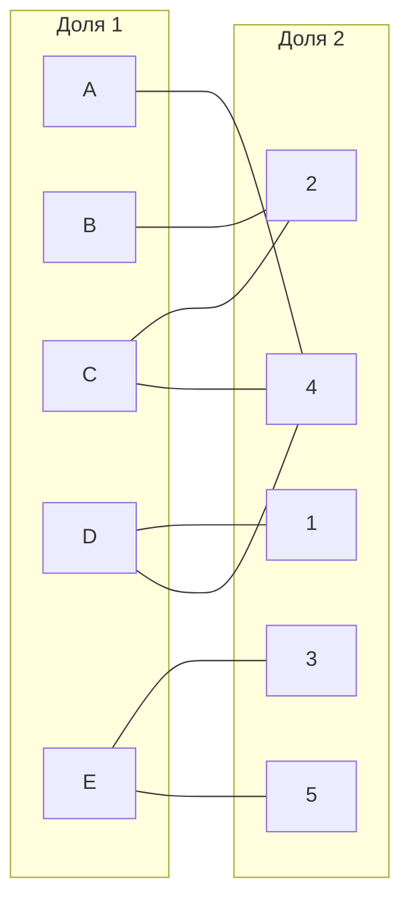
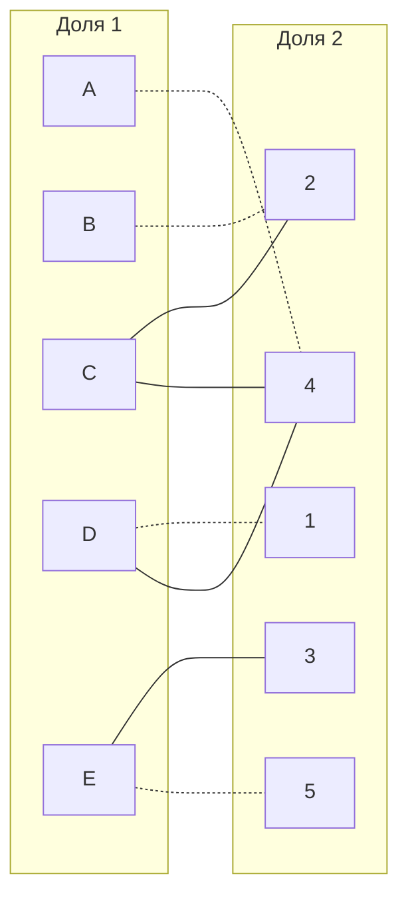
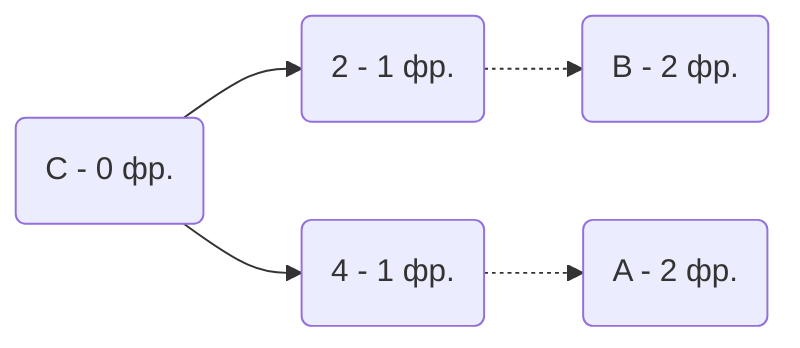
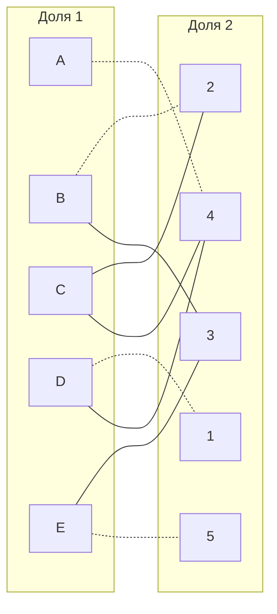
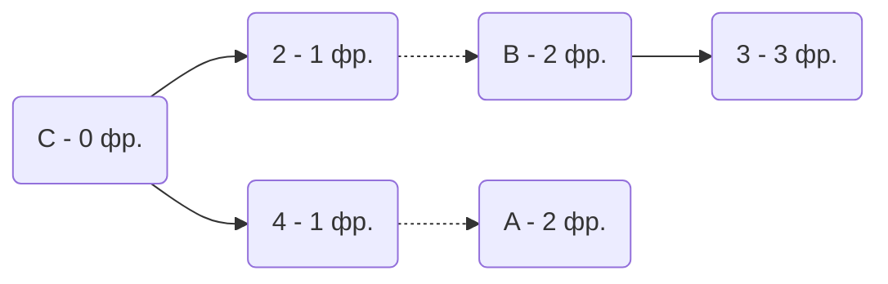
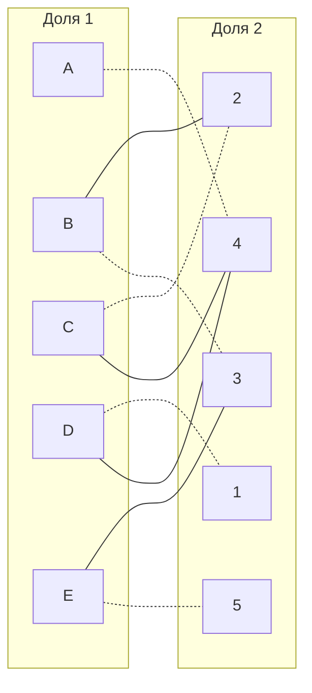

# Задание №8
## Вариант 7
Дана матрица затрат для задач A, B, C, D, E и исполнителей 1, 2, 3, 4, 5:
|       | **1** | **2** | **3** | **4** | **5** |
|-------|:-----:|:-----:|:-----:|:-----:|:-----:|
| **A** |  15   |  15   |   9   |   6   |  10   |
| **B** |  12   |   7   |   9   |  12   |  11   |
| **C** |  11   |   7   |  15   |   7   |  12   |
| **D** |   5   |   9   |   6   |   5   |  15   |
| **E** |  13   |  13   |   6   |  12   |   6   |

1. Редукция матрицы затрат по строке. Вычесть из каждой строки минимальное значение, представленное в этой строке.

|       | **1** | **2** | **3** | **4** | **5** |**Min**|
|-------|:-----:|:-----:|:-----:|:-----:|:-----:|:-----:|
| **A** |  15   |  15   |   9   |   6   |  10   |  -6   |
| **B** |  12   |   7   |   9   |  12   |  11   |  -7   |
| **C** |  11   |   7   |  15   |   7   |  12   |  -7   |
| **D** |   5   |   9   |   6   |   5   |  15   |  -5   |
| **E** |  13   |  13   |   6   |  12   |   6   |  -6   |

Результат редукции по строке:

|       | **1** | **2** | **3** | **4** | **5** |
|-------|:-----:|:-----:|:-----:|:-----:|:-----:|
| **A** |  9    |  9    |   3   |   0   |  4    |
| **B** |  5    |   0   |   2   |   5   |  4    |
| **C** |  4    |   0   |   8   |   0   |  5    |
| **D** |   0   |   4   |   1   |   0   |  10   |
| **E** |   7   |   7   |   0   |   6   |   0   |

Редукция по столбцу не выполняет, так как в каждой строке есть 0.

Была получена редуцированная матрица, где нули обозначают наименее затратные варианты назначений.

2. Построить двудольный граф, где вершины с одной стороны - задачи, другой - исполнители, вынесем рёбра, для которых в редуцированной матрице указаны нули.

Выбрано произвольное паросочетание A --- 4, B --- 2, D --- 1, E --- 5, соответствующие рёбра закрашены. Необходимо выяснить получится ли построить совершенное паросочетание. Сделать это можно при помощи чередующихся деревьев.

Непокрытой осталась только вершина C.

Из A и B рёбра ведут в вершины, которые уже рассматривались => совершенное парасочетание найдено не было

3. Повторная редукция матрицы затрат (по диагонали).

Множество X - все **покрытые построенным деревом** вершины первой доли графа
Множество Y - все **покрытые построенным деревом** вершины из второй доли графа
Множество не Y - все **непокрытые построенным деревом** вершины из второй доли графа

$$
X = \{A, B, C\}
$$

$$
Y = \{2, 4\}
$$

$$
\overline{Y} = \{1, 3, 5\}
$$

|       | **2** | **4** | **1** | **3** | **5** | **_** |
|-------|:-----:|:-----:|:-----:|:-----:|:-----:|:-----:|
| **A** |   9   |   0   |   9   |   3   |  4    |  -2   |
| **B** |   0   |   5   |   5   |   2   |  4    |  -2   |
| **C** |   0   |   0   |   4   |   8   |  5    |  -2   |
| **D** |   4   |   0   |   0   |   1   |  10   |       |
| **E** |   7   |   6   |   7   |   0   |   0   |       |
| **_** |  +2   |  +2   |       |       |       |       |

Стороки и столбцы поменяны местами для удобства процесса редукции

Результат редукции

|       | **2** | **4** | **1** | **3** | **5** |
|-------|:-----:|:-----:|:-----:|:-----:|:-----:|
| **A** |   9   |   0   |   7   |   1   |  2    |
| **B** |   0   |   5   |   3   |   **0**   |  2    |
| **C** |   0   |   0   |   2   |   6   |  3    |
| **D** |   6   |   2   |   0   |   1   |  10   |
| **E** |   9   |   8   |   7   |   0   |   0   |

В ячейке B3 появилось новое нулевое значение. Соответствующее ребро добавлено в двудольный граф.

4. Попытка снова найти совершенное парасочетание при помощи чередующихся деревьев

Построенное дерево содержит чередующуюся, относительно текущего паросочетания, цепь C2 - 2B - B3, цепь начинается и заканчивается в непокрытых вершинах, все ребра в цепи чередуются по вхождению в текущее паросочетание.
Найденная цепь перекрашена.

Полученное парасочетание является совершенным. Выпишем полученные назначения и их стоимости из исходной матрицы:
- A4 - 6
- B3 - 9
- C2 - 7
- D1 - 5
- E5 - 6

Общая стоимость затрат = 6 + 9 + 7 + 5 + 6 = 33.

## Ответ
Минимальная стоимость затрат 33, при следующих назначениях:
- задача D, исполнитель 1,
- задача C, исполнитель 2,
- задача B, исполнитель 3,
- задача A, исполнитель 4,
- задача E, исполнитель 5.