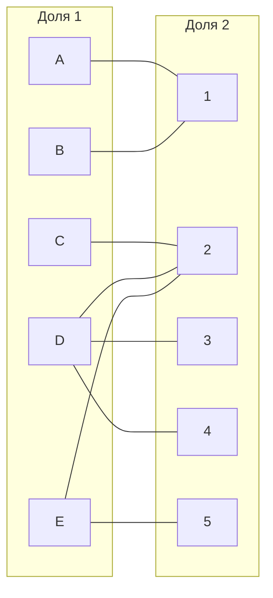
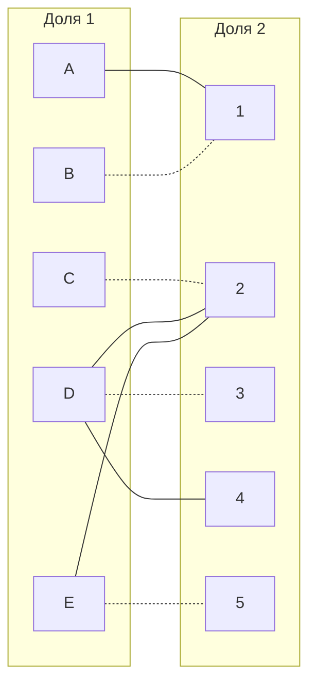
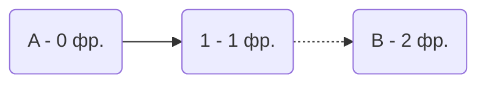
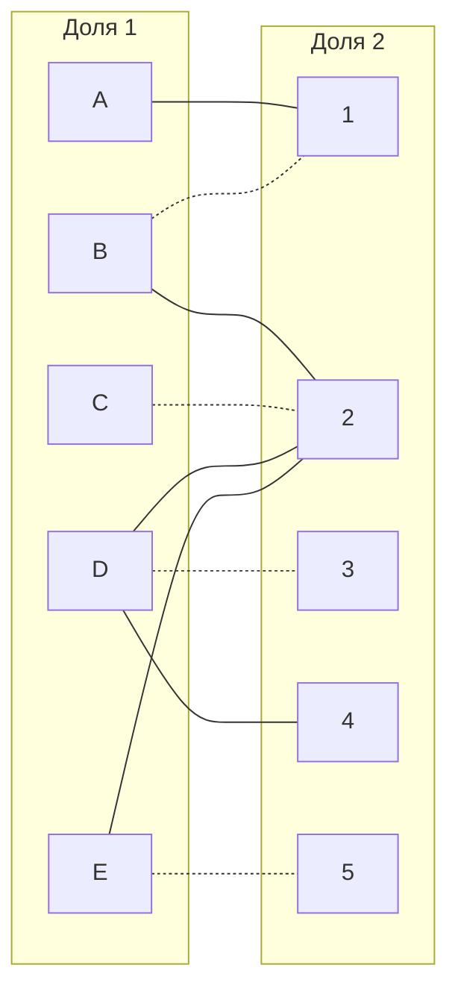
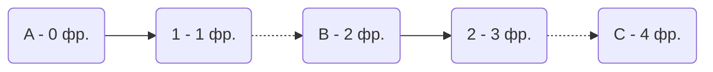
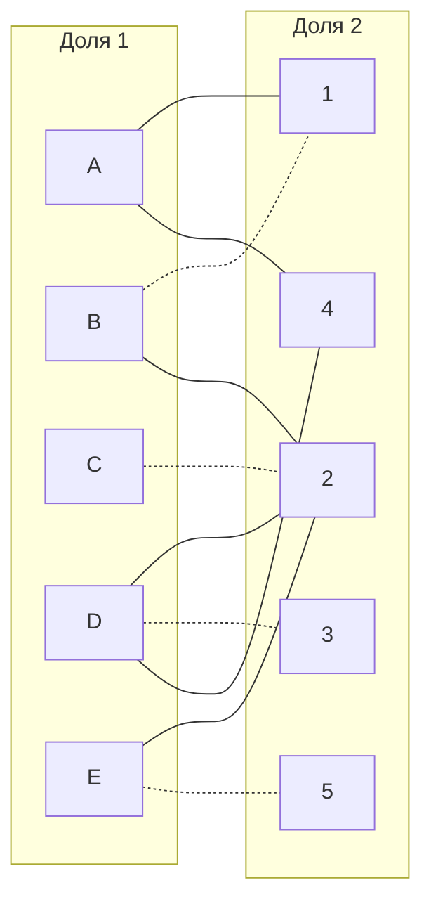
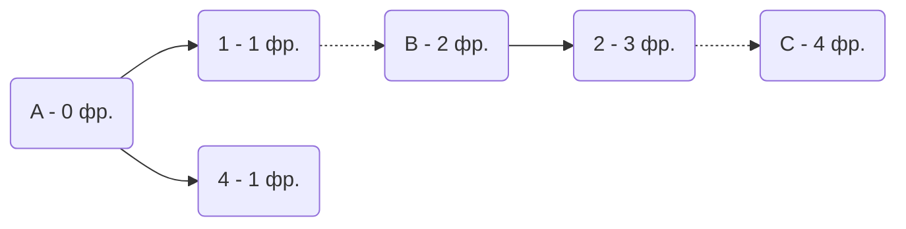
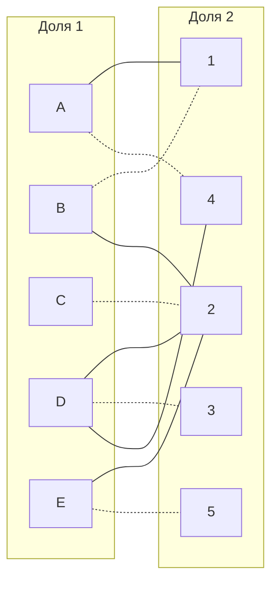

# Задание №8. Вариант 10

## Задание
В каждом варианте представлены условия задачи о назначении, в соответствии с которыми необходимо: 
1. Решить задачу с использованием Венгерского алгоритма.
2. Оформить решение задачи по шагам с подробными комментариями, таблицами и диаграммами.
3. В ответе указать минимальную сумму затрат на выполнение всех заданий.
4. В ответе вывести найденные назначения

## Постановка задачи
1. Дан полный двудольный граф, в котором каждое ребро имеет определенную стоимость. Вершины первой доли представляют задачи, вершины второй доли исполнителей. Стоимость ребра определяет затраты при выполнении соответствующей задачи соответствующим исполнителем. 
2. Затраты неотрицательны и представлены в виде матрицы затрат, в которой на пересечении i-й строки и j-го столбца указаны затраты j-го исполнителя на выполнение i-го задания.
3. Необходимо назначить исполнителей на задачи таким образом, чтобы общая стоимость затрат была минимальной.
4. Задача сводится к нахождению совершенного паросочетания с минимальной суммарной стоимостью в двудольном графе.

Дана матрица затрат для задач A, B, C, D, E и исполнителей 1, 2, 3, 4, 5:

|       | **1** | **2** | **3** | **4** | **5** |
|-------|:-----:|:-----:|:-----:|:-----:|:-----:|
| **A** |   10  |   12  |   15  |   14  |   15  |
| **B** |   5   |   6   |   15  |   13  |   14  |
| **C** |   7   |   5   |   9   |   15  |  11   |
| **D** |   15  |   5   |   7   |   7   |  14   |
| **E** |   6   |   5   |  14   |  10   |   7   |

Проведем редукцию матрицы затрат. Вычтем из каждой строки минимальное значение, представленное в этой строке.

|       | **1** | **2** | **3** | **4** | **5** | **Min** |
|-------|:-----:|:-----:|:-----:|:-----:|:-----:|:-------:|
| **A** |   0   |   2   |   5   |   4   |   5   |   -10   |
| **B** |   0   |   1   |   10  |   8   |   9   |   -5    |
| **C** |   2   |   0   |   4   |   10  |   6   |   -5    |
| **D** |   10  |   0   |   2   |   2   |   9   |   -5    |
| **E** |   1   |   0   |   9   |   5   |   2   |   -5    |

После чего вычтем из каждого столбца минимальное значение, представленное в этом столбце.

|         | **1** | **2** | **3** | **4** | **5** | **Min** |
|---------|:-----:|:-----:|:-----:|:-----:|:-----:|:-------:|
|  **A**  |   0   |   2   |   3   |   2   |   3   |    10   |
|  **B**  |   0   |   1   |   8   |   6   |   7   |    5    |
|  **C**  |   2   |   0   |   2   |   8   |   4   |    5    |
|  **D**  |   10  |   0   |   0   |   0   |   7   |    5    |
|  **E**  |   1   |   0   |   7   |   3   |   0   |    5    |
| **Min** |   0   |   0   |   2   |   2   |   2   |         |

Получим редуцированную матрицу, где нули обозначают наименее затратные варианты назначений.

|         | **1** | **2** | **3** | **4** | **5** |
|---------|:-----:|:-----:|:-----:|:-----:|:-----:|
|  **A**  |   0   |   2   |   3   |   2   |   3   |
|  **B**  |   0   |   1   |   8   |   6   |   7   |
|  **C**  |   2   |   0   |   2   |   8   |   4   |
|  **D**  |   10  |   0   |   0   |   0   |   7   |
|  **E**  |   1   |   0   |   7   |   3   |   0   |

### Построим двудольный граф.

Вынесем на него те ребра, для которых в редуцированной матрице указаны нули.

Выберем произвольное паросочетание B --- 1, C --- 2, D --- 3, E --- 5 и попытаемся построить совершенное паросочетание с помощью чередующихся деревьев.

Попытаемся построить дерево из оставшейся непокрытой вершины A.

В построенном дереве нет цепей, чередующихся относительно текущего паросочетания. Выбранное парасочетание максимально, но не совершенно, ведь не покрыты вершины A и 4. А значит, в текущей конфигурации графа задачу не решить. Следовательно, добавим рёбра в граф, проведя повторную редукцию матрицы.

### Проведем повторную редукцию матрицы затрат.

Во множество X выпишем все покрытые построенным деревом вершины первой доли графа, во множество Y все покрытые построенным деревом вершины из второй доли графа.

$$
X = \{A, B \}
$$
$$
Y = \{1 \}
$$

Необходимо найти минимальный элемент из строк, включенных во множество X и столбцов, не включенных во множество Y. 

Во множество Y не включены: 2, 3, 4, 5.

Поэтому в нашем случае это будут строки A, B и столбцы 2, 3, 4, 5.

Минимальный элемент 1, расположен в строке B и столбце 2. 

Вычтем найденное значение из строк множества X и прибавим к столбцам множества Y, компенсировав значение:

|         | **1** | **2** | **3** | **4** | **5** | **Min** |
|---------|:-----:|:-----:|:-----:|:-----:|:-----:|:-------:|
|  **A**  |   0   |   1   |   2   |   1   |   2   |    -1   |
|  **B**  |   0   |   0   |   7   |   5   |   6   |    -1   |
|  **C**  |   3   |   0   |   2   |   8   |   4   |         |
|  **D**  |   11  |   0   |   0   |   0   |   7   |         |
|  **E**  |   2   |   0   |   7   |   3   |   0   |         |
| **Min** |   +1  |       |       |       |       |         |

В ячейке B2 появилось новое нулевое значение. Добавим ребро B --- 2 в двудольный граф.

### Попытаемся построить совершенное паросочетание с помощью чередующихся деревьев.

В построенном дереве попрежнему нет цепей, чередующихся относительно текущего паросочетания. Выбранное парасочетание максимально, но не совершенно, ведь не покрыты вершины A и 4. А значит, в текущей конфигурации графа задачу не решить. Следовательно, добавим рёбра в граф, проведя повторную редукцию матрицы.

### Проведем еще одну повторную редукцию матрицы затрат.

Во множество X выпишем все покрытые построенным деревом вершины первой доли графа, во множество Y все покрытые построенным деревом вершины из второй доли графа.

$$
X = \{A, B, C \}
$$
$$
Y = \{1, 2 \}
$$

Необходимо найти минимальный элемент из строк, включенных во множество X и столбцов, не включенных во множество Y. 

Во множество Y не включены: 3, 4, 5.

Поэтому в нашем случае это будут строки A, B, C и столбцы 3, 4, 5.

Минимальный элемент 1, расположен в строке A и столбце 4. 

Вычтем найденное значение из строк множества X и прибавим к столбцам множества Y, компенсировав значение:

|         | **1** | **2** | **3** | **4** | **5** | **Min** |
|---------|:-----:|:-----:|:-----:|:-----:|:-----:|:-------:|
|  **A**  |   0   |   1   |   1   |   0   |   1   |    -1   |
|  **B**  |   0   |   0   |   6   |   4   |   5   |    -1   |
|  **C**  |   3   |   0   |   1   |   7   |   3   |    -1   |
|  **D**  |   12  |   1   |   0   |   0   |   7   |         |
|  **E**  |   3   |   1   |   7   |   3   |   0   |         |
| **Min** |   +1  |  +1   |       |       |       |         |

В ячейке A4 появилось новое нулевое значение. Добавим ребро A --- 4 в двудольный граф.

### Попытаемся построить совершенное паросочетание с помощью чередующихся деревьев.

Попробуем построить дерево из непокрытых вершин. Вершина A теперь покрыта, но вершина 4 остается непокрытой. Попробуем построить дерево от вершины 4:

A соединена с вершинами 1 и 4. Из них 1 уже покрыта паросочетанием (B --- 1), но 4 свободна.

"Перекрасим" найденную цепь и проверим полученное паросочетание.

Полученное расписание является совершенным.
Итого новые парасочетания:
- A --- 4
- B --- 1
- C --- 2
- D --- 3
- E --- 5

Выпишем полученные назначения и их стоимости из исходной матрицы:
- A4 - 14
- B1 - 5
- C2 - 5
- D3 - 7
- E5 - 7

Общая стоимость затрат:
14 + 5 + 5 + 7 + 7 = 38.

## Ответ
Минимальная стоимость затрат 38, при следующих назначениях:
- задача A, исполнитель 4,
- задача B, исполнитель 1,
- задача C, исполнитель 2,
- задача D, исполнитель 3,
- задача E, исполнитель 5.