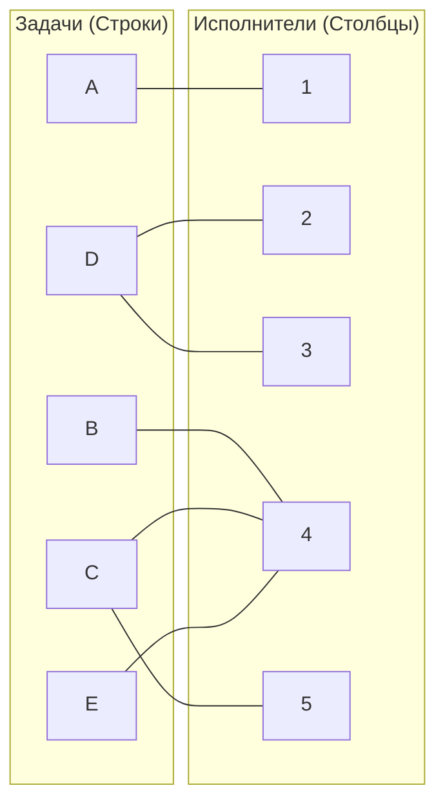
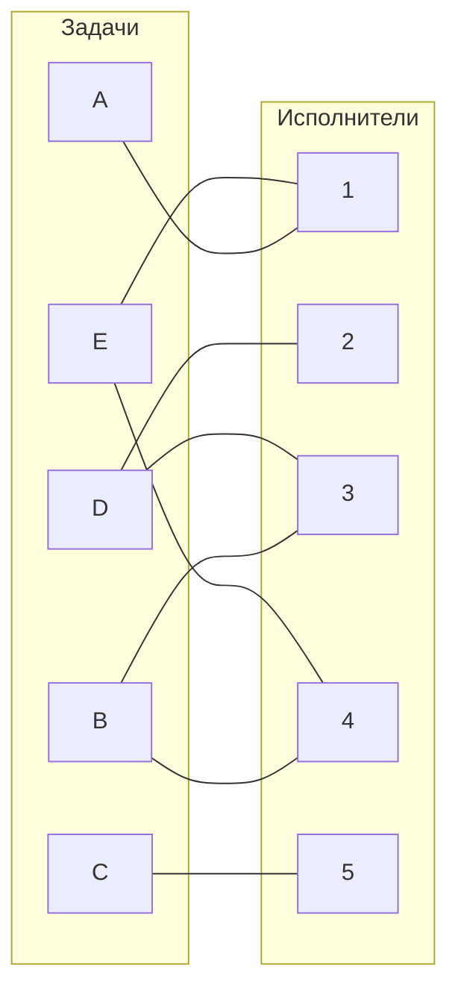
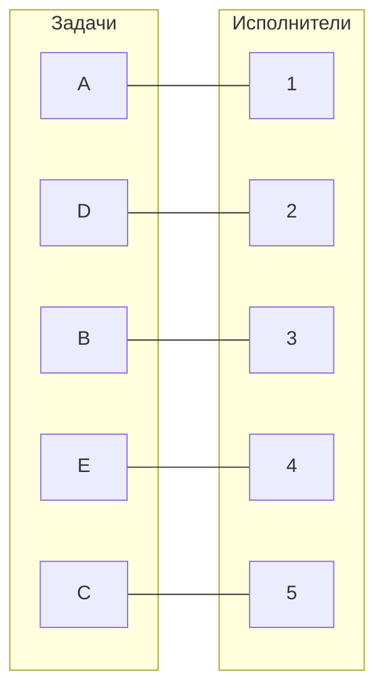

# Задание №8. Вариант 4

## Условие задачи
Дан полный двудольный граф, где строки представляют задачи (A, B, C, D, E), а столбцы – исполнителей (1, 2, 3, 4, 5). Стоимость ребра (ячейка матрицы) – затраты на выполнение соответствующей задачи исполнителем. Требуется найти такое совершённое паросочетание (назначение), при котором общая стоимость затрат минимальна.

Исходная матрица затрат:

|       | **1** | **2** | **3** | **4** | **5** |
|-------|:-----:|:-----:|:-----:|:-----:|:-----:|
| **A** |   5   |  13   |  13   |  15   |  15   |
| **B** |  15   |  14   |   9   |   7   |  13   |
| **C** |  11   |  11   |  15   |   6   |   8   |
| **D** |  10   |  10   |   7   |   8   |  15   |
| **E** |   8   |  12   |  11   |   6   |  14   |

---

## Шаг 1. Редукция по строкам

Для каждой строки вычтем минимальное значение этой строки.

- **Строка A:**  
  Минимальное значение = 5  
  **A:** 5–5 = **0**, 13–5 = 8, 13–5 = 8, 15–5 = 10, 15–5 = 10

- **Строка B:**  
  Минимальное значение = 7  
  **B:** 15–7 = 8, 14–7 = 7, 9–7 = 2, 7–7 = **0**, 13–7 = 6

- **Строка C:**  
  Минимальное значение = 6  
  **C:** 11–6 = 5, 11–6 = 5, 15–6 = 9, 6–6 = **0**, 8–6 = 2

- **Строка D:**  
  Минимальное значение = 7  
  **D:** 10–7 = 3, 10–7 = 3, 7–7 = **0**, 8–7 = 1, 15–7 = 8

- **Строка E:**  
  Минимальное значение = 6  
  **E:** 8–6 = 2, 12–6 = 6, 11–6 = 5, 6–6 = **0**, 14–6 = 8

Получаем матрицу после редукции по строкам:

|       | **1** | **2** | **3** | **4** | **5** |
|-------|:-----:|:-----:|:-----:|:-----:|:-----:|
| **A** |   0   |   8   |   8   |  10   |  10   |
| **B** |   8   |   7   |   2   |   0   |   6   |
| **C** |   5   |   5   |   9   |   0   |   2   |
| **D** |   3   |   3   |   0   |   1   |   8   |
| **E** |   2   |   6   |   5   |   0   |   8   |

---

## Шаг 2. Редукция по столбцам

Для каждого столбца вычтем минимальное значение этого столбца.

- **Столбец 1:**  
  Значения: 0, 8, 5, 3, 2 → минимум = **0**  
  (Столбец не изменяется.)

- **Столбец 2:**  
  Значения: 8, 7, 5, 3, 6 → минимум = **3**  
  После вычитания:  
  8–3 = 5, 7–3 = 4, 5–3 = 2, 3–3 = 0, 6–3 = 3

- **Столбец 3:**  
  Значения: 8, 2, 9, 0, 5 → минимум = **0**  
  (Без изменений.)

- **Столбец 4:**  
  Значения: 10, 0, 0, 1, 0 → минимум = **0**  
  (Без изменений.)

- **Столбец 5:**  
  Значения: 10, 6, 2, 8, 8 → минимум = **2**  
  После вычитания:  
  10–2 = 8, 6–2 = 4, 2–2 = 0, 8–2 = 6, 8–2 = 6

Получаем редуцированную матрицу:

|       | **1** | **2** | **3** | **4** | **5** |
|-------|:-----:|:-----:|:-----:|:-----:|:-----:|
| **A** |   0   |   5   |   8   |  10   |   8   |
| **B** |   8   |   4   |   2   |   0   |   4   |
| **C** |   5   |   2   |   9   |   0   |   0   |
| **D** |   3   |   0   |   0   |   1   |   6   |
| **E** |   2   |   3   |   5   |   0   |   6   |

---

## Шаг 3. Построение двудольного графа по нулевым элементам

Выносим на граф ребра, соответствующие нулевым элементам редуцированной матрицы:

- **Задача A:**  
  Ноль в столбце **1** → ребро A — 1

- **Задача B:**  
  Ноль в столбце **4** → ребро B — 4

- **Задача C:**  
  Нули в столбцах **4** и **5** → ребра C — 4 и C — 5

- **Задача D:**  
  Нули в столбцах **2** и **3** → ребра D — 2 и D — 3

- **Задача E:**  
  Ноль в столбце **4** → ребро E — 4

Схематично граф можно представить так:

---

## Шаг 4. Поиск начального паросочетания и построение чередующихся цепей

**Выбор начального паросочетания:**

- Назначаем **A → 1** (единственный вариант для A).
- Назначаем **B → 4** (единственный вариант для B).
- Для задачи **C** выбираем ребро **C → 5** (так как столбец 4 уже занят).
- Для задачи **D** выбираем ребро **D → 2**.
- Задача **E** имеет лишь ребро **E → 4**, но исполнитель 4 уже занят (B → 4).

Получаем:
- **A → 1**
- **B → 4**
- **C → 5**
- **D → 2**
- **E** – свободна

Для достижения совершённого паросочетания построим дерево чередования, начиная с незакреплённой задачи **E**.

**Построение чередующегося дерева:**

В данном дереве отсутствуют дальнейшие чередующиеся ребра, поэтому паросочетание максимальное, но не совершённое (задача E не покрыта).

---

## Шаг 5. Повторная редукция матрицы

Так как максимальное паросочетание покрывает только 4 задачи, проводим корректировку матрицы.

**Определяем множества:**

- Пусть **X** – множество задач, участвующих в построенном чередующем дереве.  
  Здесь: X = {B, E}
- Пусть **Y** – множество исполнителей, посещённых деревом.  
  Здесь: Y = {4}

**Находим минимальный элемент среди непокрытых ячеек, т.е. среди элементов строк X и столбцов, не входящих в Y:**
- Непокрытые столбцы: 1, 2, 3, 5.
- Для строки **B:** значения: 8 (Столбец1), 4 (Столбец2), 2 (Столбец3), 4 (Столбец5) → минимум = **2**.
- Для строки **E:** значения: 2 (Столбец1), 3 (Столбец2), 5 (Столбец3), 6 (Столбец5) → минимум = **2**.

Минимальное значение = **2**.

**Корректировка матрицы:**

- Для строк, входящих в **X** (B и E): вычесть 2 из ячеек, находящихся в столбцах, не входящих в **Y** (1, 2, 3, 5); ячейки в столбце **Y** остаются без изменений.
- Для строк, не входящих в **X** (A, C, D): прибавить 2 к ячейкам, находящимся в столбце **Y**; остальные ячейки остаются без изменений.
Применим корректировку к редуцированной матрице:

Исходная редуцированная матрица:

|       | **1** | **2** | **3** | **4** | **5** |
|-------|:-----:|:-----:|:-----:|:-----:|:-----:|
| **A** |   0   |   5   |   8   |  10   |   8   |
| **B** |   8   |   4   |   2   |   0   |   4   |
| **C** |   5   |   2   |   9   |   0   |   0   |
| **D** |   3   |   0   |   0   |   1   |   6   |
| **E** |   2   |   3   |   5   |   0   |   6   |

После корректировки:

- **Строка A** (не входит в **X**):
  - Столбцы 1, 2, 3, 5: без изменений → (0, 5, 8, 8)
  - Столбец 4 (**Y**): 10 + 2 = **12**
  
  Итог: (0, 5, 8, **12**, 8)

- **Строка B** (входит в **X**):
  - Столбцы 1, 2, 3, 5: 8 – 2 = 6, 4 – 2 = 2, 2 – 2 = 0, 4 – 2 = 2
  - Столбец 4 (**Y**): без изменений (0)
  
  Итог: (6, 2, **0**, 0, 2)

- **Строка C** (не входит в **X**):
  - Столбцы 1, 2, 3, 5: без изменений → (5, 2, 9, 0)
  - Столбец 4 (**Y**): 0 + 2 = **2**
  
  Итог: (5, 2, 9, **2**, 0)

- **Строка D** (не входит в **X**):
  - Столбцы 1, 2, 3, 5: без изменений → (3, 0, 0, 6)
  - Столбец 4 (**Y**): 1 + 2 = **3**
  
  Итог: (3, 0, 0, **3**, 6)

- **Строка E** (входит в **X**):
  - Столбцы 1, 2, 3, 5: 2 – 2 = 0, 3 – 2 = 1, 5 – 2 = 3, 6 – 2 = 4
  - Столбец 4 (**Y**): без изменений (0)
  
  Итог: (**0**, 1, 3, 0, 4)

Новая матрица после корректировки:

|       | **1** | **2** | **3** | **4** | **5** |
|-------|:-----:|:-----:|:-----:|:-----:|:-----:|
| **A** |   0   |   5   |   8   | **12**|   8   |
| **B** |   6   |   2   |   0   | **0** |   2   |
| **C** |   5   |   2   |   9   | **2** |   0   |
| **D** |   3   |   0   |   0   | **3** |   6   |
| **E** |   0   |   1   |   3   | **0** |   4   |

Построим новый двудольный граф по нулевым элементам.

**Нули по строкам новой матрицы:**

- **A:** ноль в столбце **1** → A — 1
- **B:** нули в столбцах **3** и **4** → B — 3 и B — 4
- **C:** ноль в столбце **5** → C — 5
- **D:** нули в столбцах **2** и **3** → D — 2 и D — 3
- **E:** нули в столбцах **1** и **4** → E — 1 и E — 4

Схематично граф теперь выглядит так:

---

## Шаг 6. Поиск совершённого паросочетания через чередующиеся цепи

**Исходное частичное паросочетание (Шаг 4):**
- **A → 1**
- **B → 4**
- **C → 5**
- **D → 2**
- **E** – свободна

После дополнительной редукции матрицы появляются новые нулевые элементы, которые могут позволить расширить текущее паросочетание. 

Исходя из дерева чередования (Реализовано на шаге 4), которое начинается с задачи **E**, видно, что от задачи E через исполнитель 4 можно дойти до закреплённой задачи B. Если в обновлённой матрице у задачи B появился альтернативный нулевой элемент (например, в столбце 3), то можно переназначить задачу B на этот новый исполнитель, что освободит столбец 4 для задачи E.

В результате операции увеличения паросочетания обновляем назначения следующим образом:

- A → 1 (без изменений)
- B → 3 (переназначаем, освобождая исполнитель 4)
- C → 5 (без изменений)
- D → 2 (без изменений)
- E → 4 (назначаем теперь задаче E)

Таким образом, итоговое совершённое паросочетание становится:

- **A → 1**
- **B → 3**
- **C → 5**
- **D → 2**
- **E → 4**

Схематично конечное назначение:

---

## Шаг 7. Определение итоговой стоимости и назначений

Сопоставим назначения с исходной матрицей затрат:

- **A → 1:** затраты = 5
- **B → 3:** затраты = 9
- **C → 5:** затраты = 8
- **D → 2:** затраты = 10
- **E → 4:** затраты = 6

**Общая стоимость затрат:**  
5 + 9 + 8 + 10 + 6 = **38**

---

## Ответ

Минимальная суммарная стоимость затрат равна **38**.

Оптимальные назначения:
- Задача **A** – исполнитель **1**,
- Задача **B** – исполнитель **3**,
- Задача **C** – исполнитель **5**,
- Задача **D** – исполнитель **2**,
- Задача **E** – исполнитель **4**.
