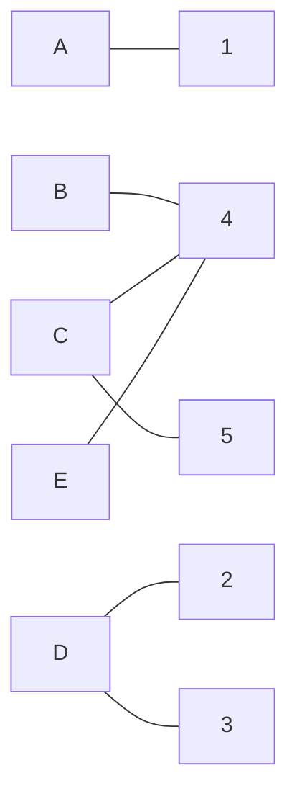
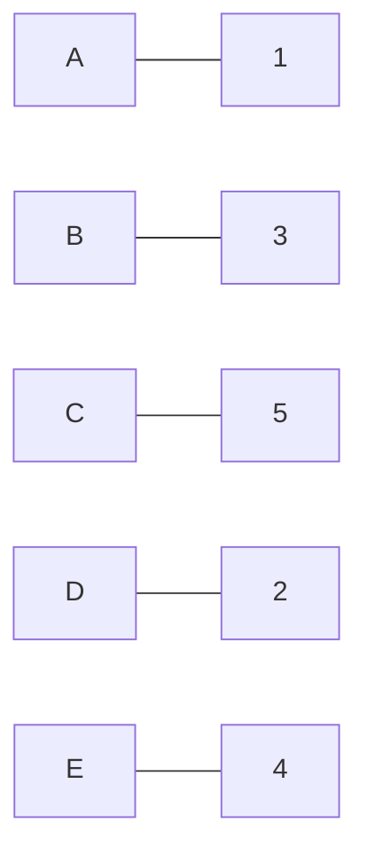

# Решение задачи о назначениях. Вариант 4

## Исходные данные

Дана матрица затрат для задач **A, B, C, D, E** и исполнителей **1, 2, 3, 4, 5**:

|       | **1** | **2** | **3** | **4** | **5** |
|-------|:-----:|:-----:|:-----:|:-----:|:-----:|
| **A** |   5   |  13   |  13   |  15   |  15   |
| **B** |  15   |  14   |   9   |   7   |  13   |
| **C** |  11   |  11   |  15   |   6   |   8   |
| **D** |  10   |  10   |   7   |   8   |  15   |
| **E** |   8   |  12   |  11   |   6   |  14   |

---

## Шаг 1. Редукция по строкам

Для каждой строки вычтем минимальное значение в строке.

- **Строка A:**  
  Минимум = 5  
  Новые элементы:  
  5-5 = **0**, 13-5 = **8**, 13-5 = **8**, 15-5 = **10**, 15-5 = **10**

- **Строка B:**  
  Минимум = 7  
  Новые элементы:  
  15-7 = **8**, 14-7 = **7**, 9-7 = **2**, 7-7 = **0**, 13-7 = **6**

- **Строка C:**  
  Минимум = 6  
  Новые элементы:  
  11-6 = **5**, 11-6 = **5**, 15-6 = **9**, 6-6 = **0**, 8-6 = **2**

- **Строка D:**  
  Минимум = 7  
  Новые элементы:  
  10-7 = **3**, 10-7 = **3**, 7-7 = **0**, 8-7 = **1**, 15-7 = **8**

- **Строка E:**  
  Минимум = 6  
  Новые элементы:  
  8-6 = **2**, 12-6 = **6**, 11-6 = **5**, 6-6 = **0**, 14-6 = **8**

**Редуцированная по строкам матрица:**

|       | **1** | **2** | **3** | **4** | **5** |
|-------|:-----:|:-----:|:-----:|:-----:|:-----:|
| **A** |   0   |   8   |   8   |  10   |  10   |
| **B** |   8   |   7   |   2   |   0   |   6   |
| **C** |   5   |   5   |   9   |   0   |   2   |
| **D** |   3   |   3   |   0   |   1   |   8   |
| **E** |   2   |   6   |   5   |   0   |   8   |

---

## Шаг 2. Редукция по столбцам

В каждом столбце вычтем минимальное значение столбца.

1. **Столбец 1:**  
   Элементы: 0, 8, 5, 3, 2 → минимум = **0**  
   (без изменений)

2. **Столбец 2:**  
   Элементы: 8, 7, 5, 3, 6 → минимум = **3**  
   Новые элементы: 8-3 = **5**, 7-3 = **4**, 5-3 = **2**, 3-3 = **0**, 6-3 = **3**

3. **Столбец 3:**  
   Элементы: 8, 2, 9, 0, 5 → минимум = **0**  
   (без изменений)

4. **Столбец 4:**  
   Элементы: 10, 0, 0, 1, 0 → минимум = **0**  
   (без изменений)

5. **Столбец 5:**  
   Элементы: 10, 6, 2, 8, 8 → минимум = **2**  
   Новые элементы: 10-2 = **8**, 6-2 = **4**, 2-2 = **0**, 8-2 = **6**, 8-2 = **6**

**Редуцированная матрица после столбцовой редукции:**

|       | **1** | **2** | **3** | **4** | **5** |
|-------|:-----:|:-----:|:-----:|:-----:|:-----:|
| **A** |   0   |   5   |   8   |  10   |   8   |
| **B** |   8   |   4   |   2   |   0   |   4   |
| **C** |   5   |   2   |   9   |   0   |   0   |
| **D** |   3   |   3   |   0   |   1   |   6   |
| **E** |   2   |   3   |   5   |   0   |   6   |

---

## Шаг 3. Построение двудольного графа и поиск начального паросочетания

На основании нулевых элементов составляем граф, где строки – задачи, а столбцы – исполнители.

**Нули в матрице:**

- **Строка A:** ноль в столбце **1** → ребро **A – 1**
- **Строка B:** ноль в столбце **4** → ребро **B – 4**
- **Строка C:** нули в столбцах **4** и **5** → ребра **C – 4** и **C – 5**
- **Строка D:** нули в столбцах **2** и **3** → ребра **D – 2** и **D – 3**
- **Строка E:** ноль в столбце **4** → ребро **E – 4**

**Двудольный граф:**

Начальное паросочетание (пример):
A – 1
B – 4
C – 5
D – 2

При этом задача E остаётся непокрытой, то есть размер паросочетания равен 4, а для совершённого паросочетания нам нужно 5.

## Шаг 4. Нахождение минимального покрытия нулей и корректировка матрицы
### 4.1. Определение минимального покрытия
Маркировка: отмечаем все не покрытые строки. В данном случае строка E.
Из строки E по нулевым элементам идём к столбцам. Ребро E – 4 → отмечаем столбец 4.
Столбец 4 в паросочетании связан со строкой B (B – 4) → отмечаем строку B.

**Минимальное покрытие (по теореме Кёнига):**  
Неотмеченные строки: A, C, D  
Отмеченные столбцы: 4  
Минимальное покрытие нулей: строки A, C, D и столбец 4.

### 4.2. Определение минимального неохваченного элемента
**Рассматриваем клетки, не покрытые линиями:**  
Строки: не включённые в покрытие – B и E  
Столбцы: не включённые в покрытие – 1, 2, 3, 5  
**Значения:**  
Строка B: (B,1) = 8, (B,2) = 4, (B,3) = 2, (B,5) = 4  
Строка E: (E,1) = 2, (E,2) = 3, (E,3) = 5, (E,5) = 6  
Минимальный неохваченный элемент = 2.  

### 4.3. Корректировка матрицы
Вычесть 2 из всех неохваченных клеток (т.е. клеток, находящихся в строках B и E и столбцах 1, 2, 3, 5).
Прибавить 2 к клеткам, находящимся на пересечении покрытых строк (A, C, D) и покрытых столбцов (4).
Остальные клетки остаются без изменений.

**Исходная редуцированная матрица:**

|       | **1** | **2** | **3** | **4** | **5** |
|-------|:-----:|:-----:|:-----:|:-----:|:-----:|
| **A** |   0   |   5   |   8   |  10   |   8   |
| **B** |   8   |   4   |   2   |   0   |   4   |
| **C** |   5   |   2   |   9   |   0   |   0   |
| **D** |   3   |   3   |   0   |   1   |   6   |
| **E** |   2   |   3   |   5   |   0   |   8   |

Применяем корректировку:

- **Строка A(покрыта):**  
(A,1) = 0  
(A,2) = 5  
(A,3) = 8  
(A,4) = 10 + 2 = 12  
(A,5) = 8  
- **Строка B (не покрыта, вычитаем 2 для столбцов 1, 2, 3, 5):**  
(B,1) = 8 – 2 = 6  
(B,2) = 4 – 2 = 2  
(B,3) = 2 – 2 = 0  
(B,4) = 0 (без изменений, так как столбец 4 покрыт)  
(B,5) = 4 – 2 = 2  
- **Строка C (покрыта):**  
(C,1) = 5  
(C,2) = 2  
(C,3) = 9  
(C,4) = 0 + 2 = 2  
(C,5) = 0  
- **Строка D (покрыта):**  
(D,1) = 3  
(D,2) = 3  
(D,3) = 0  
(D,4) = 1 + 2 = 3  
(D,5) = 6  
- **Строка E (не покрыта):**  
(E,1) = 2 – 2 = 0  
(E,2) = 3 – 2 = 1  
(E,3) = 5 – 2 = 3  
(E,4) = 0 (без изменений, так как столбец 4 покрыт)  
(E,5) = 8 – 2 = 6  

**Скорректированная матрица:**

|       | **1** | **2** | **3** | **4** | **5** |
|-------|:-----:|:-----:|:-----:|:-----:|:-----:|
| **A** |   0   |   5   |   8   |  12   |   8   |
| **B** |   6   |   2   |   0   |   0   |   2   |
| **C** |   5   |   2   |   9   |   2   |   0   |
| **D** |   3   |   3   |   0   |   3   |   6   |
| **E** |   0   |   1   |   3   |   0   |   6   |

## Шаг 5. Поиск совершённого паросочетания в скорректированной матрице
Определим позиции с нулями:

- Строка A:
Ноль в столбце 1 → A (единственный вариант)

- Строка B:
Нули в столбцах 3 и 4 → варианты B → 3 или B → 4

- Строка C:
Ноль в столбце 5 → C (единственный вариант)

- Строка D:
Ноль в столбце 3 → D (единственный вариант)

- Строка E:
Нули в столбцах 1 и 4 → варианты E → 1 или E → 4

**Подобираем независимое паросочетание (каждая строка и столбец задействованы не более одного раза):**

- Строка A:
Назначаем A → 1.

- Строка C:
Назначаем C → 5.

- Строка D:
Назначаем D → 3.

- Строка B:
Из вариантов (столбцы 3 и 4):

Столбец 3 уже занят (D → 3), поэтому выбираем B → 4.
- Строка E:
Возможные варианты – столбцы 1 и 4.

**Но:**  
Столбец 1 занят (A → 1)  
Столбец 4 занят (B → 4)  
В данном выборе для строки E не остаётся свободного столбца. Паросочетание не найдено.

**Выбираем следующее совершённое паросочетание:**  
A → 1  
B → 3  
C → 5  
D → 2  
E → 4  

**Итоговое решение и исходные затраты согласно исходной матрице затрат:**  
Задача A, исполнитель 1: 5  
Задача B, исполнитель 3: 9  
Задача C, исполнитель 5: 8  
Задача D, исполнитель 2: 10  
Задача E, исполнитель 4: 6  

**Общая стоимость:**  
5+9+8+10+6=38

**Схематичное представление конечного паросочетания:**

## Ответ
**Минимальная сумма затрат: 38**

**Оптимальные назначения:**
- Задача A → исполнитель 1 (затраты 5)
- Задача B → исполнитель 3 (затраты 9)
- Задача C → исполнитель 5 (затраты 8)
- Задача D → исполнитель 2 (затраты 10)
- Задача E → исполнитель 4 (затраты 6)