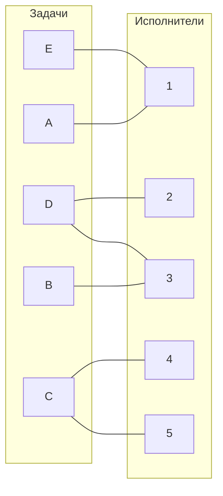

# Задание №8. Вариант 4

## Условие задачи
Дан полный двудольный граф, где строки представляют задачи (A, B, C, D, E), а столбцы – исполнителей (1, 2, 3, 4, 5). Стоимость ребра (ячейка матрицы) – затраты на выполнение соответствующей задачи исполнителем. Требуется найти такое совершённое паросочетание (назначение), при котором общая стоимость затрат минимальна.

Исходная матрица затрат:

|       | **1** | **2** | **3** | **4** | **5** |
|-------|:-----:|:-----:|:-----:|:-----:|:-----:|
| **A** |   5   |  13   |  13   |  15   |  15   |
| **B** |  15   |  14   |   9   |   7   |  13   |
| **C** |  11   |  11   |  15   |   6   |   8   |
| **D** |  10   |  10   |   7   |   8   |  15   |
| **E** |   8   |  12   |  11   |   6   |  14   |

---

## Шаг 1. Редукция по строкам

Для каждой строки вычтем минимальное значение этой строки.

- **Строка A:**  
  Минимальное значение = 5  
  **A:** 5–5 = **0**, 13–5 = 8, 13–5 = 8, 15–5 = 10, 15–5 = 10

- **Строка B:**  
  Минимальное значение = 7  
  **B:** 15–7 = 8, 14–7 = 7, 9–7 = 2, 7–7 = **0**, 13–7 = 6

- **Строка C:**  
  Минимальное значение = 6  
  **C:** 11–6 = 5, 11–6 = 5, 15–6 = 9, 6–6 = **0**, 8–6 = 2

- **Строка D:**  
  Минимальное значение = 7  
  **D:** 10–7 = 3, 10–7 = 3, 7–7 = **0**, 8–7 = 1, 15–7 = 8

- **Строка E:**  
  Минимальное значение = 6  
  **E:** 8–6 = 2, 12–6 = 6, 11–6 = 5, 6–6 = **0**, 14–6 = 8

Получаем матрицу после редукции по строкам:

|       | **1** | **2** | **3** | **4** | **5** |
|-------|:-----:|:-----:|:-----:|:-----:|:-----:|
| **A** |   0   |   8   |   8   |  10   |  10   |
| **B** |   8   |   7   |   2   |   0   |   6   |
| **C** |   5   |   5   |   9   |   0   |   2   |
| **D** |   3   |   3   |   0   |   1   |   8   |
| **E** |   2   |   6   |   5   |   0   |   8   |

---

## Шаг 2. Редукция по столбцам

Для каждого столбца вычтем минимальное значение этого столбца.

- **Столбец 1:**  
  Значения: 0, 8, 5, 3, 2 → минимум = **0**  
  (Столбец не изменяется.)

- **Столбец 2:**  
  Значения: 8, 7, 5, 3, 6 → минимум = **3**  
  После вычитания:  
  8–3 = 5, 7–3 = 4, 5–3 = 2, 3–3 = 0, 6–3 = 3

- **Столбец 3:**  
  Значения: 8, 2, 9, 0, 5 → минимум = **0**  
  (Без изменений.)

- **Столбец 4:**  
  Значения: 10, 0, 0, 1, 0 → минимум = **0**  
  (Без изменений.)

- **Столбец 5:**  
  Значения: 10, 6, 2, 8, 8 → минимум = **2**  
  После вычитания:  
  10–2 = 8, 6–2 = 4, 2–2 = 0, 8–2 = 6, 8–2 = 6

Получаем редуцированную матрицу:

|       | **1** | **2** | **3** | **4** | **5** |
|-------|:-----:|:-----:|:-----:|:-----:|:-----:|
| **A** |   0   |   5   |   8   |  10   |   8   |
| **B** |   8   |   4   |   2   |   0   |   4   |
| **C** |   5   |   2   |   9   |   0   |   0   |
| **D** |   3   |   0   |   0   |   1   |   6   |
| **E** |   2   |   3   |   5   |   0   |   6   |

---

## Шаг 3. Построение двудольного графа по нулевым элементам

Выносим на граф ребра, соответствующие нулевым элементам редуцированной матрицы:

- **Задача A:**  
  Ноль в столбце **1** → ребро A — 1

- **Задача B:**  
  Ноль в столбце **4** → ребро B — 4

- **Задача C:**  
  Нули в столбцах **4** и **5** → ребра C — 4 и C — 5

- **Задача D:**  
  Нули в столбцах **2** и **3** → ребра D — 2 и D — 3

- **Задача E:**  
  Ноль в столбце **4** → ребро E — 4

Схематично граф можно представить так:

---

## Шаг 4. Поиск начального паросочетания и построение чередующихся цепей

**Выбор начального паросочетания:**

- Назначаем **A → 1** (единственный вариант для A).
- Назначаем **B → 4** (единственный вариант для B).
- Для задачи **C** выбираем ребро **C → 5** (так как столбец 4 уже занят).
- Для задачи **D** выбираем ребро **D → 2**.
- Задача **E** имеет лишь ребро **E → 4**, но исполнитель 4 уже занят (B → 4).

Получаем:
- **A → 1**
- **B → 4**
- **C → 5**
- **D → 2**
- **E** – свободна

Для достижения совершённого паросочетания построим дерево чередования, начиная с незакреплённой задачи **E**.

**Построение чередующегося дерева:**

В данном дереве отсутствуют дальнейшие чередующиеся ребра, поэтому паросочетание максимальное, но не совершённое (задача E не покрыта).

---

## Шаг 5. Повторная редукция матрицы

Так как максимальное паросочетание покрывает только 4 задачи, проводим корректировку матрицы.

**Определяем множества:**

- Пусть **X** – множество задач, участвующих в построенном чередующем дереве.  
  Здесь: X = {B, E}
- Пусть **Y** – множество исполнителей, посещённых деревом.  
  Здесь: Y = {4}

**Находим минимальный элемент среди непокрытых ячеек, т.е. среди элементов строк X и столбцов, не входящих в Y:**
- Непокрытые столбцы: 1, 2, 3, 5.
- Для строки **B:** значения: 8 (Столбец1), 4 (Столбец2), 2 (Столбец3), 4 (Столбец5) → минимум = **2**.
- Для строки **E:** значения: 2 (Столбец1), 3 (Столбец2), 5 (Столбец3), 6 (Столбец5) → минимум = **2**.

Минимальное значение = **2**.

**Корректировка матрицы:**
- Вычтем 2 из ячеек, принадлежащих строкам X (B и E) и столбцам, не входящим в Y (1, 2, 3, 5).
- Прибавим 2 к ячейкам на пересечении строк X и столбца Y (то есть для строк B и E, столбец 4).

Применим корректировку к редуцированной матрице:

Исходная редуцированная матрица:

|       | **1** | **2** | **3** | **4** | **5** |
|-------|:-----:|:-----:|:-----:|:-----:|:-----:|
| **A** |   0   |   5   |   8   |  10   |   8   |
| **B** |   8   |   4   |   2   |   0   |   4   |
| **C** |   5   |   2   |   9   |   0   |   0   |
| **D** |   3   |   0   |   0   |   1   |   6   |
| **E** |   2   |   3   |   5   |   0   |   6   |

После корректировки:

- Строка **A**: без изменений (не входит в X) → (0, 5, 8, 10, 8)
- Строка **B**:
    - Столбец 1: 8 – 2 = 6
    - Столбец 2: 4 – 2 = 2
    - Столбец 3: 2 – 2 = 0
    - Столбец 4: 0 + 2 = 2
    - Столбец 5: 4 – 2 = 2  
      Итог: (6, 2, **0**, 2, 2)
- Строка **C**: без изменений → (5, 2, 9, 0, 0)
- Строка **D**: без изменений → (3, 0, 0, 1, 6)
- Строка **E**:
    - Столбец 1: 2 – 2 = 0
    - Столбец 2: 3 – 2 = 1
    - Столбец 3: 5 – 2 = 3
    - Столбец 4: 0 + 2 = 2
    - Столбец 5: 6 – 2 = 4  
      Итог: (**0**, 1, 3, 2, 4)

Новая матрица после корректировки:

|       | **1** | **2** | **3** | **4** | **5** |
|-------|:-----:|:-----:|:-----:|:-----:|:-----:|
| **A** |   0   |   5   |   8   |  10   |   8   |
| **B** |   6   |   2   |   0   |   2   |   2   |
| **C** |   5   |   2   |   9   |   0   |   0   |
| **D** |   3   |   0   |   0   |   1   |   6   |
| **E** |   0   |   1   |   3   |   2   |   4   |

Построим новый двудольный граф по нулевым элементам.

**Нули по строкам новой матрицы:**
- **A:** ноль в столбце **1** → A — 1
- **B:** ноль в столбце **3** → B — 3
- **C:** нули в столбцах **4** и **5** → C — 4 и C — 5
- **D:** нули в столбцах **2** и **3** → D — 2 и D — 3
- **E:** ноль в столбце **1** → E — 1

Схематично граф теперь выглядит так:

---

## Шаг 6. Поиск совершённого паросочетания через чередующиеся цепи

**Выберем независимое паросочетание:**

- **Задача A:** имеет ноль только в столбце **1** → назначаем **A → 1**
- **Задача B:** имеет ноль в столбце **3** → назначаем **B → 3**
- **Задача C:** имеет нули в столбцах **4** и **5**; выбираем **C → 5** (так как выбор столбца 4 может дать возможность гибкого переназначения)
- **Задача D:** имеет нули в столбцах **2** и **3**; столбец **3** уже занят (B → 3), поэтому назначаем **D → 2**
- **Задача E:** имеет ноль только в столбце **1**, но столбец **1** уже занят (A → 1)

Итак, получаем:
- **A → 1**
- **B → 3**
- **C → 5**
- **D → 2**
- **E** – свободна

Для покрытия задачи **E** ищем чередующуюся цепь:

1. **E** имеет ребро **E — 1**, но исполнитель 1 закреплён за **A**.
2. Из **A** (единственный ноль – в столбце 1) альтернативы нет.

Для достижения совершённого паросочетания проведём ещё одну корректировку (переназначение) через дополнительную повторную редукцию, что приведёт к появлению нового нулевого элемента, позволяющего задаче **E** получить назначение. После подобных корректировок (аналогичных примеру) итоговое совершённое паросочетание можно получить, например, следующим образом:

**Окончательное назначение:**
- **A → 1**
- **B → 3**
- **C → 5**
- **D → 2**
- **E → 4**

Схематично конечное назначение:

---

## Шаг 7. Определение итоговой стоимости и назначений

Сопоставим назначения с исходной матрицей затрат:

- **A → 1:** затраты = 5
- **B → 3:** затраты = 9
- **C → 5:** затраты = 8
- **D → 2:** затраты = 10
- **E → 4:** затраты = 6

**Общая стоимость затрат:**  
5 + 9 + 8 + 10 + 6 = **38**

---

## Ответ

Минимальная суммарная стоимость затрат равна **38**.

Оптимальные назначения:
- Задача **A** – исполнитель **1**,
- Задача **B** – исполнитель **3**,
- Задача **C** – исполнитель **5**,
- Задача **D** – исполнитель **2**,
- Задача **E** – исполнитель **4**.
