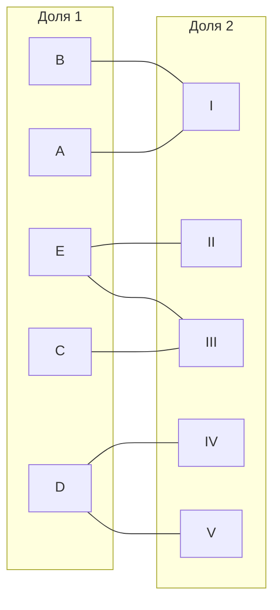
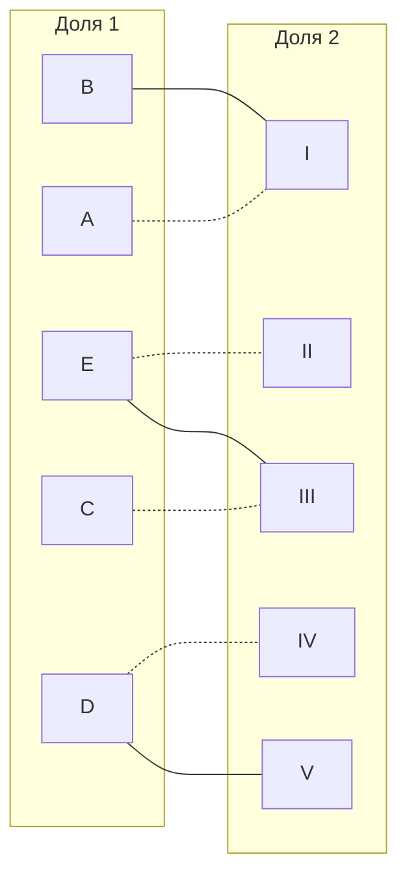
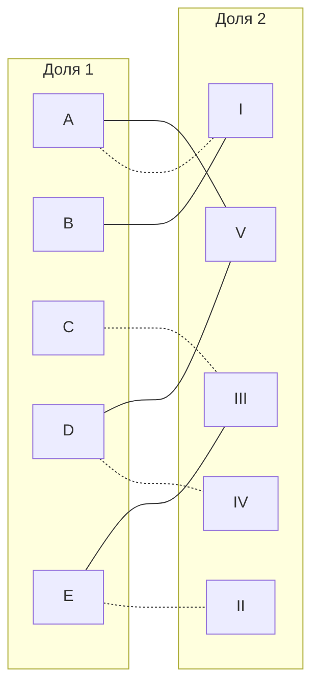

# Венгерский алгоритм. Вариант 8
## Редукция матрицы

|     |  I  | II  | III | IV  |  V  |
| :-: | :-: | :-: | :-: | :-: | :-: |
|  A  |  5  |  8  | 12  | 11  |  9  |
|  B  |  5  | 11  | 13  | 13  | 14  |
|  C  |  8  |  7  |  6  | 12  | 11  |
|  D  | 10  | 13  |  8  |  6  |  7  |
|  E  |  9  |  5  |  5  | 15  | 10  |

Произведем редукцию матрицы затрат по столбцам

|     |    I     |    II    |   III    |    IV    |    V     |
| :-: | :------: | :------: | :------: | :------: | :------: |
|  A  |    5     |    8     |    12    |    11    |    9     |
|  B  |    5     |    11    |    13    |    13    |    14    |
|  C  |    8     |    7     |    6     |    12    |    11    |
|  D  |    10    |    13    |    8     |    6     |    7     |
|  E  |    9     |    5     |    5     |    15    |    10    |
|     | ***-5*** | ***-5*** | ***-5*** | ***-6*** | ***-7*** |

Получаем следующую матрицу затрат и сразу произведем редукцию по строкам:

|     |   I   |  II   |  III  |  IV   |   V   |          |
| :-: | :---: | :---: | :---: | :---: | :---: | :------: |
|  A  | **0** |   3   |   7   |   5   |   2   | ***-0*** |
|  B  | **0** |   6   |   8   |   7   |   7   | ***-0*** |
|  C  |   3   |   2   |   1   |   6   |   4   | ***-1*** |
|  D  |   5   |   8   |   3   | **0** | **0** | ***-0*** |
|  E  |   4   | **0** | **0** |   9   |   3   | ***-0*** |

Итоговая матрица затрат выглядит следующим образом

|     |   I   |  II   |  III  |  IV   |   V   |
| :-: | :---: | :---: | :---: | :---: | :---: |
|  A  | **0** |   3   |   7   |   5   |   2   |
|  B  | **0** |   6   |   8   |   7   |   7   |
|  C  |   2   |   1   | **0** |   5   |   3   |
|  D  |   5   |   8   |   3   | **0** | **0** |
|  E  |   4   | **0** | **0** |   9   |   3   |
## Построение графа и чередующегося дерева
Строим двудольный граф, соединяя вершины так, что в левой доли оказываются исполнители, а в правой - задачи. Ребра выставим те, "стоимость" перехода по которым 0

Выберем некоторое паросочетание, допустим, \[A,I], \[C, III], \[E, II], \[D, IV]

Построим чередующееся дерево для этого графа согласно волновому алгоритму. Заметим, что непокрытой осталась только вершина B, поэтому она будет корнем дерева.
 ```mermaid
graph LR
    B(B - 0 фр.)  --> 1(I - 1 фр.) -.-> A(A - 2 фр.)
```
В полученном дереве отсутствует чередующаяся цепь, а потому требуется произвести диагональную редукцию матрицы.
## Диагональная редукция матрицы
Выделим следующие множества:
1. $X$ - множество строк (исполнителей), включенных в дерево;
2. $Y$ - множество столбцов (задач), включенных в дерево. 

Также для удобства обозначим $\overline{Y}$ - множество столбцов, не включенных в дерево. 

$$
\begin{aligned}
&X = \{A, B\}\\
&Y = \{1\}\\
&\overline{Y} = \{2,3,4,5\} 
\end{aligned}
$$

Найдем минимальный элемент на пересечении множеств $X$ и $\overline{Y}$, вычтем его из строк множества $X$ и добавим к столбцам множества $Y$

|       |   I   |  *II* | *III* | *IV*  |  *V*  |     |
|  :-:  | :---: | :---: | :---: | :---: | :---: | :-: |
|  *A*  | **0** |   3   |   7   |   5   |   2   |  -2 |
|  *B*  | **0** |   6   |   8   |   7   |   7   |  -2 |
|   C   |   2   |   1   | **0** |   5   |   3   |     |
|   D   |   5   |   8   |   3   | **0** | **0** |     |
|   E   |   4   | **0** | **0** |   9   |   3   |     |
|       |  +2   |       |       |       |       |     |

|       |   I   |   II  |  III  |  IV   |   V   |
|  :-:  | :---: | :---: | :---: | :---: | :---: |
|   A   |   2   |   1   |   5   |   3   | **0** |
|   B   |   2   |   4   |   6   |   5   |   5   |
|   C   |   4   |   1   |   0   |   5   |   3   |
|   D   |   7   |   8   |   3   |   0   |   0   |
|   E   |   6   |   0   |   0   |   9   |   3   |

После диагональной редукции в графе появился новый ноль.
## Построение нового графа и чередующегося дерева

Попробуем вновь построить чередующееся дерево:
 ```mermaid
graph LR
    B(B - 0 фр.)  --> 1(I - 1 фр.) -.-> A(A - 2 фр.) --> 5(V - 3 фр.)
```
Так как вершина **V** не покрыта, образуется чередующаяся цепь. Перекрасим ее и получим следующее:
 ```mermaid
graph LR
    subgraph "Доля 1"
        A[A]
        B[B]
        C[C]
        D[D]
        E[E]
    end
    subgraph "Доля 2"
        1[I]
        2[II]
        3[III]
        4[IV]
        5[V]
    end
    A --- 1
    A -.- 5
    B -.- 1
    C -.- 3
    D -.- 4
    D --- 5
    E -.- 2
    E --- 3
``` 
То есть, было получено паросочетание:

$$
\begin{aligned}
A &- V\\
B &- I\\
C &- III\\
D &- IV\\
E &- II 
\end{aligned}
$$

Которое является **совершенным**. Общая стоимость соответственно будет составлять: $9+5+6+6+5=31$
## Ответ
Расписание общей стоимостью 31:
1. A - V
2. B - I
3. C - III
4. D - IV
5. E - II