# Задание №8. Вариант 2

#### Дана матрица затрат для задач A, B, C, D, E и исполнителей 1, 2, 3, 4, 5:

|       | **1** | **2** | **3** | **4** | **5** |
|-------|:-----:|:-----:|:-----:|:-----:|:-----:|
| **A** |   6   |   6   |   6   |   8   |  14   |
| **B** |   5   |   9   |  10   |  14   |  14   |
| **C** |  11   |  14   |  14   |  14   |  11   |
| **D** |   5   |  14   |  11   |  10   |  15   |
| **E** |   9   |  13   |  10   |  11   |   6   |

#### Решение задачи:

1. Проведем редукцию матрицы затрат. Вычтем из каждой строки минимальное значение, представленное в этой строке.

|       | **1** | **2** | **3** | **4** | **5** | **Min** |
|-------|:-----:|:-----:|:-----:|:-----:|:-----:|:-----:|
| **A** | **0** | **0** | **0** |   2   |  8   |  -6   |
| **B** | **0** |   4   |  5   |  9   |  9   |  -5   |
| **C** | **0** |  3   |  3   |  3   | **0** |  -11   |
| **D** | **0** |  9   |  6   |  5   |  10   |  -5   |
| **E** |   3   |  7   |  4   |  5   | **0** |  -6   |

После чего вычтем из каждого столбца минимальное значение, представленное в этом столбце.

|       | **1** | **2** | **3** | **4** | **5** |
|-------|:-----:|:-----:|:-----:|:-----:|:-----:|
| **A** | **0** | **0** | **0** |   0   |  8   |
| **B** | **0** |   4   |  5   |  7   |  9   |
| **C** | **0** |  3   |  3   |  1   | **0** |
| **D** | **0** |  9   |  6   |  3   |  10   |
| **E** |   3   |  7   |  4   |  3   | **0** |
| **Min** | 0 | 0 | 0 | -2 | 0 |

Получим редуцированную матрицу, где нули обозначают наименее затратные варианты назначений.

|       | **1** | **2** | **3** | **4** | **5** |
|-------|:-----:|:-----:|:-----:|:-----:|:-----:|
| **A** | **0** | **0** | **0** |   **0**   |  8   |
| **B** | **0** |   4   |  5   |  7   |  9   |
| **C** | **0** |  3   |  3   |  1   | **0** |
| **D** | **0** |  9   |  6   |  3   |  10   |
| **E** |   3   |  7   |  4   |  3   | **0** |

2. Построим двудольный граф, вынесем на него те ребра, для которых в редуцированной матрице указаны нули.

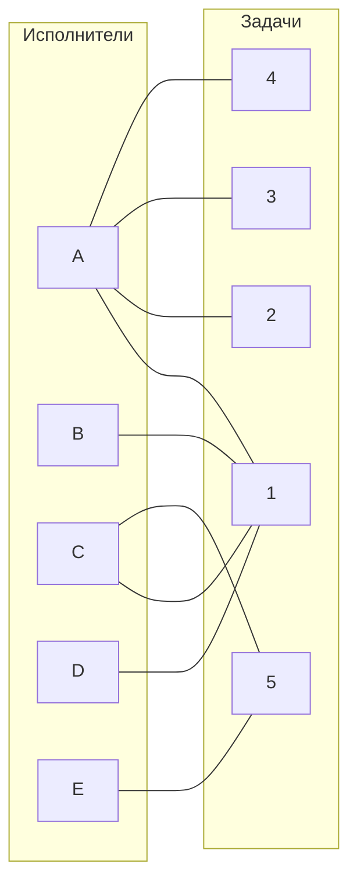

Выберем произвольное паросочетание A --- 2, B --- 1, C --- 5 и попытаемся построить совершенное паросочетание с помощью чередующихся деревьев.

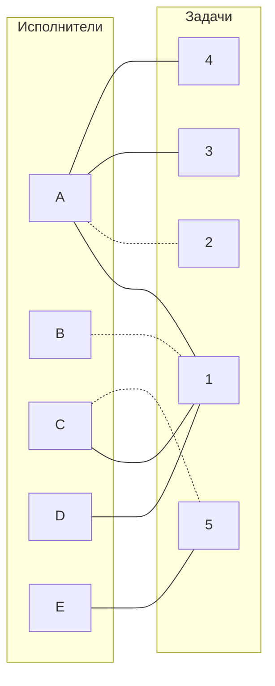

Попытаемся построить дерево из оставшихся непокрытых вершин D, E.

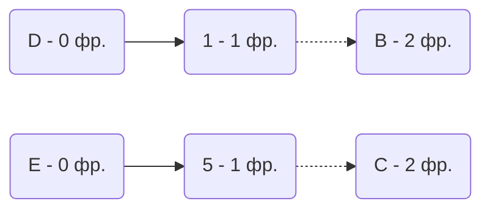

Из D пришли в B, ветка закончилась в покрытой вершине.
Из E пришли в C, из С можно было бы пойти в 1, но 1 уже использовали когда двигались по пути D. Соответственно, ветка закончилась в покрытой вершине.

В этом графе нет совершенного паросочетания.

3. Проведем повторную редукцию матрицы затрат.

Во множество $X$ выпишем все **покрытые построенным деревом** вершины первой доли графа.

Во множество $Y$ все **покрытые построенным деревом** вершины из второй доли графа.

Во множество $\overline{Y}$ все **НЕ покрытые построенным деревом** вершины из второй доли графа

$$X = \{B, C, D, E\}$$
$$Y = \{1, 5 \}$$
$$\overline{Y} = \{2, 3, 4\}$$

Необходимо найти минимальный элемент из строк, включенных во множество $X$ и столбцов, включенных во множество $\overline{Y}$. В нашем случае это будут строки B, C, D, E и столбцы 2, 3, 4. Минимальным элементом является 1, расположен в строке C и столбце 4.

Вычтем найденное значение из строк множества $X$ и прибавим к столбцам множества $Y$:

Было:

|       | **1** | **2** | **3** | **4** | **5** |
|-------|:-----:|:-----:|:-----:|:-----:|:-----:|
| **A** | **0** | **0** | **0** |   **0**   |  8   |
| **B** | **0** |   4   |  5   |  7   |  9   |
| **C** | **0** |  3   |  3   |  1   | **0** |
| **D** | **0** |  9   |  6   |  3   |  10   |
| **E** |   3   |  7   |  4   |  3   | **0** |

Стало:

|       | **1** | **2** | **3** | **4** | **5** | **Min** |
|-------|:-----:|:-----:|:-----:|:-----:|:-----:|:-----:|
| **A** | 1 | **0** | **0** |   **0**   |  9   |     |
| **B** | **0** |   3   |  4   |  6   |  9   |  -1   |
| **C** | **0** |  2   |  2   |  **0**   | **0** |  -1   |
| **D** | **0** |  8   |  5   |  2   |  10   |  -1   |
| **E** |   3   |  6   |  3   |  2   | **0** |  -1   |
| **Min** | +1 |  |  |  | +1 |

В ячейке C4 появилось новое нулевое значение, добавим соответствующее ребро в двудольный граф.

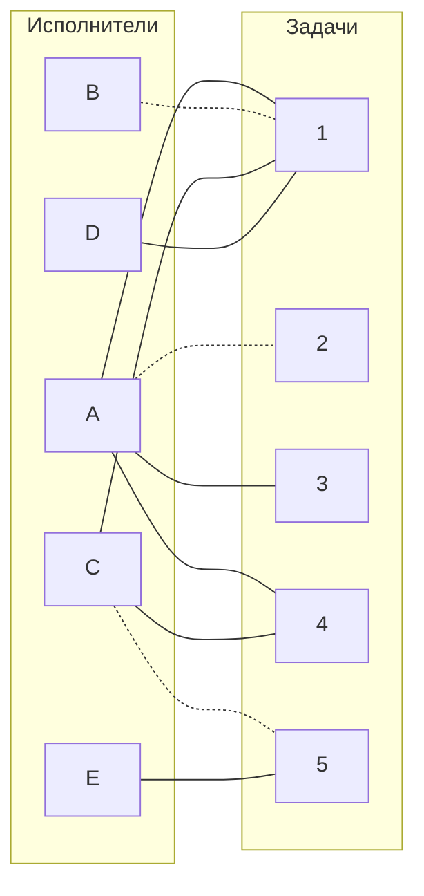

4. Попытаемся построить совершенное паросочетание с помощью чередующихся деревьев.

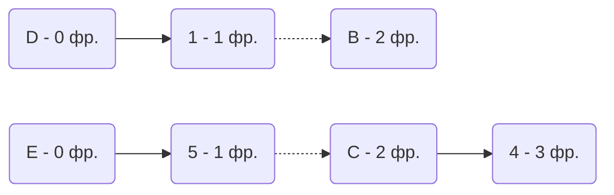

Построенное дерево содержит чередующуюся, относительно текущего паросочетания, цепь E -- 5 -- C -- 4, цепь начинается и заканчивается в непокрытых вершинах, все ребра в цепи чередуются по вхождению в текущее паросочетание.

"Перекрасим" найденную цепь и проверим полученное паросочетание.

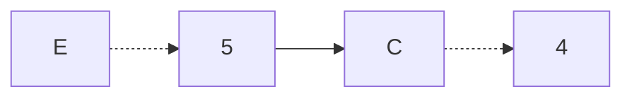

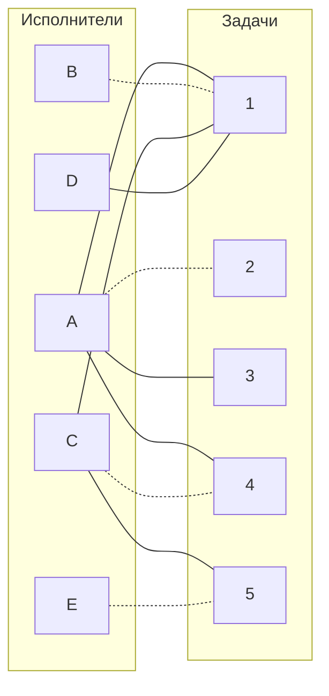

Полученное расписание не является совершенным.

5. Проведем повторную редукцию матрицы затрат.

$$X = \{B, C, D, E\}$$
$$Y = \{1, 4, 5\}$$
$$\overline{Y} = \{2, 3\}$$

Необходимо найти минимальный элемент из строк, включенных во множество $X$ и столбцов, включенных во множество $\overline{Y}$. Теперь это будут строки B, C, D, E и столбцы 2, 3. Минимальным элементом является 2, расположен в ячейках C2 и C3.

Вычтем найденное значение из строк множества $X$ и прибавим к столбцам множества $Y$:

Было:

|       | **1** | **2** | **3** | **4** | **5** | **Min** |
|-------|:-----:|:-----:|:-----:|:-----:|:-----:|:-----:|
| **A** | 1 | **0** | **0** |   **0**   |  9   |     |
| **B** | **0** |   3   |  4   |  6   |  9   |     |
| **C** | **0** |  2   |  2   |  **0**   | **0** |     |
| **D** | **0** |  8   |  5   |  2   |  10   |    |
| **E** |   3   |  6   |  3   |  2   | **0** |    |
| **Min** | |  |  |  | |

Стало:

|       | **1** | **2** | **3** | **4** | **5** | **Min** |
|-------|:-----:|:-----:|:-----:|:-----:|:-----:|:-----:|
| **A** | 3 | **0** | **0** |   2   |  11   |     |
| **B** | **0** |   1   |  2   |  6   |  9   |  -2   |
| **C** | **0** |  **0**   |  **0**   |  **0**   | **0** |  -2   |
| **D** | **0** |  6   |  3   |  2   |  10   |  -2   |
| **E** |   3   |  4   |  1   |  2   | **0** |  -2   |
| **Min** | +2 |  |  | +2 | +2 |

В ячейках C2, C3 появилось новое нулевое значение, добавим соответствующие ребра в двудольный граф.

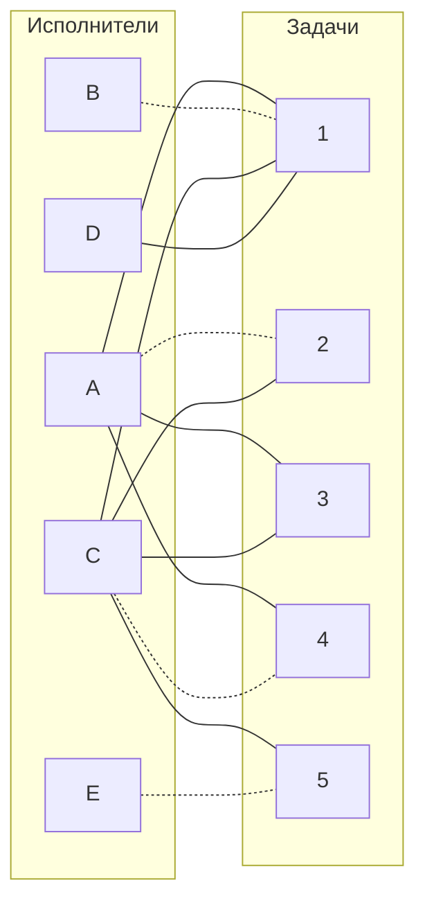

6. Попытаемся построить совершенное паросочетание.

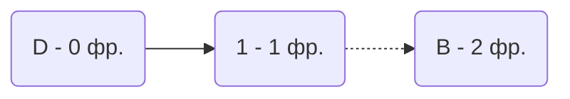

Из D пришли в B, ветка закончилась в покрытой вершине.

В этом графе нет совершенного паросочетания.

7. Проведем повторную редукцию матрицы затрат.

$$X = \{B, D\}$$
$$Y = \{1\}$$
$$\overline{Y} = \{2, 3, 4, 5\}$$

Необходимо найти минимальный элемент из строк, включенных во множество $X$ и столбцов, включенных во множество $\overline{Y}$. В нашем случае это будут строки B, D и столбцы 2, 3, 4, 5. Минимальным элементом является 1, расположен в строке B и столбце 2.

Вычтем найденное значение из строк множества $X$ и прибавим к столбцам множества $Y$:

Было:

|       | **1** | **2** | **3** | **4** | **5** | **Min** |
|-------|:-----:|:-----:|:-----:|:-----:|:-----:|:-----:|
| **A** | 3 | **0** | **0** |   2   |  11   |     |
| **B** | **0** |   1   |  2   |  6   |  9   |     |
| **C** | **0** |  **0**   |  **0**   |  **0**   | **0** |     |
| **D** | **0** |  6   |  3   |  2   |  10   |     |
| **E** |   3   |  4   |  1   |  2   | **0** |     |
| **Min** |  |  |  |  |  |

Стало:

|       | **1** | **2** | **3** | **4** | **5** | **Min** |
|-------|:-----:|:-----:|:-----:|:-----:|:-----:|:-----:|
| **A** | 4 | **0** | **0** |   2   |  11   |     |
| **B** | **0** |   **0**   |  1   |  5   |  8   |   -1  |
| **C** | 1 |  **0**   |  **0**   |  **0**   | **0** |     |
| **D** | **0** |  5   |  2   |  1   |  9   |   -1  |
| **E** |   4   |  4   |  1   |  2   | **0** |     |
| **Min** | +1 |  |  |  | |

В ячейке B2 появилось новое нулевое значение, добавим соответствующее ребро в двудольный граф.

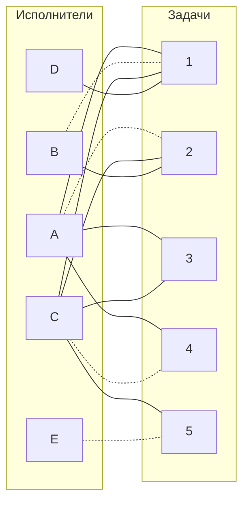
8. Попытаемся построить совершенное паросочетание.

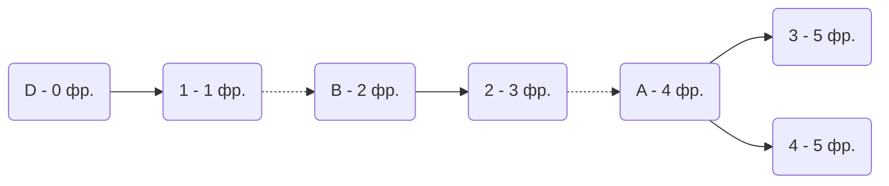
Построенное дерево содержит чередующуюся, относительно текущего паросочетания, цепь D - 1 - B - 2 - A - 3, цепь начинается и заканчивается в непокрытых вершинах, все ребра в цепи чередуются по вхождению в текущее паросочетание.

"Перекрасим" найденную цепь и проверим полученное паросочетание.

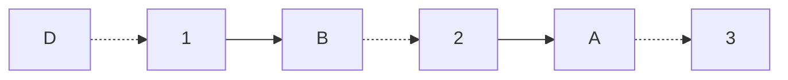

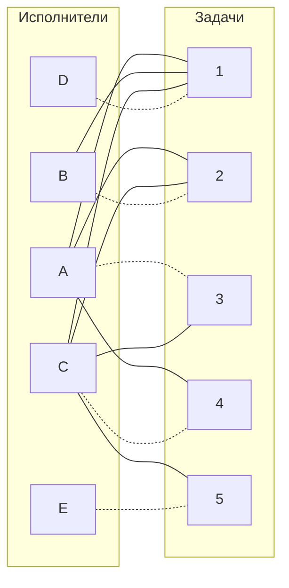

Полученное расписание является совершенным. Выпишем полученные назначения и их стоимости из исходной матрицы:
- A3 - 6
- B2 - 9
- C4 - 14
- D1 - 5
- E5 - 6

Общая стоимость затрат = 6 + 9 + 14 + 5 + 6 = 40.

## Ответ
Минимальная стоимость затрат 40, при следующих назначениях:
- задача A, исполнитель 3,
- задача B, исполнитель 2,
- задача C, исполнитель 4,
- задача D, исполнитель 1,
- задача E, исполнитель 5.