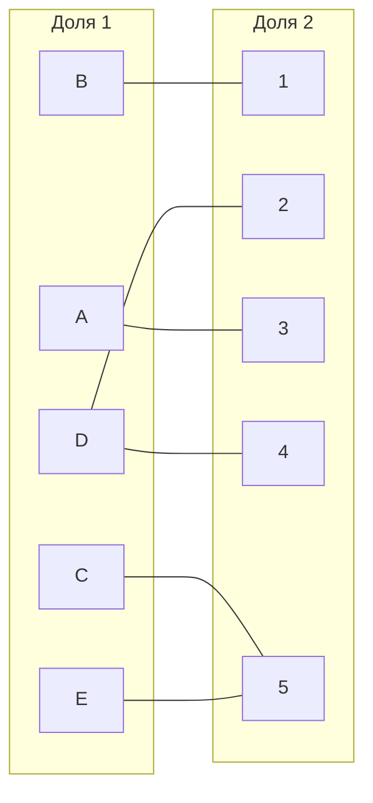
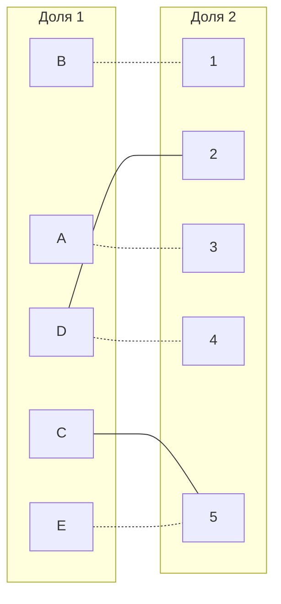
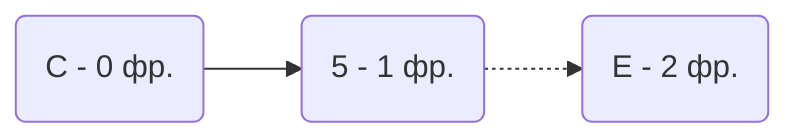
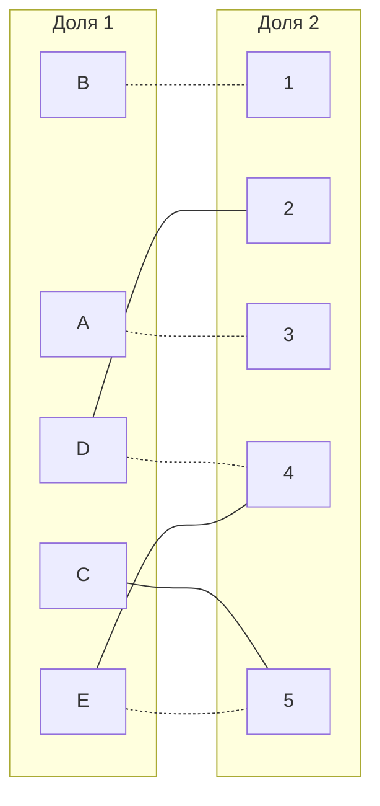
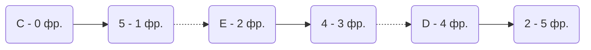
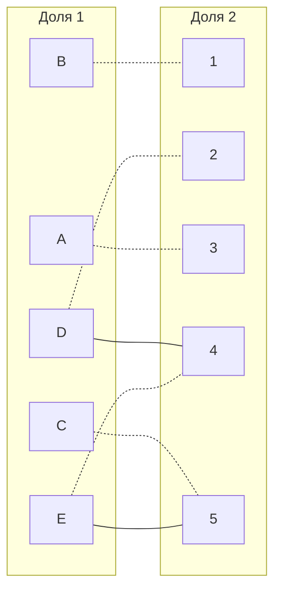

## Вариант 3
#### Матрица затрат:

|       | **1** | **2** | **3** | **4** | **5** |
|-------|:-----:|:-----:|:-----:|:-----:|:-----:|
| **A** |  12   |   9   |   6   |   8   |  14   | 
| **B** |   5   |  11   |  15   |  11   |   8   |
| **C** |  14   |  14   |   9   |  11   |   6   |
| **D** |  15   |   9   |  10   |   9   |  15   |
| **E** |  14   |  12   |  10   |   9   |   7   |

**1 шаг**

Выполним редукцию матрицы по строкам

|       | **1** | **2** | **3** | **4** | **5** | **min**  |
|-------|:-----:|:-----:|:-----:|:-----:|:-----:|:--------:|
| **A** |  12   |   9   |   6   |   8   |  14   |    -6    |
| **B** |   5   |  11   |  15   |  11   |   8   |    -5    |
| **C** |  14   |  14   |   9   |  11   |   6   |    -6    |
| **D** |  15   |   9   |  10   |   9   |  15   |    -9    |
| **E** |  14   |  12   |  10   |   9   |   7   |    -7    |

Получим редуцированную матрицу, где нули обозначают наименее затратные варианты назначений.

|       | **1** | **2** | **3** | **4** | **5** |
|-------|:-----:|:-----:|:-----:|:-----:|:-----:|
| **A** |   6   |   3   |   0   |   2   |   8   | 
| **B** |   0   |   6   |  10   |   6   |   3   |
| **C** |   8   |   8   |   3   |   5   |   0   |
| **D** |   6   |   0   |   1   |   0   |   6   |
| **E** |   7   |   5   |   3   |   2   |   0   |

**2 шаг**

На основе редуцированной матрицы строим двудольный граф.
Вынесем на него те ребра, для которых в редуцированной матрице указаны нули.

**3 шаг**

Выберем произвольное паросочетание [A ; 3], [ B ; 1], [D ; 4], [E ; 5] и попытаемся построить совершенное паросочетание с помощью чередующихся деревьев.

Используем волновой метод для построения чередующегося дерева. Начинаем с вершины С, так как она не покрыта.

В построенном дереве нет цепей, чередующихся относительно текущего паросочетания, ветка закончилась в покрытых вершинах, то есть в указанном графе нет совершенного паросочетания.

Выполним диагональную редукцию матрицы затрат. Во множество X выпишем все покрытые вершины первой доли графа, во множество Y все покрытые вершины из второй доли графа.

$$
X = \{C, Е\}
$$
$$
Y = \{5\}
$$
$$
\overline{Y} = \{1, 2, 3, 4\}
$$

Найдем минимальный элемент из строк, включенных во множество X (С и Е) и столбцов, включенных во множество $\overline{Y}$ (1, 2, 3, 4). Минимальный элемент 2 (Е4). 

Вычтем найденное значение из строк множества X и прибавим к столбцам множества Y:

|   | 1  | 2  | 3  | 4  | 5  |    |
|---|----|----|----|----|----|----|
| A | 6  | 3  | 0  | 2  | 8  |    |
| B | 0  | 6  | 10 | 6  | 3  |    |
| D | 6  | 0  | 1  | 0  | 6  |    |
| C | 8  | 8  | 3  | 5  | 0  | -2 |
| E | 7  | 5  | 3  | 2  | 0  | -2 |
|   |    |    |    |    | +2 |    |

|   | 1  | 2  | 3  | 4  | 5  |
|---|----|----|----|----|----|
| A | 6  | 3  | 0  |  2 | 10 |
| B | 0  | 6  | 10 |  6 | 5  |
| D | 6  | 0  | 1  | 0  | 8  |
| C | 6  | 6  | 1  | 3  | 0  |
| E | 5  | 3  | 1  | 0  | 0  |

Получили новое ребро Е4.

Применим волновой метод.

Получчили чередующуюся цепь С5 - 5Е - Е4 - 4D - D2.

Перекрашиваем найденную цепь, теперь покрытми врешинами стали вершины: [C ; 5] , [E ; 4] , [D ; 2] + начальные парасочетания: [A ; 3] , [B ; 1]

Полученное паросочетание является совершенным. Выпишем полученные назначения и их стоимости из исходной матрицы:
- A3 - 6
- B1 - 5
- C5 - 6
- D2 - 9
- E4 - 9

Общая стоимость затрат 35.

**Ответ:**
Минимальная стоимость затрат 35, при следующих назначениях:
- задача A, исполнитель 3,
- задача B, исполнитель 1,
- задача C, исполнитель 5,
- задача D, исполнитель 2,
- задача E, исполнитель 4.