### Вариант 5:
#### Матрица затрат:

|       | **1** | **2** | **3** | **4** | **5** |
|-------|:-----:|:-----:|:-----:|:-----:|:-----:|
| **A** |  11   |   9   |  10   |  10   |   8   |
| **B** |  14   |  10   |   5   |  14   |  14   |
| **C** |  10   |  14   |   8   |  14   |  10   |
| **D** |  14   |   8   |   6   |   7   |  12   |
| **E** |   5   |  15   |   7   |   5   |  14   |

1. Проведем редукцуию матрицы по строкам. Для этого вычтем из элементов каждой строки наименьший элемент в строке.

|       | **1** | **2** | **3** | **4** | **5** |
|-------|:-----:|:-----:|:-----:|:-----:|:-----:|
| **A** |  3    |   1   |   2   |   2   |   0   | 
| **B** |   9   |   5   |   0   |   9   |   9   |
| **C** |   2   |   6   |   0   |   6   |   2   |
| **D** |   8   |   2   |   0   |   1   |   6   |
| **E** |   0   |  10   |   2   |   0   |   9   |

2. Проведем редукцуию матрицы по столбцам. Для этого вычтем из элементов столбцов, в которых нет нулей, наименьший элемент в столбце. Получим матрицу минимальных затрат:

|       | **1** | **2** | **3** | **4** | **5** |
|-------|:-----:|:-----:|:-----:|:-----:|:-----:|
| **A** |   3   |   **0**   |   2   |   2   |   **0**   | 
| **B** |   9   |   4   |   **0**   |   9   |   9   |
| **C** |   2   |   5   |   **0**   |   6   |   2   |
| **D** |   8   |   1   |   **0**   |   1   |   6   |
| **E** |   **0**   |   9   |   2   |   **0**   |   9   |

3. На основе пулоченной матрицы построим двудольных граф. Вынесем на него ребра, для которых в матрице минимальных затрат указаны нули.
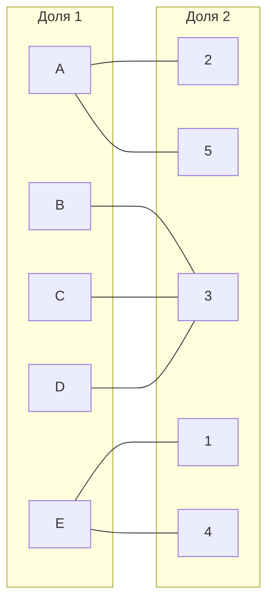
4. Найдем в двудольном графе совершенное паросочетание с помощью волнового метода и чередующегося дерева. 

Выберем произвольное парасочетание A - 2, B - 3, E - 1.

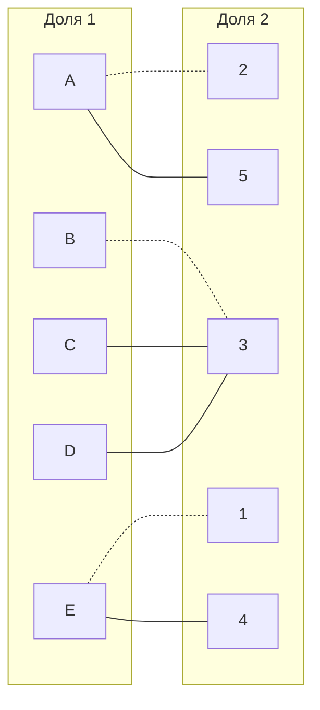

Попытаемся построить дерево из оставшихся непокрытыми вершин C и D.

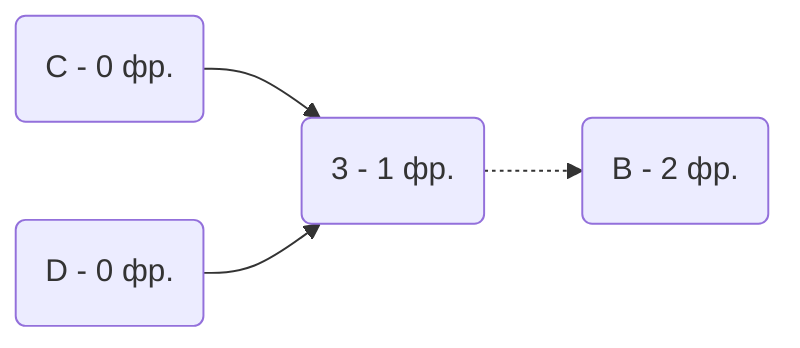

В построенном дереве нет цепей, чередующееся относительно текущего паросочетания, обе ветки закончились в покрытой вершине, то есть в указанном графе нет совершенного паросочетания.

5. Проведем повторную редукцию матрицы затрат.

Во множество X выпишем все **покрытые построенным деревом** вершины первой доли графа, во множество Y все **покрытые построенным деревом** вершины из второй доли графа.

$$
X = \{B, C, D\}
$$
$$
Y = \{3 \}
$$

Необходимо найти минимальный элемент из строк, включенных во множество X и столбцов, не включенных во множество Y. В нашем случае это будут строки B, C, D и столбцы 1, 2, 4, 5. Минимальный элемент 1, расположен в строке D и столбце 2. 

Вычтем найденное значение из строк множества X и прибавим к столбцам множества Y:

|       | **1** | **2** | **3** | **4** | **5** |       |
|-------|:-----:|:-----:|:-----:|:-----:|:-----:|:-----:|
| **A** |   3   | **0** |   3   |   2   | **0** |       | 
| **B** |   8   |   3   | **0** |   8   |   8   |  -1   |
| **C** |   1   |   4   | **0** |   5   |   1   |  -1   |
| **D** |   7   | **0** | **0** | **0** |   5   |  -1   |
| **E** | **0** |   9   |   3   | **0** |   9   |       |
|       |       |       |  +1   |       |       |       |

В ячейке D2 и D4 появились новые нулевые значения, добавим соответствующие ребра в двудольный граф.

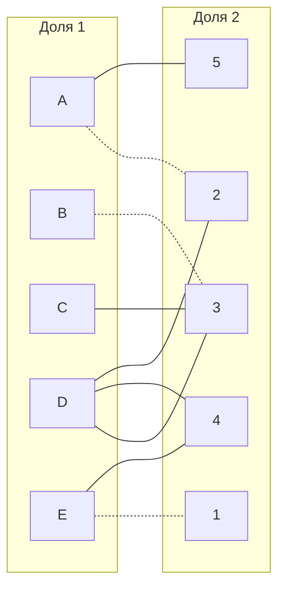

6. Попытаемся построить совершенное паросочетание с помощью чередующихся деревьев.

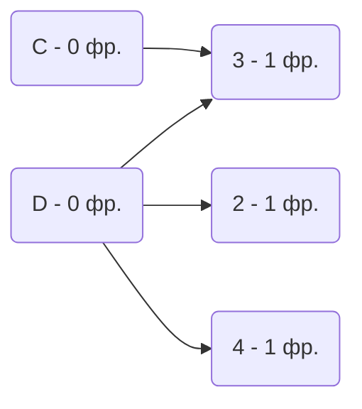

Построенное дерево содержит чередующуюся, относительно текущего паросочетания, цепь D-4, цепь начинается и заканчивается в непокрытых вершинах, все ребра в цепи чередуются по вхождению в текущее паросочетание.

"Перекрасим" найденную цепь и проверим полученное паросочетание.

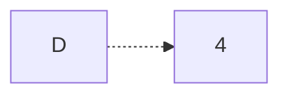
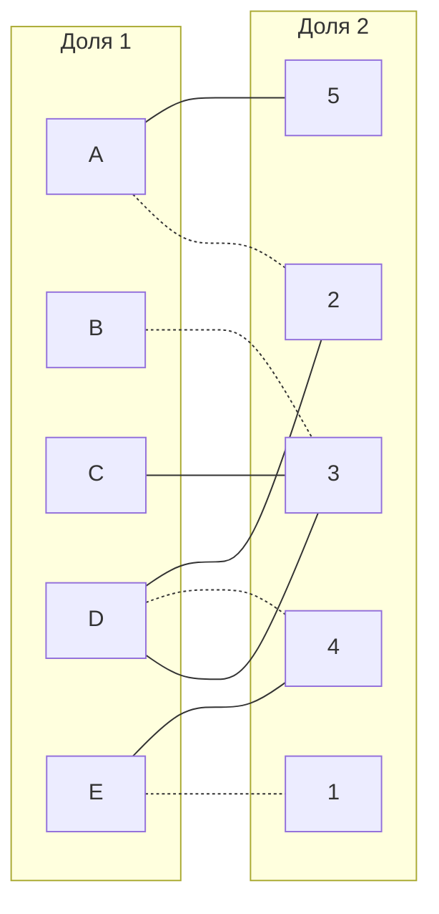

Попытаемся построить совершенное паросочетание из непокрытой вершины С.

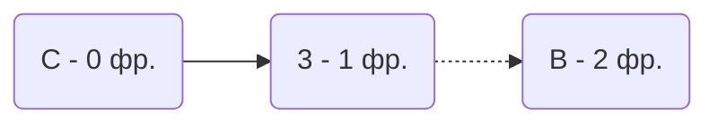

В построенном дереве нет цепей, чередующееся относительно текущего паросочетания, обе ветки закончились в покрытой вершине, то есть в указанном графе нет совершенного паросочетания.

7. Проведем повторную редукцию матрицы затрат.

Во множество X выпишем все **покрытые построенным деревом** вершины первой доли графа, во множество Y все **покрытые построенным деревом** вершины из второй доли графа.

$$
X = \{C, B\}
$$
$$
Y = \{3\}
$$

Необходимо найти минимальный элемент из строк, включенных во множество X и столбцов, не включенных во множество Y. В нашем случае это будут строки C, B и столбцы 1, 2, 4, 5. Минимальный элемент 1, расположен в строке C и столбце 1. 

Вычтем найденное значение из строк множества X и прибавим к столбцам множества Y:

|       | **1** | **2** | **3** | **4** | **5** |       |
|-------|:-----:|:-----:|:-----:|:-----:|:-----:|:-----:|
| **A** |   3   | **0** |   3   |   2   | **0** |       | 
| **B** |   7   |   2   | **0** |   7   |   7   |  -1   |
| **C** | **0** |   3   | **0** |   5   | **0** |  -1   |
| **D** |   7   | **0** | **0** | **0** |   5   |       |
| **E** | **0** |   9   |   3   | **0** |   9   |       |
|       |       |       |  +1   |       |       |       |

В ячейке C1 и C5 появились новые нулевые значения, добавим соответствующие ребра в двудольный граф.

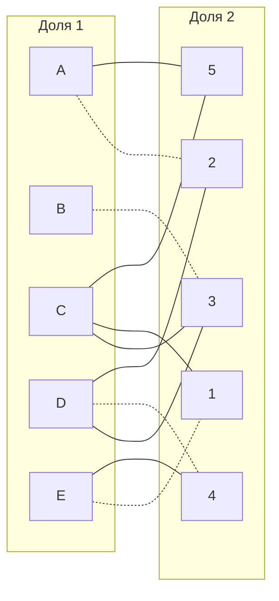

8. Попытаемся построить совершенное паросочетание с помощью чередующихся деревьев.

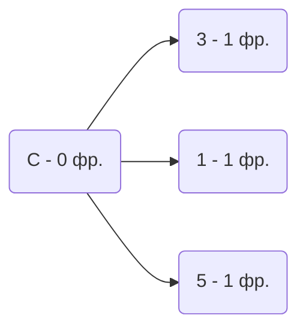

Построенное дерево содержит чередующуюся, относительно текущего паросочетания, цепь C-5, цепь начинается и заканчивается в непокрытых вершинах, все ребра в цепи чередуются по вхождению в текущее паросочетание.

"Перекрасим" найденную цепь и проверим полученное паросочетание.

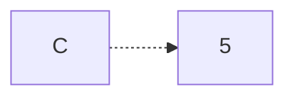
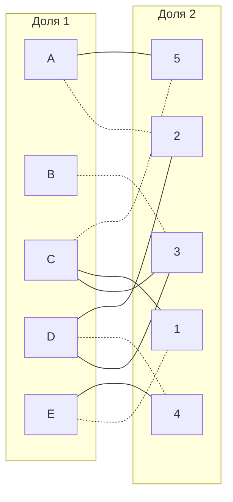

Полученное расписание является совершенным. Выпишем полученные назначения и их стоимости из исходной матрицы:
- A2 - 9
- B3 - 5
- C5 - 10
- D4 - 7
- E1 - 5

Общая стоимость затрат = 9 + 5 + 10 + 7 + 5 = 36.

## Ответ
Минимальная стоимость затрат 36, при следующих назначениях:
- задача A, исполнитель 2,
- задача B, исполнитель 3,
- задача C, исполнитель 5,
- задача D, исполнитель 4,
- задача E, исполнитель 1.