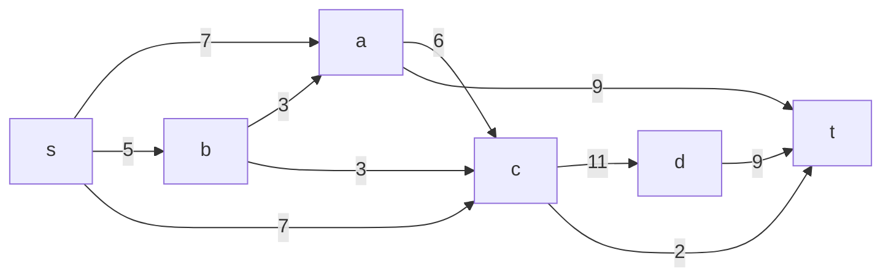
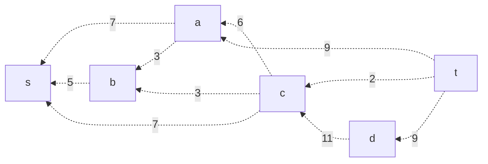
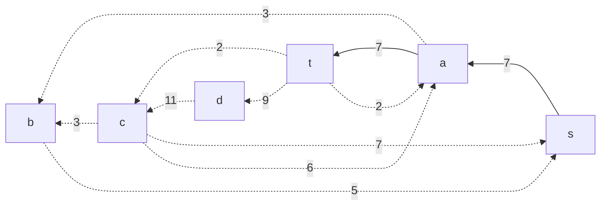
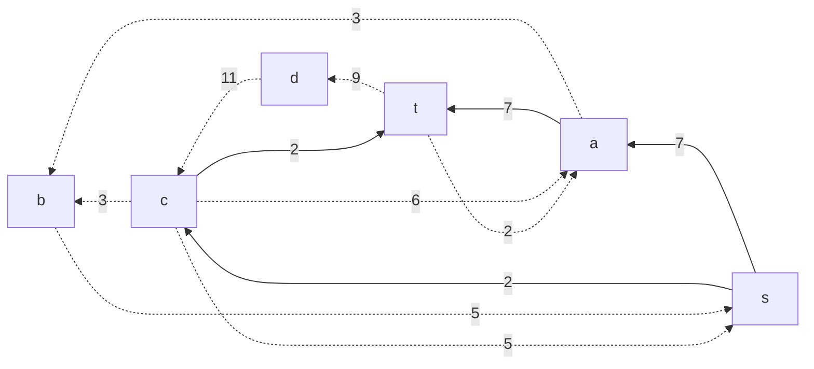
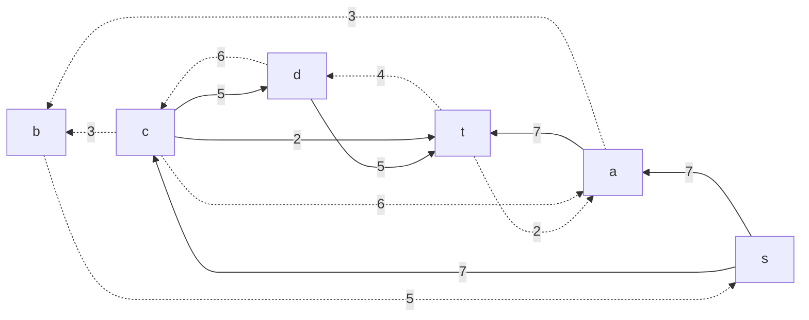
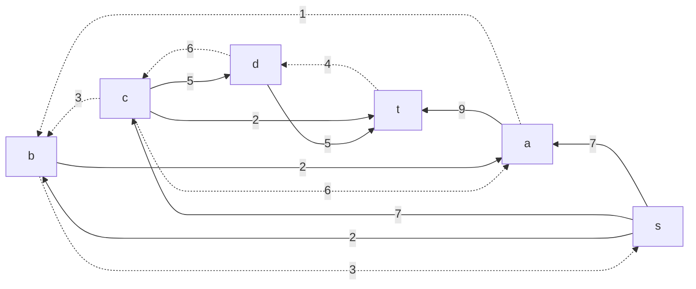
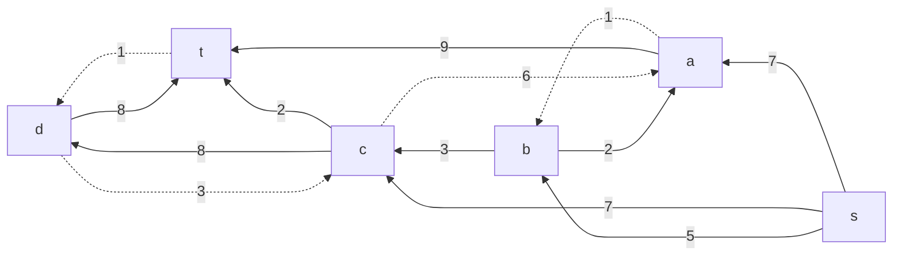
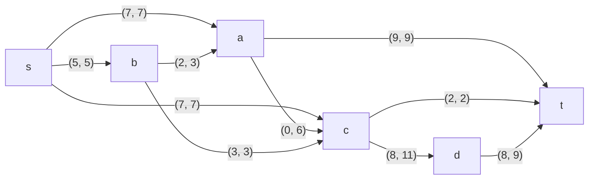

# Задание №9
# Задача о максимальном потоке.

### Вариант 3:
#### Пропускная способность дуг сети:

|          Дуги          | sa | sb | sc | bc | cd | dt | ac | at | ba | ct |
|:----------------------:|:--:|:--:|:--:|:--:|:--:|:--:|:--:|:--:|:--:|:--:|
| Пропускная способность | 7  | 5  | 7  | 3  | 11 | 9  | 6  | 9  |  3 |  2 |

### 1. Построим сеть с источником **s**, стоком **t** и указанными пропускными способностями дуг.

Построим остаточную сеть. Так как изначально поток в сети не задан, все дуги сети являются пустыми (локальный поток равен нулю), соответственно в остаточную сеть необходимо вынести обратную дугу с весом равным пропускной способности.

Мы пока не будем корректировать потоки в исходной сети, сделаем это в самом конце.

### 2. Проведем поиск увеличивающего пути в остаточной сети
В остаточной сети найден увеличивающий путь t -> a -> s. Минимальный вес дуг на этом пути равен 7.

Уменьшим вес дуг на найденном пути, дуги для которых вес стал нулевым удалим из остаточной сети.

### 3. Продолжим поиск увеличивающего пути в остаточной сети
В остаточной сети найден увеличивающий путь t -> c -> s. Минимальный вес дуг на этом пути равен 2.

Уменьшим вес дуг на найденном пути, дуги для которых вес стал нулевым удалим из остаточной сети.

### 4. Продолжим поиск увеличивающего пути в остаточной сети
В остаточной сети найден увеличивающий путь t -> d -> c -> s. Минимальный вес дуг на этом пути равен 5.

Уменьшим вес дуг на найденном пути, дуги для которых вес стал нулевым удалим из остаточной сети.

### 5. Продолжим поиск увеличивающего пути в остаточной сети
В остаточной сети найден увеличивающий путь t -> a -> b -> s. Минимальный вес дуг на этом пути равен 2.

Уменьшим вес дуг на найденном пути, дуги для которых вес стал нулевым удалим из остаточной сети.

### 6. Продолжим поиск увеличивающего пути в остаточной сети
В остаточной сети найден увеличивающий путь t -> d -> c -> b -> s. Минимальный вес дуг на этом пути равен 3.

Уменьшим вес дуг на найденном пути, дуги для которых вес стал нулевым удалим из остаточной сети.

Скорректируем соответствующим образом локальные потоки в исходной сети. Первым числом будем указывать локальный поток, вторым пропускную способность дуги. 

### 7. Продолжим поиск увеличивающего пути в остаточной сети
В остаточной сети не найдено увеличивающих путей, следовательно, алгоритм завершил работу и найденный поток величиной 19 является максимальным для данной сети. Для проверки возьмем сумму всех потоков из источника, она также равна 19, значит все верно.

### 8. Проверим значение максимального потока перебором всех разрезов сети.

Для сети из 5 вершин нужно найти 26 - 2 = 24 = 16 разрезов. 

| № | V1                      | V2    | Пропускная способность разреза |
|---|:-----------------------------------|:-----------------|:------------------------------:|
| 1 | s                                  | t, a, b, c, d    |           5 + 7 + 7 = **19**   |
|   | **s + одна вершина из a, b, c, d** |                  |                                |
| 2 | s, a                               | t, b, c, d       |         5 + 7 + 6 + 9 = 27     |
| 3 | s, b                               | t, a, c, d       |       7 + 3 + 3 + 7 = 20       |
| 4 | s, c                               | t, a, b, d       |         5 + 7 + 11 + 2 = 25    |
| 5 | s, d                               | t, a, b, c       |         5 + 7 + 7 + 9 = 28        |
|   | **s + пара вершин из a, b, c, d**  |                  |                                |
| 6 | s, a, b                            | t, c, d          |       7 + 3 + 6 + 9 = 25     |
| 7 | s, a, c                            | t, b, d          |         5 + 9 + 11 + 2 = 27       |
| 8 | s, a, d                            | t, b, c          |       5 + 7 + 6 + 9 + 9 = 36     |
| 9 | s, b, c                            | t, a, d          |       7 + 3 + 11 + 2 = 23      |
|10 | s, b, d                            | t, a, c          |       7 + 3 + 7 + 3 + 9 = 29     |
|11 | s, c, d                            | t, a, b          |        5 + 7 + 2 + 9 = 23        |
|   | **s + три вершины из a, b, c, d**  |                  |                                |
|12 | s, a, b, c                         | t, d             |         6 + 11 + 9 + 2 = 28       |
|13 | s, a, b, d                         | t, c             |       6 + 3 + 7 + 9 + 9 = 34     |
|14 | s, a, c, d                         | t, b             |         5 + 9 + 9 + 2 = 25       |
|15 | s, b, c, d                         | t, a             |          3 + 7 + 9 + 2 = 21       |
|   |**s + четыре вершины из a, b, c, d**|                  |                                |
|16 | s, a, b, c, d                      | t                |            9 + 9 + 2 = 20        |

Минимальная пропускная способность разреза равна 19 ( {s} / {a, c, b, t} ), что совпадает с найденной величиной максимального потока в сети.

### Ответ:
Максимальный поток в сети равен 19, для достижения этого результата поток должен идти по следующим узлам:

