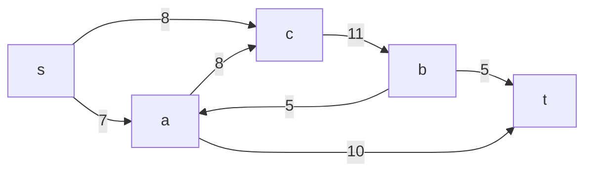
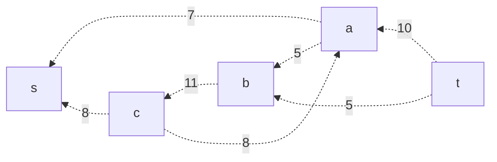
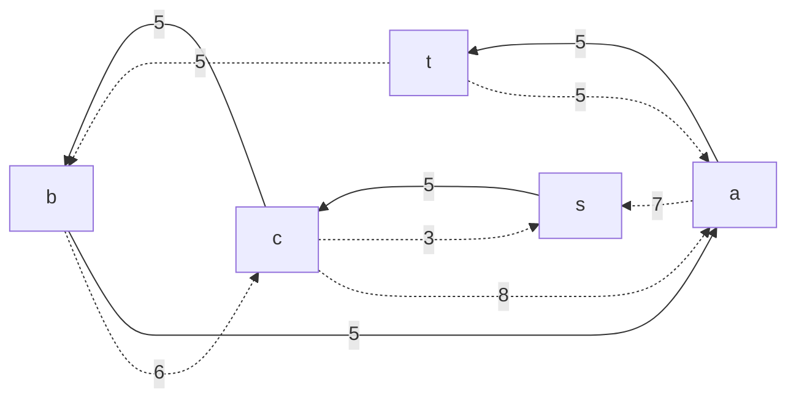
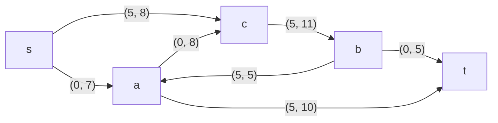
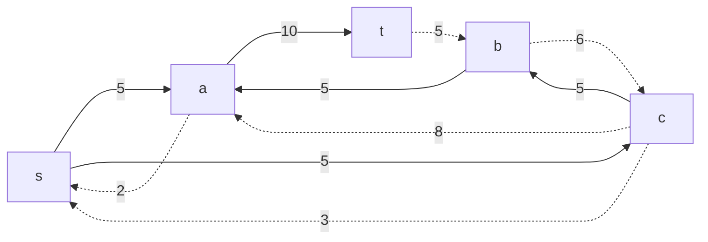
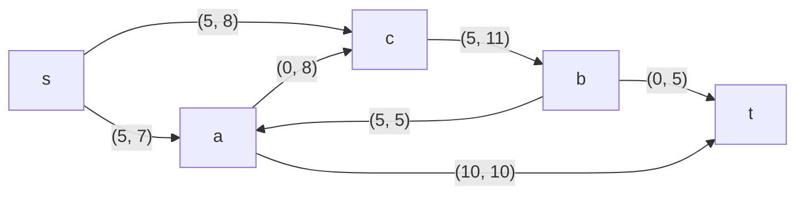
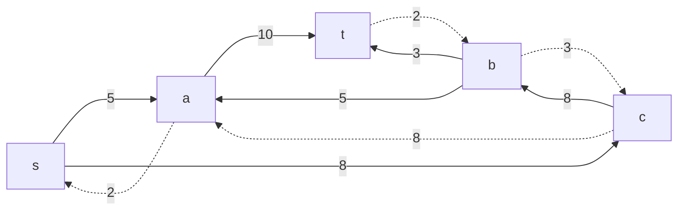
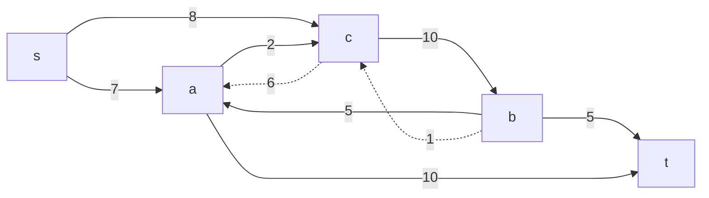
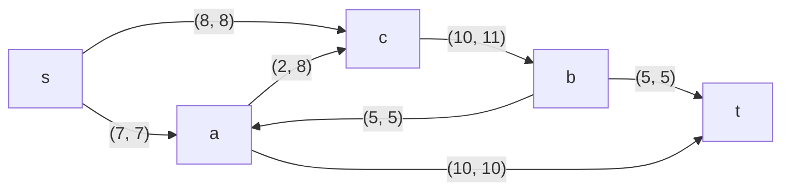

# Задание №9
# Задача о максимальном потоке.

## Задание
Для каждого варианта представлены условия задачи, в соответствии с которыми необходимо: 
1. Построить сеть с указанием пропускной способности дуг.
2. Построить остаточную сеть.
3. Определить максимальный поток методом поиска увеличивающих путей в остаточной сети.
4. Проверить величину максимального потока через поиск минимальной пропускной способности разрезов сети, то есть рассчитать пропускную способность всех разрезов сети.
5. Оформить решение задачи по шагам с подробными комментариями, таблицами и диаграммами.
6. В ответе указать максимальную величину потока и как это поток можно организовать, то есть изобразить сеть с указанием соответствующих локальных потоков.

## Постановка задачи
1. Дана сеть (взвешенный ориентированный граф) с источником s и стоком t.
2. Для каждой дуги определена ее пропускная способность.
3. Необходимо найти максимальный поток для указанной сети. 

## Вариант №1

Пропускная способность дуг сети указана в таблице.

|          Дуги          | sa | sc | ac | ba | cb | bt | at |
|:----------------------:|:--:|:--:|:--:|:--:|:--:|----|----|
| Пропускная способность | 7  | 8  | 8  | 5  | 11 | 5  | 10 |

### Построим сеть с источником **s**, стоком **t** и указанными пропускными способностями дуг.

Построим остаточную сеть. Так как изначально поток в сети не задан, все дуги сети являются пустыми (локальный поток равен нулю), соответственно в остаточную сеть необходимо вынести обратную дугу с весом равным пропускной способности. 

### Проведем поиск увеличивающего пути в остаточной сети
В остаточной сети найден увеличивающий путь t -> a -> b -> c -> s.

Вес дуг в пути:
- ta: 10
- ab: 5
- bc: 11
- cs: 8

Минимальный вес дуг на этом пути равен 5.

Уменьшим вес дуг на найденном пути.
Дуги, для которых вес стал нулевым, в данном случае ab, удалим из остаточной сети.  

Скорректируем соответствующим образом локальные потоки в исходной сети. 
Первым числом будем указывать локальный поток, вторым пропускную способность дуги. 

### Продолжим поиск увеличивающего пути в остаточной сети

В остаточной сети найден увеличивающий путь t -> a -> s. 

Вес дуг в пути:
- ta: 5
- as: 7

Минимальный вес дуг на этом пути равен 5.

Уменьшим вес дуг на найденном пути.
Дуги, для которых вес стал нулевым, в данном случае ta, удалим из остаточной сети.

Скорректируем соответствующим образом локальные потоки в исходной сети.

### Продолжим поиск увеличивающего пути в остаточной сети

В остаточной сети найден увеличивающий путь t -> b -> c -> s. 

Вес дуг в пути:
- tb: 5
- bc: 6
- cs: 3

Минимальный вес дуг на этом пути равен 3.

Уменьшим вес дуг на найденном пути.
Дуги, для которых вес стал нулевым, в данном случае cs, удалим из остаточной сети.

Скорректируем соответствующим образом локальные потоки в исходной сети.

### Продолжим поиск увеличивающего пути в остаточной сети

В остаточной сети найден увеличивающий путь t -> b -> c -> a -> s. 

Вес дуг в пути:
- tb: 2
- bc: 3
- ca: 8
- as: 2

Минимальный вес дуг на этом пути равен 2.

Уменьшим вес дуг на найденном пути.
Дуги, для которых вес стал нулевым, в данном случае tb и as, удалим из остаточной сети.

Скорректируем соответствующим образом локальные потоки в исходной сети.

### Продолжим поиск увеличивающего пути в остаточной сети
В остаточной сети не найдено увеличивающих путей, следовательно, алгоритм завершил работу.
Найденный поток величиной 15 является максимальным для данной сети.

### Проверим значение максимального потока перебором всех разрезов сети.
Разрез сети - разбиение множества всех узлов в сети на два непересекающихся подмножества V1 и V2, причём во множество V1 входит источник (s), а в V2 входит сток (t).

Пропускная способность разреза - сумма пропускных способностей всех дуг, которые начинаются в вершинах из множества V1 и оканчиваются в вершинах из V2.

Для сети из _n_ вершин существует 2n - 2 различных разрезов, так как две вершины из множества (источник и сток) "зафиксированы" в V1 и V2, остальные вершины можно различными способами распределять между множествами V1 и V2.

Для сети из 5 вершин нужно найти 25 - 2 = 23 = 8 разрезов. 

| № | V1                   | V2 | Пропускная способность разреза |
|---|:--------------------------------|:--------------|:------------------------------:|
| 1 | s                               | a, b, c, t    |           7 + 8 = 15           |
|   | **s + одна вершина из a, b, c** |               |                                |
| 2 | s, a                            | b, c, t       |         8 + 8 + 10 = 26        |
| 3 | s, b                            | a, c, t       |         8 + 7 + 5 + 5 = 25     |
| 4 | s, c                            | a, b, t       |         7 + 11 = 18            |
|   | **s + пара вершин из a, b, c**  |               |                                |
| 5 | s, a, b                         | c, t          |         8 + 8 + 10 + 5 = 31    |
| 6 | s, b, c                         | a, t          |         7 + 5 + 5 = 17         |
| 7 | s, a, c                         | b, t          |         10 + 11 = 21           |
|   | **s + три вершины из a, b, c**  |               |                                |
| 8 | s, a, b, c                      | t             |           10 + 5 = 15          |

Минимальная пропускная способность разреза равна 15 ( {s} / {t, a, b, c} ), что совпадает с найденной величиной максимального потока в сети.

### Ответ:
Максимальный поток в сети равен 15, он реализуется следующим локальными потоками:

