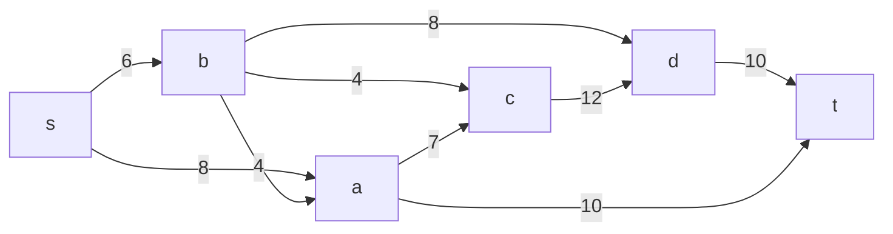
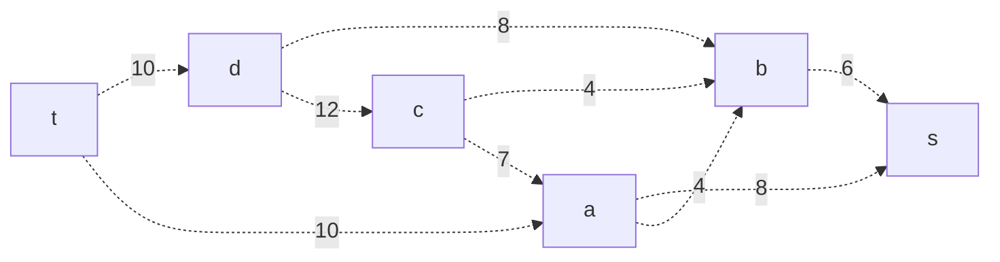
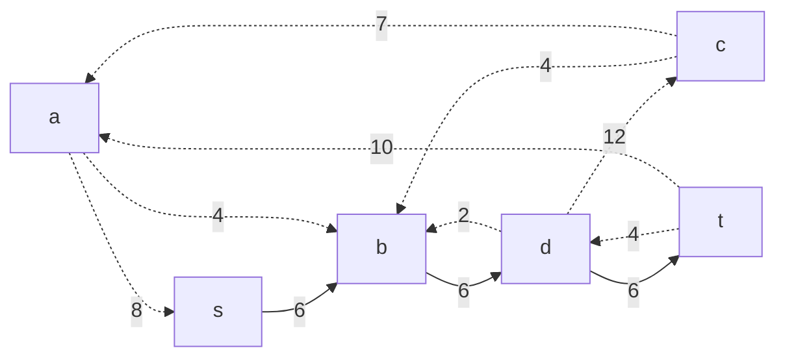
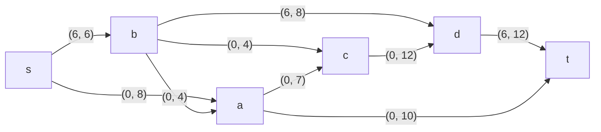
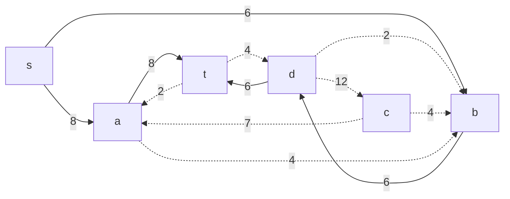

# Задание 9. Вариант 7. #
Пропускная способность дуг указана в таблице
|          Дуги          | sa | sb | bd | bc | cd | dt | ac | at | ba |
|:----------------------:|:--:|:--:|:--:|:--:|:--:|:--:|:--:|:--:|:--:|
| Пропускная способность | 8  | 6  | 8  | 4  | 12 | 10 | 7  | 10 |  4 |
### 1. Построить сеть с источником **s** и стоком **t** и указанными в таблице способностями дуг

Построить остаточную сеть, соответствующую текущему потоку. Изначально поток в сети не задан, поэтому все дуги сети являются пустыми (локальный поток равен нулю), соответственно в остаточную сеть необходимо вынести обратную дугу с весом равным пропускной способности.

### 2. Найти какой-нибудь увеличивающий путь в остаточной цепи. 
В остаточной цепи найден увеличивающий путь t -> d -> b -> s. Минимальный вес дуги в данном пути равен 6.

Уменьшить вес дуг на найденном пути, дуги для которых вес стал нулевым удалим из остаточной сети.

Скорректировать соответствующим образом локальные потоки в исходной сети. Первым числом будем указывать локальный поток, вторым пропускную способность дуги. 

### 3. Продолжить поиск увеличивающего пути в остаточной сети.

В остаточной цепи найден увеличивающий путь t -> a -> s. Минимальный вес дуги в данном пути равен 8.

Уменьшить вес дуг на найденном пути, дуги для которых вес стал нулевым удалим из остаточной сети.

Скорректировать соответствующим образом локальные потоки в исходной сети. Первым числом будем указывать локальный поток, вторым пропускную способность дуги. 

### 4. Продолжить поиск увеличивающего пути в остаточной сети.
В остаточной сети не найдено увеличивающих путей, следовательно, алгоритм завершил работу и найденный поток величиной 14 является максимальным для данной сети.
### 6. Проверить значение максимального потока перебором всех разрезов сети.
Разрез сети - разбиение множества вершин на два подмножества V1 и V2, где во множество V1 входит источник, а в V2 входит сток.

Пропускная способность разреза - сумма пропускной способности дуг, начинающихся в вершинах из множества V1 и оканчивающихся в вершинах из V2.

Для сети из _n_ вершин существует 2n - 2 различных разрезов, так как две вершины из множества (источник и сток) "зафиксированы" в V1 и V2, остальные вершины можно различными способами распределять между множествами V1 и V2.

Для сети из 6 вершин нужно найти 26 - 2 = 24 = 16 разрезов.

| № | V1                      | V2    | Пропускная способность разреза |
|---|:-----------------------------------|:-----------------|:------------------------------:|
| 1 | s                                  | t, a, b, c, d    |           6 + 8 = **14**       |
|   | **s + одна вершина из a, b, c, d** |                  |                                |
| 2 | s, a                               | t, b, c, d       |         6 + 7 + 10 = 23        |
| 3 | s, b                               | t, a, c, d       |       8 + 4 + 4 + 8 = 24       |
| 4 | s, c                               | t, a, b, d       |         6 + 8 + 12 = 26        |
| 5 | s, d                               | t, a, b, c       |         6 + 8 + 10 = 24        |
|   | **s + пара вершин из a, b, c, d**  |                  |                                |
| 6 | s, a, b                            | t, c, d          |       7 + 10 + 4 + 8 = 29      |
| 7 | s, a, c                            | t, b, d          |         6 + 10 + 12 = 28       |
| 8 | s, a, d                            | t, b, c          |       6 + 7 + 10 + 10 = 33     |
| 9 | s, b, c                            | t, a, d          |       8 + 4 + 8 + 12 = 32      |
|10 | s, b, d                            | t, a, c          |       8 + 4 + 4 + 10 = 26      |
|11 | s, c, d                            | t, a, b          |         6 + 8 + 10 = 24        |
|   | **s + три вершины из a, b, c, d**  |                  |                                |
|12 | s, a, b, c                         | t, d             |         10 + 8 + 12 = 30       |
|13 | s, a, b, d                         | t, c             |       7 + 10 + 4 + 10 = 31     |
|14 | s, a, c, d                         | t, b             |         6 + 10 + 10 = 26       |
|15 | s, b, c, d                         | t, a             |          8 + 4 + 10 = 22       |
|   |**s + четыре вершины из a, b, c, d**|                  |                                |
|16 | s, a, b, c, d                      | t                |            10 + 10 = 20        |

Минимальная пропускная способность разреза равна 11 ( {s} / {t, a, b, c, d} ), что совпадает с найденной величиной максимального потока в сети.

### Ответ:
Максимальный поток в сети равен 14, он реализуется следующим локальными потоками:
