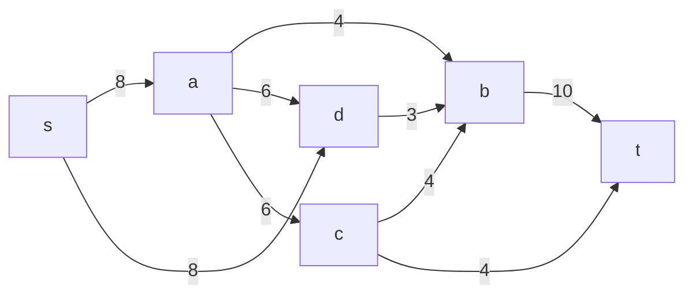
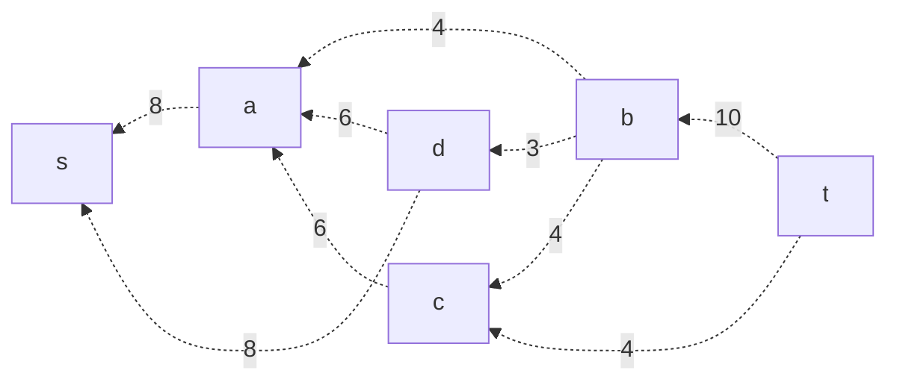
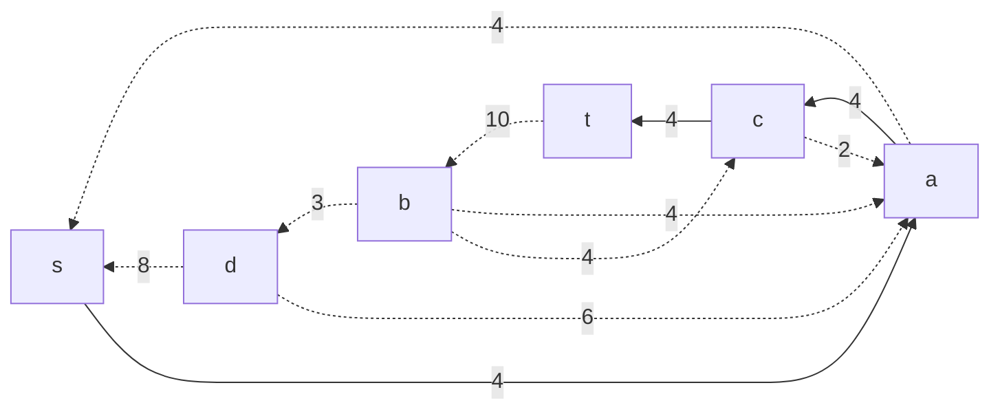
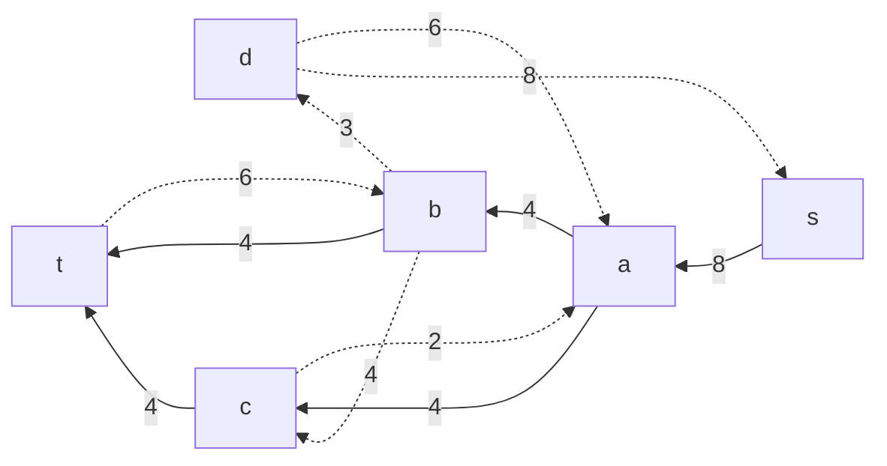
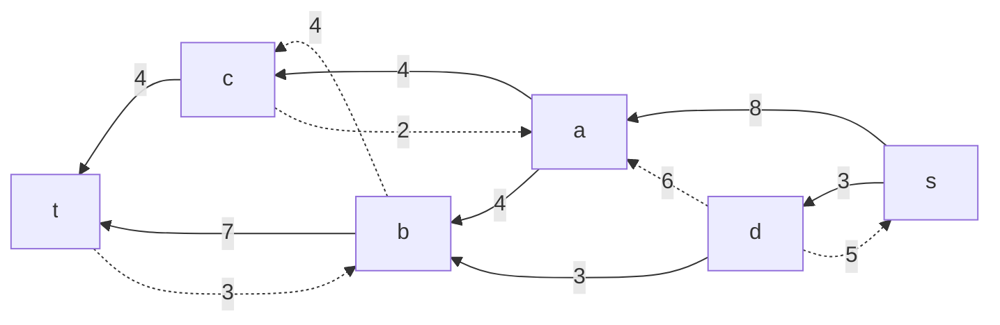
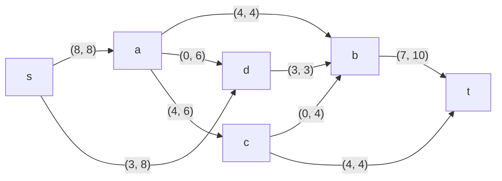

# Задание №9
# Задача о максимальном потоке.

### Вариант 10:
#### Пропускная способность дуг сети:

|          Дуги          | sa | sd | ab | ad | db | cb | ct | bt | ac | 
|:----------------------:|:--:|:--:|:--:|:--:|:--:|:--:|:--:|:--:|:--:|
| Пропускная способность | 8  | 8  | 4  | 6  | 3 | 4  | 4  | 10  |  6 |

### 1. Построим сеть с источником **s**, стоком **t** и указанными пропускными способностями дуг.

Построим остаточную сеть. Так как изначально поток в сети не задан, все дуги сети являются пустыми (локальный поток равен нулю), соответственно в остаточную сеть необходимо вынести обратную дугу с весом равным пропускной способности.

Корректировку потоков в исходной сети сделаем в самом конце.

### 2. Проведем поиск увеличивающего пути в остаточной сети
В остаточной сети найден увеличивающий путь t -> c -> a -> s. Минимальный вес дуг на этом пути равен 4.

Уменьшим вес дуг на найденном пути, дуги для которых вес стал нулевым, удалим из остаточной сети.

### 3. Продолжим поиск увеличивающего пути в остаточной сети
В остаточной сети найден увеличивающий путь t -> b -> a -> s. Минимальный вес дуг на этом пути равен 4.

Уменьшим вес дуг на найденном пути, дуги для которых вес стал нулевым, удалим из остаточной сети.

### 4. Продолжим поиск увеличивающего пути в остаточной сети
В остаточной сети найден увеличивающий путь t -> b -> d -> s. Минимальный вес дуг на этом пути равен 3.

Уменьшим вес дуг на найденном пути, дуги для которых вес стал нулевым, удалим из остаточной сети.

Скорректируем соответствующим образом локальные потоки в исходной сети. Первым числом будем указывать локальный поток, вторым пропускную способность дуги. 

### 7. Продолжим поиск увеличивающего пути в остаточной сети
В остаточной сети не найдено увеличивающих путей, следовательно, алгоритм завершил работу и найденный поток величиной 11 является максимальным для данной сети. Для проверки возьмем сумму всех потоков из источника, она также равна 11, значит все верно.

### 8. Проверим значение максимального потока перебором всех разрезов сети.

Для сети из 6 вершин нужно найти 26 - 2 = 24 = 16 разрезов. 

| № | V1                      | V2    | Пропускная способность разреза |
|---|:-----------------------------------|:-----------------|:------------------------------:|
| 1 | s                                  | t, a, b, c, d    |           8 + 8 = 16    |
|   | **s + одна вершина из a, b, c, d** |                  |                                |
| 2 | s, a                               | t, b, c, d       |         8 + 4 + 6 + 6 = 24     |
| 3 | s, b                               | t, a, c, d       |       8 + 8 + 10 = 26       |
| 4 | s, c                               | t, a, b, d       |         8 + 8 + 4 + 4 = 24    |
| 5 | s, d                               | t, a, b, c       |         8 + 3 = 11        |
|   | **s + пара вершин из a, b, c, d**  |                  |                                |
| 6 | s, a, b                            | t, c, d          |       8 + 4 + 6 + 6 + 10 = 34     |
| 7 | s, a, c                            | t, b, d          |         8 + 4 + 6 + 4 + 4 = 26       |
| 8 | s, a, d                            | t, b, c          |       4 + 6 + 3 = 13     |
| 9 | s, b, c                            | t, a, d          |       8 + 8 + 10 + 4 = 30      |
|10 | s, b, d                            | t, a, c          |       8 + 10 = 18     |
|11 | s, c, d                            | t, a, b          |        8 + 4 + 4 + 3 = 19        |
|   | **s + три вершины из a, b, c, d**  |                  |                                |
|12 | s, a, b, c                         | t, d             |         8 + 6 + 10 + 4 = 28       |
|13 | s, a, b, d                         | t, c             |       6 + 10 = 16     |
|14 | s, a, c, d                         | t, b             |         4 + 4 +4 + 3 = 15       |
|15 | s, b, c, d                         | t, a             |          8 + 10 = 18       |
|   |**s + четыре вершины из a, b, c, d**|                  |                                |
|16 | s, a, b, c, d                      | t                |            10 + 4 = 14        |

Минимальная пропускная способность разреза равна 11 ( {s, d} / {t, a, b, c} ), что совпадает с найденной величиной максимального потока в сети.

### Ответ:
Максимальный поток в сети равен 11,  он реализуется следующим локальными потоками:

