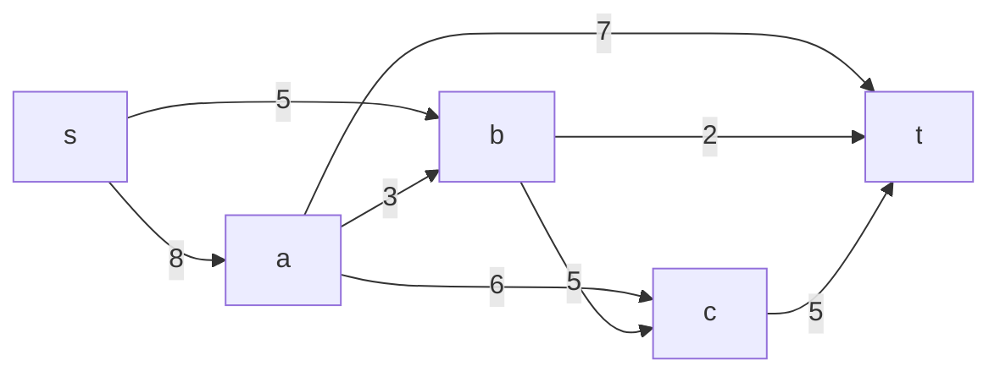
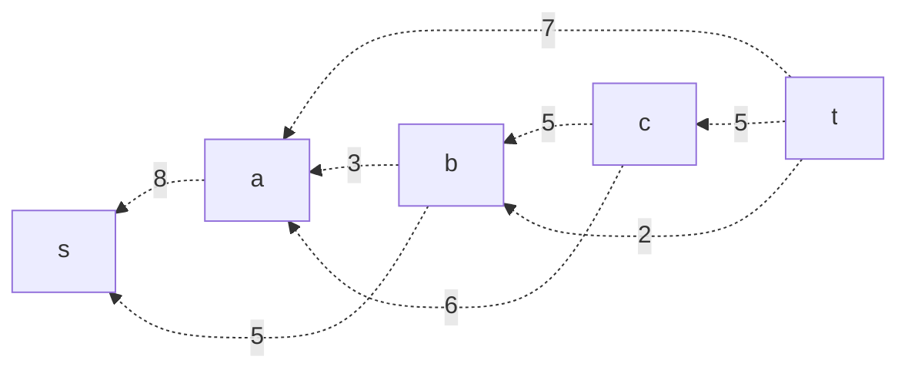
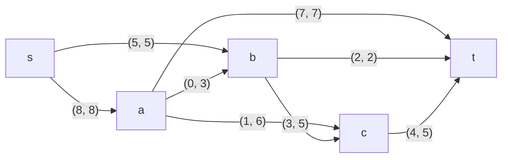

## Постановка задачи
1. Дана сеть (взвешенный ориентированный граф) с источником **s** и стоком **t**.
2. Для каждой дуги задана её пропускная способность.
3. Необходимо найти максимальный поток в сети.

В данной задаче пропускные способности дуг заданы в таблице:

| Дуга | sa | at | sb | ab | ac | bc | bt | ct |
|:----:|:--:|:--:|:--:|:--:|:--:|:--:|:--:|:--:|
| Пропускная способность | 8  | 7  | 5  | 3  | 6  | 5  | 2  | 5  |

Вершины сети: **s**, **a**, **b**, **c**, **t**.

Дуги сети:
- **s &rarr; a**: 8
- **s &rarr; b**: 5
- **a &rarr; t**: 7
- **a &rarr; b**: 3
- **a &rarr; c**: 6
- **b &rarr; c**: 5
- **b &rarr; t**: 2
- **c &rarr; t**: 5

### 1. Построим граф сети

Изначально поток во всех дугах равен нулю. Для каждой дуги в остаточную сеть добавляем обратную дугу с пропускной способностью, равной исходной.

### 2. Поиск первого увеличивающего пути

**Путь 1:** s &rarr; a &rarr; t

- Пропускные способности дуг на пути: s&rarr;a = 8, a&rarr;t = 7.
- Минимальная пропускная способность (бутылочное горлышко) = **7**.

Увеличим поток на 7 по найденному пути и скорректируем остаточную сеть:

- **s &rarr; a:** 8 − 7 = 1 (осталось)
- **a &rarr; t:** 7 − 7 = 0 (дуга полностью задействована; удаляем её из остаточной сети)

Обновлённые локальные потоки в исходной сети:

И соответствующие обратные дуги в остаточной сети (например, для дуги s&rarr;a теперь обратная a&rarr;s имеет ёмкость 7).

### 3. Поиск второго увеличивающего пути

**Путь 2:** s &rarr; a &rarr; c &rarr; t

Проверим остаточные пропускные способности:
- **s &rarr; a:** остаточная способность = 1
- **a &rarr; c:** 6
- **c &rarr; t:** 5

Бутылочное горлышко = **min(1, 6, 5) = 1**.

Увеличиваем поток на 1:
- **s &rarr; a:** 1 − 1 = 0
- **a &rarr; c:** 6 − 1 = 5
- **c &rarr; t:** 5 − 1 = 4

Обновлённые локальные потоки:
- По дуге **s &rarr; a**: суммарный поток = 7 + 1 = 8 (т.е. полностью задействована дуга s&rarr;a).
- По дуге **a &rarr; c**: поток = 1.

Обновлённый общий поток = 7 + 1 = **8**.

### 4. Поиск третьего увеличивающего пути

**Путь 3:** s &rarr; b &rarr; t

Остаточные пропускные способности:
- **s &rarr; b:** 5
- **b &rarr; t:** 2

Бутылочное горлышко = **min(5, 2) = 2**.

Увеличиваем поток на 2:
- **s &rarr; b:** 5 − 2 = 3
- **b &rarr; t:** 2 − 2 = 0 (дуга полностью задействована)

Обновлённые локальные потоки:
- **s &rarr; b:** поток = 2.
- **b &rarr; t:** поток = 2.

Общий поток теперь = 8 + 2 = **10**.

### 5. Поиск четвёртого увеличивающего пути

**Путь 4:** s &rarr; b &rarr; c &rarr; t

Проверим остаточные пропускные способности:
- **s &rarr; b:** остаточная способность = 3
- **b &rarr; c:** 5
- **c &rarr; t:** остаточная способность = 4

Бутылочное горлышко = **min(3, 5, 4) = 3**.

Увеличиваем поток на 3:
- **s &rarr; b:** 3 − 3 = 0
- **b &rarr; c:** 5 − 3 = 2
- **c &rarr; t:** 4 − 3 = 1

Обновлённые локальные потоки:
- По дуге **s &rarr; b:** суммарный поток = 2 + 3 = 5 (т.е. полностью задействована дуга s&rarr;b).
- По дуге **b &rarr; c:** поток = 3.
- По дуге **c &rarr; t:** суммарный поток = 1 (от пути 2) + 3 = 4.

Общий поток теперь = поток из **s** = (8 от s&rarr;a) + (5 от s&rarr;b) = **13**.

### 6. Проверка завершения алгоритма

После последнего шага из вершины **s** уже не исходит дуга с положительной остаточной пропускной способностью (s&rarr;a и s&rarr;b полностью задействованы). Следовательно, в остаточной сети не существует увеличивающего пути, и алгоритм завершается.

### 7. Проверка значения максимального потока перебором разрезов

Рассмотрим разрез, в котором в $V_1$ находится только вершина **s**, а в $V_2$ — все остальные (**a, b, c, t**). Пропускная способность разреза равна сумме исходных дуг, выходящих из **s**:
- Из **s** &rarr; **a**: 8
- Из **s** &rarr; **b**: 5

Итого: $8 + 5 = 13$, что совпадает с найденной величиной максимального потока.

### Ответ:
Максимальный поток в сети равен **13** и реализуется следующими локальными потоками:

