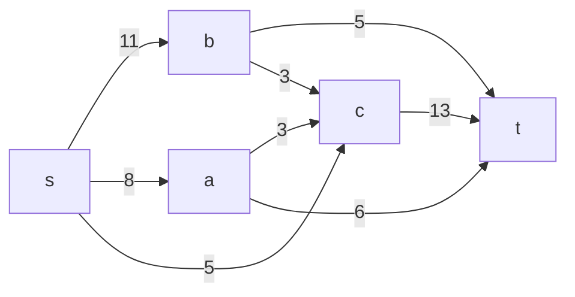
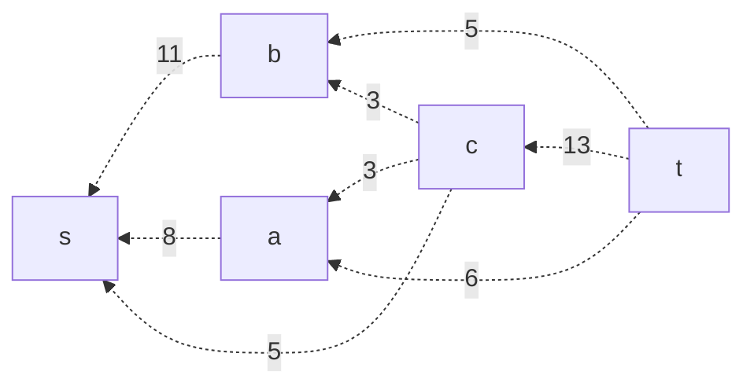
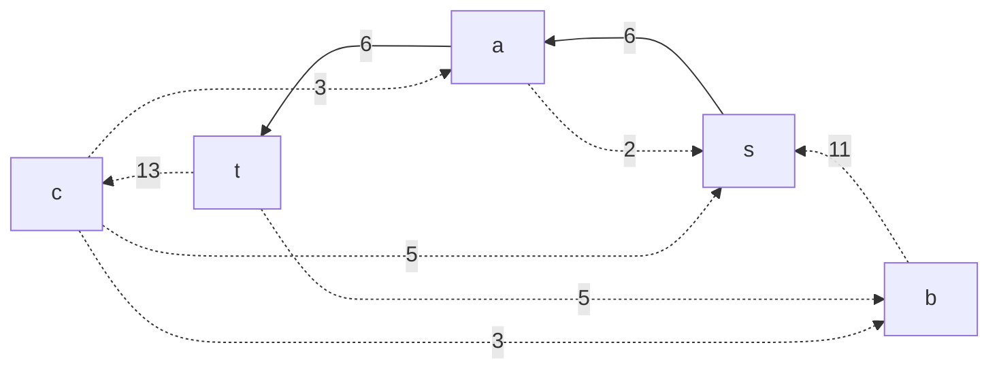
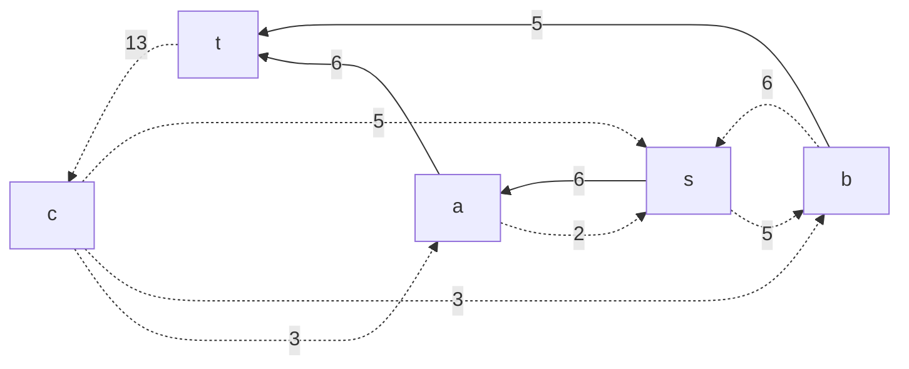
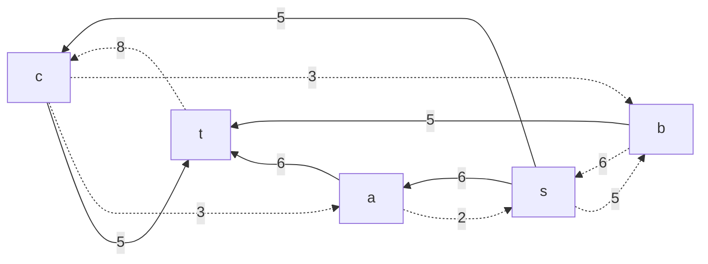
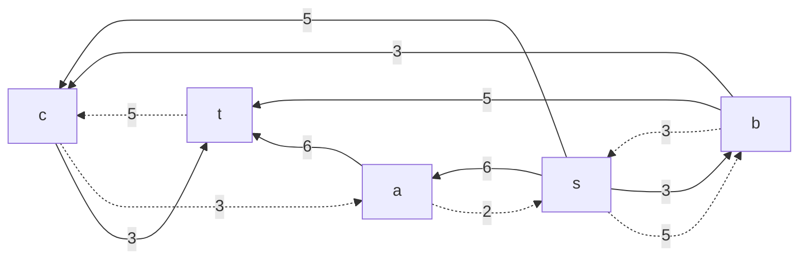
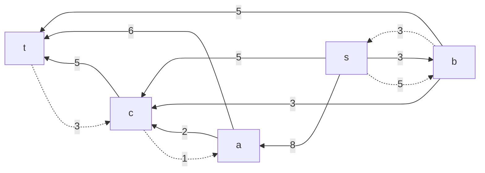
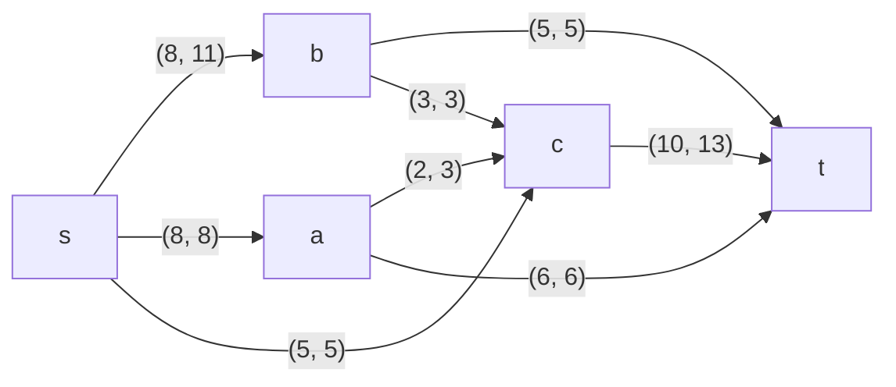

# Задание №9
# Задача о максимальном потоке.

### Вариант 9:
#### Пропускная способность дуг сети:

|          Дуги          | sb | sa | bt | sc | bc | ac | at | ct |
|:----------------------:|:--:|:--:|:--:|:--:|:--:|:--:|:--:|:--:|
| Пропускная способность | 11 | 8  | 5  | 5  | 3  | 3  | 6  | 13 |

## 1. Построим сеть с источником **s**, стоком **t** и указанными пропускными способностями дуг.

### Построим остаточную сеть. 
Так как изначально поток в сети не задан, все дуги сети являются пустыми (локальный поток равен нулю), соответственно в остаточную сеть необходимо вынести обратную дугу с весом равным пропускной способности.

### 2. Проведем поиск увеличивающего пути в остаточной сети
В остаточной сети найден увеличивающий путь t -> a -> s. 

Минимальный вес дуг на этом пути равен 6.

### 3. Проведем поиск увеличивающего пути в остаточной сети
В остаточной сети найден увеличивающий путь t -> b -> s. 

Минимальный вес дуг на этом пути равен 5.

### 4. Проведем поиск увеличивающего пути в остаточной сети
В остаточной сети найден увеличивающий путь t -> с -> s. 

Минимальный вес дуг на этом пути равен 5.

### 5. Проведем поиск увеличивающего пути в остаточной сети
В остаточной сети найден увеличивающий путь t -> с -> b -> s. 

Минимальный вес дуг на этом пути равен 3.

### 6. Проведем поиск увеличивающего пути в остаточной сети
В остаточной сети найден увеличивающий путь t -> с -> a -> s. 

Минимальный вес дуг на этом пути равен 2.

Скорректируем соответствующим образом локальные потоки в исходной сети. Первым числом будем указывать локальный поток, вторым пропускную способность дуги. 

### 7. Продолжим поиск увеличивающего пути в остаточной сети
В остаточной сети не найдено увеличивающих путей, следовательно, алгоритм завершил работу и найденный поток величиной 21 является максимальным для данной сети. (проверка: сумма значений на ребрах из источника s = 21 и сумма значений на ребрах в сток t также равна 21).

### 8. Проверим значение максимального потока перебором всех разрезов сети.

Для сети из 5 вершин нужно найти 25 - 2 = 23 = 8 разрезов. 

| № | V1                   | V2 | Пропускная способность разреза |
|---|:--------------------------------|:--------------|:------------------------------:|
| 1 | s                               | a, b, c, t    |           11 + 8 + 5 = 24          |
|   | **s + одна вершина из a, b, c** |               |                                |
| 2 | s, a                            | b, c, t       |         11 + 5 + 3 + 6 = 25         |
| 3 | s, b                            | a, c, t       |         **8 + 5 + 3 + 5 = 21**       |
| 4 | s, c                            | a, b, t       |         11 + 8 + 13 = 32         |
|   | **s + пара вершин из a, b, c**  |               |                                |
| 5 | s, a, b                         | c, t          |         5 + 3 + 6 + 3 + 5 = 22        |
| 6 | s, a, c                         | b, t          |         11 + 6 + 13  = 30       |
| 7 | s, b, c                         | a, t          |         8 + 5 + 13 = 26        |
|   | **s + три вершины из a, b, c**  |               |                                |
| 8 | s, a, b, c                      | t             |           6 + 13 + 5 = 24          |

Минимальная пропускная способность разреза равна 21 ( {s, b } / { a, c, t } ), что совпадает с найденной величиной максимального потока в сети.

### Ответ:
Максимальный поток в сети равен: 21
