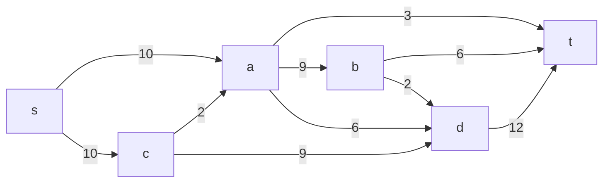
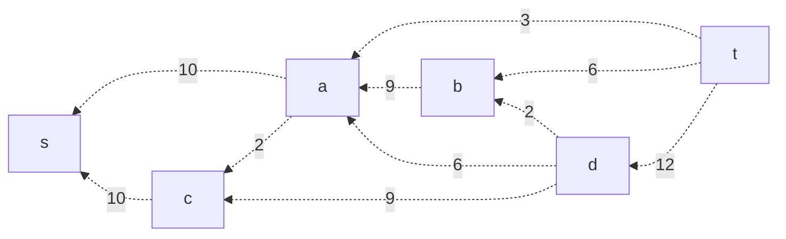
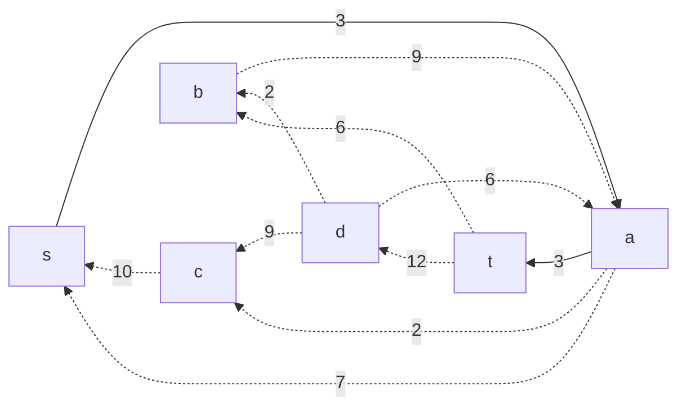
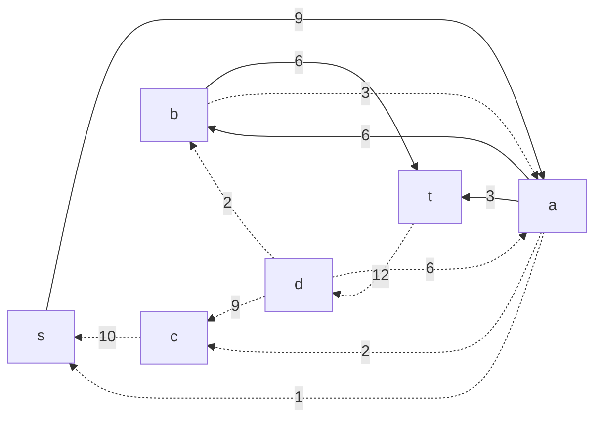
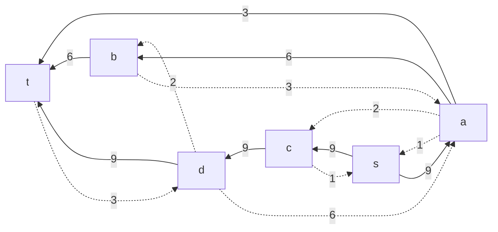
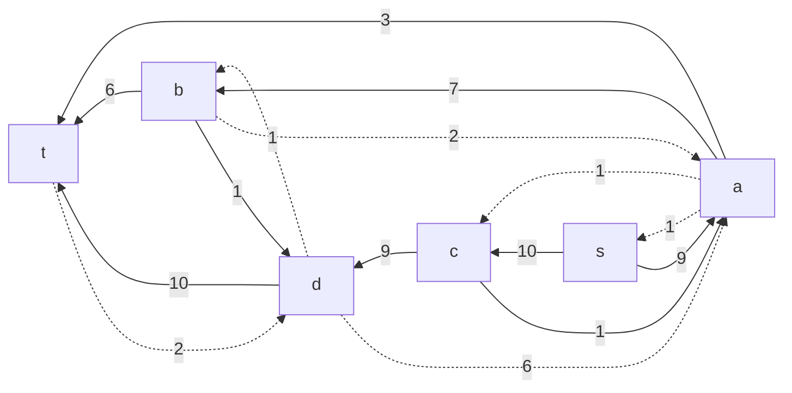
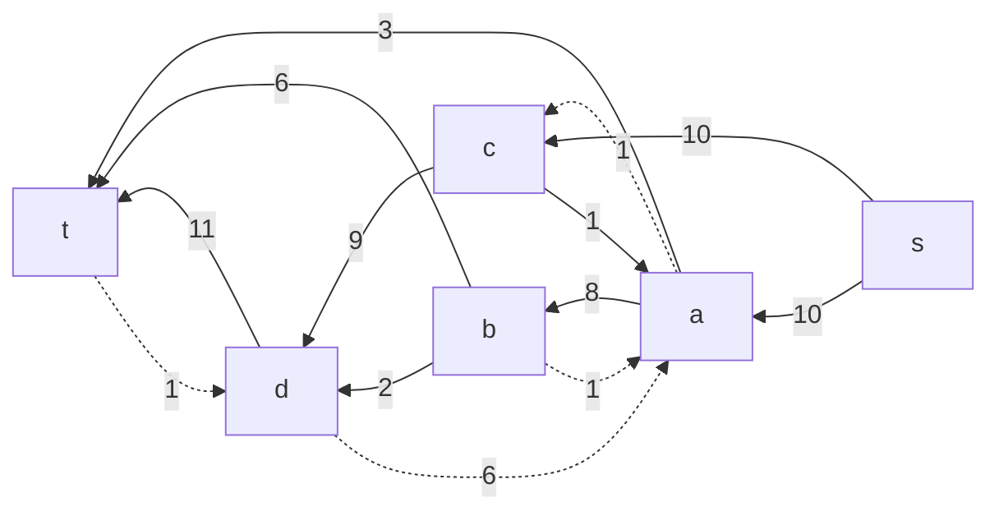
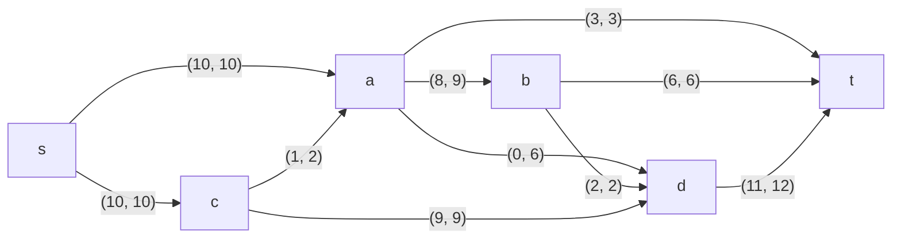

### Вариант 2:
#### Пропускная способность дуг сети:

|          Дуги          | sa | sc | ca | at | ab | ad | cd | bt | dt | bd |
|:----------------------:|:--:|:--:|:--:|:--:|:--:|:--:|:--:|:--:|:--:|:--:|
| Пропускная способность | 10 | 10 | 2  | 3  | 9  | 6  | 9  | 6  | 12 |  2 |

**1. Построим сеть с источником s, стоком t и указанными пропускными способностями дуг.**

**Построим остаточную сеть.** 

Так как изначально поток в сети не задан, локальный поток всех дуг равен нулю, соответственно в остаточную сеть необходимо вынести обратную дугу с весом равным пропускной способности. 

**2. Проведем поиск увеличивающего пути в остаточной сети**

**2.1** В остаточной сети найден увеличивающий путь t $\rightarrow$ a $\rightarrow$ s. Минимальный вес дуг на этом пути равен 3.

Уменьшим вес дуг на найденном пути, дуги для которых вес стал нулевым удалим из остаточной сети.

Скорректируем соответствующим образом локальные потоки в исходной сети. Первым числом будем указывать локальный поток, вторым пропускную способность дуги. 

**2.2** В остаточной сети найден увеличивающий путь t $\rightarrow$ b $\rightarrow$ a $\rightarrow$ s. Минимальный вес дуг на этом пути равен 6.

Уменьшим вес дуг на найденном пути, дуги для которых вес стал нулевым удалим из остаточной сети.

Скорректируем соответствующим образом локальные потоки в исходной сети. 

**2.3** В остаточной сети найден увеличивающий путь t $\rightarrow$ d $\rightarrow$ c $\rightarrow$ s. Минимальный вес дуг на этом пути равен 9.

Уменьшим вес дуг на найденном пути, дуги для которых вес стал нулевым удалим из остаточной сети.

Скорректируем соответствующим образом локальные потоки в исходной сети. 

**2.4** В остаточной сети найден увеличивающий путь t $\rightarrow$ d $\rightarrow$ b $\rightarrow$ a $\rightarrow$ c $\rightarrow$ s. Минимальный вес дуг на этом пути равен 1.

Уменьшим вес дуг на найденном пути, дуги для которых вес стал нулевым удалим из остаточной сети.

Скорректируем соответствующим образом локальные потоки в исходной сети. 

**2.5** В остаточной сети найден увеличивающий путь t $\rightarrow$ d $\rightarrow$ b $\rightarrow$ a $\rightarrow$ s. Минимальный вес дуг на этом пути равен 1.

Уменьшим вес дуг на найденном пути, дуги для которых вес стал нулевым удалим из остаточной сети.

Скорректируем соответствующим образом локальные потоки в исходной сети. 

**3. Продолжим поиск увеличивающего пути в остаточной сети**

В остаточной сети не найдено увеличивающих путей, следовательно, алгоритм завершил работу и найденный поток величиной 20 является максимальным для данной сети.

**4. Проверим значение максимального потока перебором всех разрезов сети.**

Найдем пропускную способность всех разрезов сети.

Для сети из 6 вершин нужно найти 26 - 2 = 24 = 16 разрезов. 

| V1                   | V2 | Пропускная способность разреза |
|:--------------------------------|:--------------|:------------------------------:|
| s                               | a, b, c, d, t    |       10 + 10 = 20          |
| s, a                            | b, c, d, t       |       10 + 3 + 9 + 6 = 28      |
| s, b                            | a, c, d, t       |       10 + 10 + 2 + 6 = 28     |
| s, c                            | a, b, d, t       |        10 + 2 + 9 = 21         |
| s, d                            | a, b, c, t       |        10 + 10 + 12 = 32         |
| s, a, b                         | c, d, t          |         10 + 3 + 6 + 6 + 2 = 27         |
| s, a, c                         | b, d, t          |         3 + 9 + 6 + 9 = 27         |
| s, a, d                         | b, c, t          |         10 + 3 + 9 + 12 = 34        |
| s, b, c                         | a, d, t          |         10 + 2 + 6 + 9 + 2 = 29         |
| s, b, d                         | a, c, t          |         10 + 10 + 6 + 12 = 38         |
| s, c, d                         | a, b, t          |         10 + 2 + 12 = 24        |
| s, a, b, c                      | d, t             |         3 + 6 + 6 + 2 + 9 = 26          |
| s, a, b, d                      | c, t             |         10 + 3 + 6 + 12 = 31   |
| s, a, c, d                      | b, t             |         3 + 9 + 12 = 24        |
| s, b, c, d                      | a, t             |         10 + 6 + 2 + 12 = 30   |
| s, a, b, c, d                   | t                |         3 + 6 + 12 = 21        |

Минимальная пропускная способность разреза равна 20 ( {s} / {t, a, b, c, d} ), что совпадает с найденной величиной максимального потока в сети.

### Ответ:
Максимальный поток в сети равен 20, он реализуется следующим локальными потоками:

